[toc]

# 0304 Entropy (1)

## Entropy: Definition

### Notation:

- Let $X$ be a _discrete random variable_(离散随机变量) with alphabet(字母表/样本空间) $\mathcal{X}$ and **probability mass function** $p(x)=Pr(X=x), x\in \mathcal{X}$. (abbrev. $p_{\mathcal{X}}(x)$)

- The entropy of $X$ is defined by $$H(X)=-\sum_{x \in \mathcal{X}} p(x) \log p(x)$$

- Remark:
    - $0 \log{0} \rightarrow 0$
    - 我们有时也直接用概率分布函数表示字母表,因为$H(X)$仅与$p(x)$有关
    - $H(X) \geq 0$
    - 当$X$均匀分布时,$H(X)=\log{|X|}$,在离散情况下熵是最大的
    - $H_{b}(X)=\log _{b}{a} H_{a}(X)$
        - 对数底取$e$时,entropy is measured in nats
        - 对数取$2$时,entropy is measured in bits
    - 本课程中,主要讨论有限字母表的问题

### Examples:

- Binary entropy function 
$$\text { Let } X=\left\{\begin{array}{ll}1 & \text { with probablity } p \\ 0 & \text { with probability } 1-p\end{array}\right.$$
$$H(X)=-p \log p-(1-p) \log (1-p)$$
> 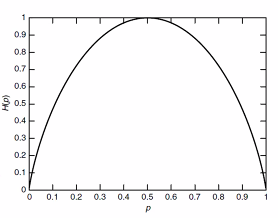

- 用期望的形式表达熵, 熵是随机变量$\log \frac{1}{p(X)}$的期望
$$\begin{aligned} E_{p} g(X) &=\sum_{x \in x} g(x) p(x) \\ H(X) &=E_{p} \log \frac{1}{p(X)} \end{aligned}$$

### Properties

> **Theorem** For any discrete random variable $X$ $0 \leq H(X) \leq \log |X|$
> **Pf.** 非负,trivial
> Note. $f(x)=-x \log x$ is concave in $x$ (by second-derivative). and that $\sum_{X} p(x)=1$.
> By applying the concavity of $f(x)$, 
$$\frac{1}{|\mathcal{X}|} \sum_{x \in \chi}-p(x) \log p(x) \leq-\frac{1}{|\mathcal{X}|} \log \frac{\sum_{x} p(x)}{|x|}=\frac{1}{|x|} \log |\mathcal{X}|$$
>> Recall: Concavity.
>> $$\sum_{i} p_{i} f\left(x_{i}\right) \leq f\left(\sum_{i} p_{i} x_{i}\right)$$

> **Lemma: 均匀分布最大化离散熵** equality holds iff $p(x)=1 /|\mathcal{X}|$

## More Entropies

- 我们会定义更多熵, 条件熵/联合熵...
- 熵的定义只与概率密度有关, 和字母表的取值具体情况无关. 
- 对多个随机变量, 我们可以定义
    - 联合分布 $p\left(x_{i}, x_{j}\right)$
    - 条件分布 $p\left(x_{i} | \dots\right)$
    - 都可以计算出熵
- 概率论中基本定律
    - Chain Rule $p\left(x_{1}, x_{2}, \ldots, x_{n}\right)=p\left(x_{n}\right) p\left(x_{n-1} | x_{n}\right) \ldots p\left(x_{1} | x_{2}, \ldots, x_{n-1}\right)$
    - Bayesian Rule $p(y) p(x | y)=p(x) p(y | x)$
    - 这些基本准则的存在, 表明熵也可能存在特殊的结构

### Joint Entropy

Facts: 多个随机变量的字母表可以组合成一个字母表

> **Definition** The joint entropy $H(X,Y)$ of a pair of discrete random variable $(X,Y)$ with joint distribution $p(x,y)$ is defined as $$H(X, Y)=-\sum_{x \in X} \sum_{y \in Y} p(x, y) \log p(x, y)$$

Propositions:
1. $H(X,X)=H(X)$, 可以理解成本质上是同一件事, 只是多次实验而已
2. $H(X,Y)=H(Y,X)$
3. 联合熵也可以写成联合期望的形式 $$H\left(X_{1}, X_{2}, \ldots, X_{n}\right)=-\sum p\left(x_{1}, x_{2}, \ldots, x_{n}\right) \log p\left(x_{1}, x_{2}, \ldots, x_{n}\right)=-E \log p\left(X_{1}, \ldots, X_{n}\right)$$

### Conditional Entropy

两种计算方式

- 先对fixed $X$算条件熵, 再对所有条件熵加权求和.
    - Entropy for $p(Y|X=x)$ $$H(Y | X=x)=\sum_{y}-p(y | X=x) \log p(y | X=x)=- E \log p(Y | X=x)$$
    - Entropy for $p(Y|X)$
    $$H(Y|X) = \sum_{x} p(x) H(Y|X=x)$$

- 也可以通过直接根据以下推导, 直接计算$\log p(Y | X)$的期望. $$\begin{aligned} H(Y | X) &=\sum_{x \in \mathcal{X}} p(x) H(Y | X=x) \\ &=-\sum_{x \in \mathcal{X}} p(x) \sum_{y \in \mathcal{Y}} p(y | x) \log p(y | x) \\ &=-\sum_{x \in X} \sum_{y \in y} p(x, y) \log p(y | x) \\ &=-E \log p(Y | X) \end{aligned}$$

> **Proposition** $H(Y | X) \leq H(Y)$
> 直观理解, 条件熵(在X已知的情况下,Y的不确定度)会比原始系统的熵要低, 条件降低了系统的不确定度.

> **Remark** Example中两个有意思的结论, 后续给出证明
> $$\begin{array}{c}\boldsymbol{H}(X | \boldsymbol{Y}) \neq \boldsymbol{H}(\boldsymbol{Y} | \boldsymbol{X}) \\ \boldsymbol{H}(\boldsymbol{X} | \boldsymbol{Y})+\boldsymbol{H}(\boldsymbol{Y})=\boldsymbol{H}(\boldsymbol{Y} | \boldsymbol{X})+\boldsymbol{H}(\boldsymbol{X})=\boldsymbol{H}(\boldsymbol{X}, \boldsymbol{Y})\end{array}$$
> 直观理解, 两件事的先后发生的不确定性不具有对称性, 两件事的不确定性之和可以理解为两件事(带条件)先后发生的不确定性之和.

### Chain Rule

Recall: 概率论中, $p(x, y)=p(x | y) p(y)=p(y | x) p(x)$. 因此我们有$\log p(x, y)=\log p(x | y)+\log p(y)=\log p(y | x)+\log p(x)$.

考虑上节中定义的条件熵, $$\begin{aligned} & E-\log p(x, y) \\=& E-\log p(x | y)+E-\log p(y) \\=& E-\log p(y | x)+E-\log p(x) \end{aligned}$$

> **Theorem: Chain Rule** $H(X, Y)=H(Y)+H(X | Y)=H(X)+H(Y | X)$

**Proposition**
1. 如果X和Y独立,那么$H(X,Y)=H(X)+H(Y)$.
2. 如果X是关于Y的函数,那么$H(X,Y)=H(Y)$.
3. 贝叶斯公式: $H(X, Y | Z)=H(X | Z)+H(Y | X, Z)$
    **Pf.** Note $$ p(x,z)p(y|x,z)=p(x,y,z) = p(z)p(x,y|z)$$
   and that $$p(x,z)=p(x|z)p(z)$$
   it follows that $p(x, y | z)=p(x | z) p(y | x, z)$.

### Venn Diagram

我们如何高效地整理信息量的关系?

> $H(X, Y)=H(Y)+H(X | Y)=H(X)+H(Y | X)$
> 

### Zero Entropy

如果随机变量的条件熵为0, 那么Y是X的一个函数 (i.e., for all $x$ with $p(x)>0$, there is only one possible value of $y$ with $p(x,y)>0$.

Zero Entropy在网络分析/人工智能的推理上具有很大的应用. 当我们遇到条件关系时, 可以考虑用这种方式解决它.

**Pf.** By condition we have $$H(Y|X) = \sum_{x} p(x) H(Y|X=x) = 0$$
Note that $p(x)>0$, thus for any $x$, we have $H(Y|X=x)=0$.

It follows that when $x$ is determined, the distribution of $Y$ is a single value.

# 0309 Entropy (2)

## Relative Entropy

相对熵, 度量两种分布之间的距离 (K-L distance), 假定$p(x)$, $q(x)$具有相同的维数(over the same alphabet $\mathcal{X}$), 我们有
$$\begin{aligned} D(p \| q)=& \sum_{x \in \mathcal{X}} p(x) \log \frac{p(x)}{q(x)} \\ &=E_{p} \log \frac{p(X)}{q(X)} \end{aligned}$$

注意, 仅对p求期望, 我们还有以下规定或性质
- $0 \log _{0}^{0}=0,0 \log \frac{0}{q}=0, p \log \frac{p}{0}=\infty$
- 若存在事件x, 使得$p(x)>0$且$q(x)=0$, 那么$D(p \| q)=\infty$
- $D(p \| q) \geq 0$
- $D(p \| q)=E_{p}(-\log q(x))-E_{p}(-\log p(x))=E_{p}(-\log q(x))-H(p)$, 相对熵可写作一个关于p分布的期望减去一个p的熵的形式

### Relative Entropy is NOT Metric
> A metric d: $X,Y \mapsto R^{+}$ between two distributions should satifsy
> - $d(X, Y) \geq 0$
> - $d(X, Y) \equiv d(Y, X)$
> - $d(X, Y)=0$ if and only if $X=Y$
> - $d(X, Y)+d(Y, Z) \geq d(X, Z)$

- Euclidean distance is a metric
- KL distance is not a metric
  - $D(p\| p)= 0$
  - but $D(p|\ q) \neq D(q|\ p)$
  - distance but not metric
- **Variational Distance(差分/变分距离)** between $p$ and $q$ is denoted as
$$
V(p, q)=\sum_{x \in \mathcal{X}}|p(x)-q(x)|
$$
- Pinsker's Inequality: 相对熵是差分距离的一个上界
$$
D(p \| q) \geq \frac{1}{2 \ln 2} V^{2}(p, q)
$$

### Conditional Relative Entropy
条件相对熵 = 计算两种单个条件概率分布相对熵, 再对p取平均. 该计算方法也可改写成期望的形式

$$\begin{aligned}
D(p(y | x) \| q(y | x)) &=\sum_{x} p(x) \sum_{y} p(y | x) \log \frac{p(y | x)}{q(y | x)} \\
&=\sum_{x} \sum_{y} p(x) p(y | x) \log \frac{p(y | x)}{q(y | x)} \\
&=E_{p(x, y)} \log \frac{p(Y | X)}{q(Y | X)}
\end{aligned}$$

性质: Chain Rule $D(p(x, y) \| q(x, y))=D(p(x) \| q(x))+D(p(y | x) \| q(y | x))$.
**Proof.** By Definition
$$\begin{array}{l}
D(p(x, y) \| q(x, y))=\sum_{x} \sum_{y} p(x, y) \log \frac{p(x, y)}{q(x, y)}=\sum_{x} \sum_{y} p(x, y) \log \frac{p(x) p(y | x)}{q(x) q(y | x)} \\
=\sum_{x} \sum_{y} p(x, y)\left(\log \frac{p(x)}{q(x)}+\log \frac{p(y | x)}{q(y | x)}\right)
\end{array}$$

## Mutual Information
$$
\begin{aligned} I(X ; Y) &=\sum_{x} \sum_{y} p(x, y) \log \frac{p(x, y)}{p(x) p(y)} \\ &=D(p(x, y) \| p(x) p(y)) \\ &=E_{p(x, y)} \log \frac{p(X, Y)}{p(X) p(Y)} \end{aligned}
$$

互信息的性质:
- $I(X;Y)=I(Y;X)$
- $I(X;X)=H(X)$ 随机变量的熵就是它本身互信息的值
- $X$和$Y$独立, $I(X;Y)=0$. 没有关联的随机变量互信息为0
- 注意Notation: $I(X;Y)$ $H(X,Y)$
- 我们通常用关系式计算信息量

### Mutual Information and Entropy

 

$$\begin{array}{c}I(X ; Y)=H(X)-H(X | Y) \\I(X ; Y)=H(Y)-H(Y | X) \\I(X ; Y)=H(X)+H(Y)-H(X, Y) \\I(X ; Y)=I(Y ; X) \\I(X ; X)=H(X)\end{array}$$

Note: 面积可能为负, 所以$I(X;Y)$部分必不可少
**Proof.** Recall $p(X, Y)=p(X) p(Y | X)=p(Y) p(X | Y)$
To Prove $I(X ; Y)=H(X)+H(Y)-H(X, Y)$, Since 
$$\log \frac{p(X, Y)}{p(X) p(Y)}=-\log p(X)-\log p(Y)+\log p(X, Y)$$
By taking Expectation of $p(x,y)$ and using $E(X_1 +X_2) = E(X_1) + E(X_2)$, we get $I(X ; Y)=H(X)+H(Y)-H(X, Y)$

Proposition:
If $X$ and $Y$ are independent, then
$$H(X,Y)=H(X)+H(Y)$$
$$I(X;Y) = H(X)+H(Y)-H(X,Y)$$
or vice versa.

### Conditional Mutual Information
$$\begin{aligned}
I(X ; Y | Z) &=H(X | Z)-H(X | Y, Z) \\
&=E_{p(x, y, z)} \log \frac{p(X, Y | Z)}{p(X | Z) p(Y | Z)}
\end{aligned}$$

> Chain Rule is a decomposition

$$I\left(X_{1}, X_{2}, \ldots, X_{n} ; Y\right)=\sum_{i=1}^{n} I\left(X_{i} ;  Y | X_{i-1}, X_{i-2}, \ldots, X_{1}\right)$$

**Proof.** $I\left(X_{1}, X_{2}, \ldots, X_{n} ; Y\right)=H\left(X_{1}, \ldots, X_{n}\right)-H\left(X_{1}, \ldots, X_{n} | Y\right)$
Apply Chain Rule for entropy respectively, then bind the $\sum$ together, rewrite in the mutual information form.

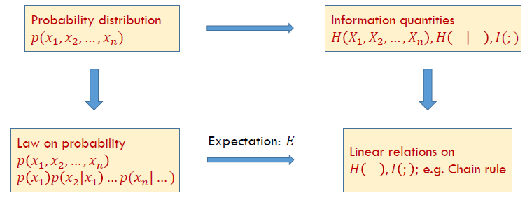

信息度量的好处是用单一值避免随着随机变量的增多,样本空间指数型的上升

## Propositions About Information Quantities

### Nonnegative Mutual Information
> **Information inequality** Let $p(x),q(x),x\in X$ be two probability mass functions. Then 
> $$D(p\| q)\ge 0$$
> with equality iff $p(x)=q(x)$ for all $x$.

**Proof.**
- By convexity: $$-D(p \| q)=\Sigma p \log \frac{q}{p} \leq \log \Sigma p \frac{q}{p}=\log \Sigma q \leq \log 1=0$$
- Using $\log x \le x - 1$when $x>0$ $$-D(p \| q)=\Sigma p \log \frac{q}{p} \leq \Sigma p\left(\frac{q}{p}-1\right)=\Sigma q-\Sigma p \leq 0$$
  $\sum q$可能取不到1, 因为$p=0$而$q\neq0$时相对熵被定义为0, 此时这一项q就被消去了. 实际参与运算的$q$之和$\le 1$

### More Properties
- $D(p \| q)=0$ iff $p(x)=q(x)$
- $I(X;Y) \ge 0$, with equality iff $X$ and $Y$ are independent
- $D(p(y|x)\| q(y|x))\ge 0$ with equality iff $p(y|x)=q(y|x)$ for all $x$ and $y$ such that $p(x)>0$
- $I(X;Y|Z)\ge 0$ with equality iff $X$ and $Y$ are conditionally independent given $Z$.
- Let $u(x)=\frac{1}{|x|}$ be the uniform probability mass fuction over $X$, and let $p(x)$ be the probability mass function for $X$, Then
  $$0\le D(p\| u)= \log |\mathcal{X}|-H(X)$$
- (Conditioning reduces entropy) (Information can't hurt)
  $$H(X|Y) \le H(X)$$
  with equality iff $X$ and $Y$ are independent
  hint: relation with $I(X;Y)$

# 0311 Entropy (3)

## Independence Bound on Entropy

From intuition to math expression.
Let $X_1,X_2,\cdots,X_n$ be drawn according to $p(x_1,x_2,\cdots,x_n)$. Then
$$H\left(X_{1}, X_{2}, \ldots, X_{n}\right) \leq \sum_{i=1}^{n} H\left(X_{i}\right)$$
with equality if and only if the $X_i$ are independent.

**Pf.** by chain rule and conditioning reduces entropy
$$H\left(X_{1}, X_{2}, \ldots, X_{n}\right)=\sum_{i=1}^{n} H\left(X_{i} | X_{i-1}, \ldots, X_{1}\right) \leq \sum_{i=1}^{n} H\left(X_{i}\right)$$

## Markov Chain
$$ p(x,y,z) = p(x)p(y|x)p(z|y) \text{denoted as} X \rightarrow Y\rightarrow Z$$
i.e. $p(z|y,x)=p(z|y)$

Prop about markov chain
-  $X \rightarrow Y \rightarrow Z$ iff $X$ and $Z$ are conditionally independent given $Y$.
- 时间可逆 $X \iff Y \iff Z$
  - an easy interpretation is that in the mutual information $I(X ; Z | Y)$, $X$ and $Z$ can be switched.
- 仿射 if$Z=f(Y)$ then $X \rightarrow Y \rightarrow Z$.
- 体现在信息度量上, if $X \rightarrow Y\rightarrow Z$, then $I(X;Z|Y)=0$ i.e. $Y$ and $Z$ are conditionally independent given $Y$.
  **Pf.** from the probability formula we have
  $$I(X ; Z | Y )=E_{p(x, y, z)} \log \frac{p(X, Y | Z)}{p(X | Z) p(Y | Z)}$$

## Data Processing Inequality
马尔科夫系统的信息是如何演化的? 马尔可夫链实际上相当于数据分步处理的过程
Theorem : If  $X \rightarrow Y \rightarrow Z$, Then $I(X;Y)\ge I(X;Z)$
信息处理得越多,信息丢失的越多
**Pf.** $I(X;Y,Z)=I(X;Z)+I(X;Y|Z)=I(X;Y)+I(X;Z|Y)$
Since $I(X;Z|Y)=0$, we have
$$I(X;Z)+I(X;Y|Z)=I(X;Y)$$

- In particular, if $Z=g(Y)$, then $I(X;Y)\ge I(X;g(Y))$
- Collary: If  $X \rightarrow Y \rightarrow Z$, $I(X;Y|Z)\le I(X;Y)$, 对三个随机变量而言, **条件互信息不一定小于等于互信息(与条件熵不同)**

### I(X;Y;Z)
有关上面Remark的一个反例:

Assume $X,Y$ are two independent random variables uniformly distributed on {0,1}.
  $$Z=X+Y (mod 2)$$
  We can find that $I(X;Y|Z)> I(X;Y)$. 

从问题中, $X,Y,Z$任意两个都能决定剩下一个, 分布都相同, 且两两相互独立(by def $p(X,Z)=p(X)p(Z)$).

$$\begin{aligned}
I(X ; Y | Z) &=H(X | Z)-H(X | Y, Z) \\
&=H(X | Z) \\
&=H(X) \\
&=1
\end{aligned}$$
$$1=I(X;Y|Z)>I(X;Y)=0$$
**Intuition:** 当你知道$Z$之后,$X$和$Y$之间可以解出更多信息出来. 熵就不具备这一性质.
**Denote:** $I(X;Y;Z)=I(X;Y)-I(X;Y|Z)$ 仅仅是符号意义, 不具有互信息的意义, 因为它可能小于0.

## Information Diagram

### 2RVs to more

| 2RVs | 3RVs| 4RVs
| --| --| --|
| | | 
| **Virtual Circles** | Area are all nonnegative except $I(X;Y;Z)$| All areas can be expressed in combinations of (conditional) entropy/mutual info  |

Circles are not representing any entities, for independent variables, unintersected circles are not allowed, since values can be negative.
Only items like $H(X|Y)$, $I(X;Y|Z)$ are nonnegative
Reference: Ch. 3, Information Theory and Network Coding, R. W. Yeung

### Markov Chain

| $X\rightarrow Y\rightarrow Z$ | $X_1\rightarrow \cdots \rightarrow X_n$ |
|--|--|
| | |
|用半圆表示,保证相互相交,**保证每块非负**  | 更一般的情况, n个相互相交的半圆|
|共6块,**三者互信息=X与Z的互信息** |保证第一个和最后一个有明显相交 |

### Examples: Use Info Diagram to Prove Inequalities

$$\begin{array}{c}
H(X, Y, Z) \leq \frac{H(X, Y)+H(Y, Z)+H(Z, X)}{2} \leq H(X)+H(Y)+H(Z) \\
H(X | Y, Z)+H(Y | X, Z)+H(Z | X, Y) \leq \frac{H(X, Y | Z)+H(Y, Z | X)+H(Z, X | Y)}{2} \leq H(X, Y, Z)
\end{array}$$
With graphical interpretation:
$$a+c+e \le \frac{(a+b+c)+(c+d+e)+(a+f+e)}{2} \le a+b+\cdot +g $$
***Note, some areas can be negative! Take signals into account***

## Practical Examples

### Causality(因果推断)
我们将系统中的因素用图表示,计算信息量,写出信息量之间的相互关系,推导信息之间是否具有一定关系
e.g. Given: $X \perp Y | Z$ and $X \perp Z$ and Prove: $X \perp Y$

### Perfect Secrecy(完美安全模型)

明文由秘密和密钥生成: $H(Y|X,Z)=0$
接收端可以通过明文和密钥生成:$H(X|Y,Z)=0$
我们可以由此推出: $I(X;Y)\ge H(X)-H(Z)$
假设窃听者与秘密之间毫无关联$I(X;Y) = 0$
那么如果要使$I(X;Y)=0$, 我们需要$H(X)\le H(Z)$, 即信息长度小于密钥长度.

## Fano's Inequality: Estimation

### Background

- Suppose that we wish to estimate a random variable 𝑋with a distribution $𝑝(𝑥)$.
- We observe a random variable $𝑌$ that is related to 𝑋by the conditional distribution $𝑝(𝑦|𝑥)$.
- From 𝑌, we calculate a function $𝑔(𝑌)=\hat{X}$, where $\hat{X}$ 𝑋is an estimate of 𝑋and takes on values in $\hat{X}$.
  - We will not restrict the alphabet $\hat{X}$ to be equal to 𝑋, and we will also allow the function 𝑔(𝑌)to be random.
- We wish to bound the probability that $\hat{X}$≠𝑋. We observe that 𝑋→𝑌→$\hat{X}$ forms a Markov chain. Define the probability of error
  $P_e=Pr(\hat{X} \neq X)$
- When 𝐻(𝑋|𝑌)=0, we know that $P_e=0$. How about $𝐻(𝑋|𝑌)$,as $P_e\rightarrow 0$?

> **Theorem (Fano’s Inequality)** For any estimator $\hat{X}$ such that $X \rightarrow Y \rightarrow \hat{X}$ with $P_e = \Pr(\hat{X}\neq X)$ we have
> $$H\left(P_{e}\right)+P_{e} \log |\mathcal{X}| \geq H(X | \hat{X}) \geqslant H(X | Y)$$
> Or can be weakened to
> $$1+P_{e} \log |\mathcal{X}| \geqslant H(X | Y) \text{ or } P_{e} \geqslant \frac{H(X| Y)-1}{\log |x|}$$
> 
> 后者是data-processing 不等式, 前者是法诺不等式的核心部分.

### Proof

Define an error random variable 
$$E=\left\{\begin{array}{ll}
0, & \text { if } \hat{X}=X \\
1, & \text { if } \hat{X} \neq X
\end{array}\right.$$
Then
$$\begin{aligned}
H(E, X | \hat{X}) &=H(X | \hat{X})+H(E | X, \bar{X}) \\
&=H(E | \hat{X})+H(X | E, \hat{X})
\end{aligned}$$

- 马尔可夫链implies$H(E | X, \hat{X})=0$
- 第二步,  $H(X|\hat{X},E=1)<=H(x)=H(P_e)$, 熵永远小于字母表的对数值
- 此外, $H(X | E, \hat{X}) \leq P_{e} \log |x|$ 因为
$$\begin{aligned}
H(X | E, \hat{X}) &=\operatorname{Pr}(E=0) H(X | \hat{X}, E=0)+\operatorname{Pr}(E=1) H(X | \hat{X}, E=1) \\
& \leq\left(1-P_{e}\right) 0+P_{e} \log |\mathcal{X}|
\end{aligned}$$

**Corollary** Let $P_{e}=\operatorname{Pr}(X \neq \hat{X})$, and let $\hat{X}: y \rightarrow x$; then $H\left(P_{e}\right)+P_{e} \log (|x|-1) \geq H(X | Y)$, 由于已知$X$和$\hat{X}$不等, 在估计时, 熵的上界可以调小 (corollary)

直观理解:
$P_e \rightarrow 0$ implies $H(P_e) \rightarrow 0$ implies $H(X|Y)\rightarrow 0$ 错误率趋向于0时, X和Y的关系趋向确定.

Recall: binary entropy function
$H(p)=-plogp-(1-p)log(1-p)$ 实际是简写的记号, 计算的是两点分布的熵

## Convexity/ Concavity of Information Measures

**Log Sum Inequality** for nonnegative $a_1, \cdots, a_n$ and $b_1, \cdots, b_n$,
$$\sum_{i=1}^{n} a_{i} \log \frac{a_{i}}{b_{i}} \geq\left(\sum_{i=1}^{n} a_{i}\right) \log \frac{\sum_{i=1}^{n} a_{i}}{\sum_{i=1}^{n} b_{i}}$$
with equality if and only if $\frac{a_i}{b_i}=const$.
Pf. by moving $\left(\sum_{i=1}^{n} a_{i}\right)$ to the left, the coefficient can be regarded as a probability distribution.

Corollaries:
- Concavity of $H(P)$
- $(X,Y)~p(x,y)=p(x)p(y|x)$, then $I(X;Y)$is a concave function of $p(x)$ for fixed $p(y|x)$ and a convex function of$p(y|x)$ for fixed $p(x)$ 
  - Note given $p(x)$, $p(y|x) \rightarrow p(x,y) \rightarrowp(y)$
- Convexity of relative entropy. $D(p\|q)$is a convex function for pair $(p,q)$.
- 可以把 $p(x), p(y)$等看作高维空间上的一个点, 而不是概率分布. for $X ={1, 2,3...,n}$, define $\mathbb{x}_1 = p_1, \mathbb{x}_2= p_2, ..$

# 0316 AEP

## Law of Large Numbers

随机变量的收敛性
1. **In probability** if for every $\epsilon > 0$, $\Pr\{|X_n-X|>\epsilon \} \rightarrow 0$
2. **In mean square** if $E(X_n-X)^2 \rightarrow 0$
3. **With probability 1**(almost surely) if $\Pr\{\lim_{n\rightarrow \infty} X_n = X\}$
Note $(2)\rightarrow(1)$ $(3)\rightarrow(1)$, proof by Malkov and Chebshev.

强大数定律: For i.i.d random variables, $\bar{X_n} \rightarrow E(X_1)$ with probability 1.
弱大数定律: For i.i.d random variables, $\bar{X_n} \rightarrow E(X_1)$ in probability.

## AEP (Asymptotic Equipartition Property)
渐进均分性, 大数定律在信息论中的体现.
**Theorem** If $X_{1}, X_{2}, \dots$ are i.i.d. $\sim p(x)$, then
$$\begin{aligned}
-\frac{1}{n} \log p\left(X_{1}, X_{2}, \ldots, X_{n}\right) &=-\frac{1}{n} \sum_{i} \log p\left(X_{i}\right) \\
& \rightarrow-E \log p(X) \text { in probability } \\
&=H(X)
\end{aligned}$$

**Proof.** 
AEP应用于数据压缩算法中, 我们用极限的语言写出证明:

$$\begin{aligned}
H(X)-\epsilon & \leq-\frac{1}{n} \log p\left(X_{1}, X_{2}, \ldots, X_{n}\right) \leq H(X)+\epsilon \\
2^{-n(H(X)+\epsilon)} & \leq p\left(X_{1}, X_{2}, \ldots, X_{n}\right) \leq 2^{-n(H(X)-\epsilon)} \Rightarrow A_{\epsilon}^{(n)}
\end{aligned}$$
Reason:
- Functions of independent random variables are also independent random variables.
- Since the $X_i$ are i.i.d., so are $\log p\left(X_{i}\right)$
- By the weak law of large numbers

将极限的定义展开, 我们可以通过如下方式导出并定义典型集

$$H(X)-\epsilon \leq-\frac{1}{n} \log p\left(X_{1}, X_{2}, \ldots, X_{n}\right) \leq H(X)+\epsilon$$
也即
$$2^{-n(H(X)+\epsilon)} \leq p\left(X_{1}, X_{2}, \dots, X_{n}\right) \leq 2^{-n(H(X)-\epsilon)} \Rightarrow A_{\epsilon}^{(n)}$$
导出典型集的概念.

## Typical Set
**Definition**样本空间中,所有满足$2^{-n(H(X)+\epsilon)} \leq p\left(X_{1}, X_{2}, \ldots, X_{n}\right) \leq 2^{-n(H(X)-\epsilon)}$的$\left(x_{1}, x_{2}, \ldots, x_{n}\right)$

**Properties**
1. If $\left(x_{1}, x_{2}, \ldots, x_{n}\right) \in A_{e}^{(n)},$ then $H(X)-\epsilon \leq-\frac{1}{n} \log p\left(x_{1}, x_{2}, \ldots, x_{n}\right) \leq H(X)+\epsilon$
   **Proof.** 见上一节的概念导出
2. 典型集中所有元素概率之和接近于1. $\operatorname{Pr}\left\{A_{\epsilon}^{(n)}\right\} \geq 1-\epsilon$ for $n$ sufficiently large.
   **Proof.** 由AEP, 我们知道给定任意$\epsilon$, 对任意$\delta > 0$, 存在$n_0$,对任意$n>n_0$, 
   $$\Pr\left\{\left| -\frac{1}{n} \log p\left(X_{1}, X_{2}, \ldots, X_{n}\right)-H(X) \right| > \epsilon\right\} < \delta$$
   equivalently,
   $$\operatorname{Pr}\left\{\left|-\frac{1}{n} \log p\left(X_{1}, X_{2}, \ldots, X_{n}\right)-H(X)\right|<\epsilon\right\}>1-\delta$$
   注意典型集的定义, 有
   $$\operatorname{Pr}\left\{A_{\epsilon}^{(n)}\right\}= \operatorname{Pr}\left\{\left|-\frac{1}{n} \log p\left(X_{1}, X_{2}, \ldots, X_{n}\right)-H(X)\right|<\epsilon\right\}$$
   Setting $\delta=\epsilon$,
   $$\operatorname{Pr}\left\{A_{\epsilon}^{(n)}\right\} \geq 1-\epsilon$$
3. 典型集的大小存在上界:$\left|A_{e}^{(n)}\right| \leq 2^{n(H(X)+\epsilon)},$ where $|A|$ denotes the number of elements in the set $A$
   **Proof.**
   $$\begin{aligned}
    1 &=\sum_{x \in \mathcal{X}^{n}} p(x) \\
    & \geq \sum_{x \in A_{\epsilon}^{(n)}} p(x) \\
    & \geq \sum_{x \in A_{\epsilon}^{(n)}} 2^{-n(H(X)+\epsilon)} \\
    &=2^{-n(H(X)+\epsilon)}\left|A_{e}^{(n)}\right|_{(X)}
    \end{aligned}$$
    Thus, $\left|A_{\epsilon}^{(n)}\right| \leq 2^{n(H(X)+\epsilon)}$
    进一步, 我们可以说明
    $$\frac{\left|\boldsymbol{A}_{\epsilon}^{(\boldsymbol{n})}\right|}{\left|x^{n}\right|} \leq \mathbf{2}^{n(\boldsymbol{H}(\boldsymbol{X})-\log |\boldsymbol{x}|)} \rightarrow \mathbf{0}$$
    (在X非均匀分布时,$H(X)<\log{|X|}$)
    Recall:性质2实质说明了$\operatorname{Pr}\left(x^{n}\right) \approx \operatorname{Pr}\left(A_{\epsilon}^{(n)}\right)$, 结合这两点我们可以获得如图所示的典型集的直观理解.
    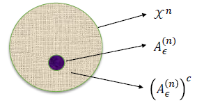
4. $\left|A_{\epsilon}^{(n)}\right| \geq(1-\epsilon) 2^{n(H(X)-\epsilon)}$ for $n$ sufficiently large.
   **Proof.** For sufficiently large $n, \operatorname{Pr}\left\{A_{\epsilon}^{(n)}\right\}>1-\epsilon,$ so that
   $$\begin{aligned}
    & 1-\epsilon<\operatorname{Pr}\left\{A_{e}^{(n)}\right\} \\
    \leq & \sum_{x \in A_{\epsilon}^{(n)}} 2^{-n(H(X)-\epsilon)} \\
    =& 2^{-n(H(X)-e)}\left|A_{e}^{(n)}\right|
    \end{aligned}$$
    Thus $\left|A_{\epsilon}^{(n)}\right| \geq(1-\epsilon) 2^{n(H(X)-\epsilon)}$

### High Probability Set
给出更宽泛的定义, 高概率集
**Definition** For each $n=1,2, \ldots,$ let $B_{\delta}^{(n)} \subseteq x^{n}$ be the smallest set with
$$\operatorname{Pr}\left\{B_{\delta}^{(n)}\right\} \geq 1-\delta$$

**Theorem** 高概率集元素大小的下界 Let $X_{1}, X_{2}, \ldots, X_{n}$ be i.i.d $\sim p(x) .$ For $\delta<\frac{1}{2}$ and any $\delta^{\prime}>0,$ if $\operatorname{Pr}\left\{B_{\delta}^{(n)}\right\} \geq 1-\delta,$ then 
$$\frac{1}{n} \log \left|B_{\delta}^{(n)}\right|>H-\delta^{\prime}$$
for $n$ sufficiently large.

高概率集和$2^{nH}$是同阶的, 我们可以说典型集可能是最小的高概率集.

**Intuition** As $A_{\epsilon}^{(n)}$ has $2^{n(H \pm \epsilon)}$ elements, $\left|B_{\delta}^{(n)}\right|$ and $\left|A_{\epsilon}^{(n)}\right|$ are equal to the first order in the exponent
Idea: 高概率集和典型集的概率分布的交集应该也是很大的, 否则缺失会比较严重, 会与1有明显的差距. 因此我们的证明就是研究$\operatorname{Pr}\left(A_{\epsilon}^{(n)} \cap B_{\delta}^{(n)}\right)$

**Proof.** For any two sets $A, B,$ if $\operatorname{Pr}(A) \geq 1-\epsilon_{1} \operatorname{Pr}(B) \geq 1-\epsilon_{2},$ then $\operatorname{Pr}(A \cap B)>1-\epsilon_{1}-\epsilon_{2}$ 首先从概率意义上得到一个trivial的结论

$$\begin{array}{l}
1-\epsilon-\delta \leq \operatorname{Pr}\left(A_{\epsilon}^{(n)} \cap B_{\delta}^{(n)}\right)=\sum_{A_{\epsilon}^{(n)} \cap B_{\delta}^{(n)}} p\left(x^{n}\right) \leq \sum_{A_{\epsilon}^{(n)} \cap B_{\delta}^{(n)}} 2^{-n(H-\epsilon)} \\ 
=\left|A_{\epsilon}^{(n)} \cap B_{\delta}^{(n)}\right| 2^{-n(H-\epsilon)} \leq\left|B_{\delta}^{(n)}\right| 2^{-n(H-\epsilon)}
\end{array}$$
得出结论: 高概率集必定占据了典型集大部分的空间
$$\left|B_{\delta}^{(n)}\right| \geq\left|A_{\epsilon}^{(n)} \cap B_{\delta}^{(n)}\right| \geq 2^{n(H-\epsilon)}(1-\epsilon-\delta)$$

## Data Compression
数据源(iid) $X^n = (X_1,...,X_n)$ ----> Encoder ----m bits --> Decoder --> $\hat{X}^n$

### Problem Formulation
- Source: $X_{1}, X_{2}, \ldots,$ are i.i.d. $\sim p(X) .$数据源, iid的假设虽然有时对实际问题过于强, 但理论上是需要的
- Source sequences: $X^{n}=\left(X_{1}, \ldots, X_{n}\right)$ denotes the $n$ -tuple that represents a sequence of $n$ source symbols
- Alphabet: $x=\{1,2, \ldots,|x|\}-$ the possible values that each $X_{i}$ can take on 
- Encoder and decoder are a pair of functions $f, g$ such that $$f: x \rightarrow\{0,1\}^{*}$ and $g:\{0,1\}^{*} \rightarrow x$$ 
- Probability of error $P_{e}=P\left(X^{n} \neq \bar{X}^{n}\right)$ 我们通过解码器获得信息, 希望解码后的错误率能够在n很大时,无穷趋向于0
  - If $P_{e}=0,$ "lossless" 无损编码, otherwise "lossy" 有损编码
- The rate of a scheme 码率: $R=\frac{m}{n}(R=\log |X| \text { is trivial! })$ n个随机变量用m个码来编, 这里的R不一定是最优的, 我们希望找到尽可能小的R.(及其对应的encoder,decoder)
ToDo: Find an encoder and decoder pair such that $P_{e} \rightarrow 0$, as $n \rightarrow \infty$

### Procedure

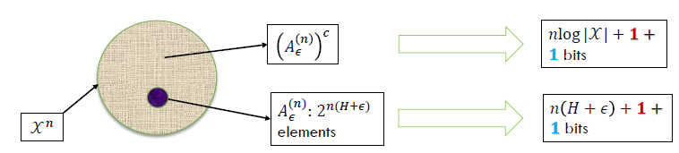
实际中, 我们没有必要给每个样本相同的编码长度, 我们要对样本空间进行划分. 比如, 对典型集等高概率集区分开来
- 非典型集中, 我们至少需要 $n\log|\mathcal{X}| + 1 + 1$ 1个bit凑整,另一个bit用以区分非典型集
- 典型集需要 $n(H+\epsilon) + 1 + 1$区分

Divide and conquer: $x^{n} \in A_{\epsilon}^{(n)}$ and $x^{n} \notin A_{\epsilon}^{(n)}$
- $x^{n} \in A_{\epsilon}^{(n)}:$
  - since there are $\leq 2^{n(H+\epsilon)}$ sequences in $A_{\epsilon}^{(n)},$ the indexing requires no more than $n(H+$ $\left.e^{\epsilon}\right)+1$ bits. $[\text { The extra bit may be necessary because } n(H+\epsilon)$ may not be an integer.] 
- $x^{n} \notin A_{\epsilon}^{(n)}:$
  - Slimilarly, we can index each sequence not in $A_{\epsilon}^{(n)}$ by using not more than $n \log |X|+1$ bits.
- To deal with overlap in the $\{0,1\}$ sequences, 但这样的编码可能会带来冲突, 比如{0,0},{0,0}, 所以我们在起始位置再加一位进行区分
  - We prefix all these sequences by a 0 , giving a total length of $\leq n(H+\epsilon)+2$ bits to represent each sequence in $A_{\epsilon}^{(n)}$
  - Prefixing these indices by 1 , we have a code for all the sequences in $X^{n}$.

### Analysis

分析一下期望长度.
$$\begin{aligned}
E\left(l\left(X^{n}\right)\right) &=\sum_{x^{n}} p\left(x^{n}\right) l\left(x^{n}\right) \\
&=\sum_{x^{n} \in A_{\epsilon}^{(n)}} p\left(x^{n}\right) l\left(x^{n}\right)+\sum_{x^{n} \in A_{\epsilon}^{(n)}} p\left(x^{n}\right) l\left(x^{n}\right) \\
& \leq \sum_{x^{n} \in A_{\epsilon}^{(n)}} p\left(x^{n}\right)(n(H+\epsilon)+2)+\sum_{x^{n} \in A_{\epsilon}^{(n)}} p\left(x^{n}\right)(n \log |x|+2) \\
&=\operatorname{Pr}\left\{A_{\epsilon}^{(n)}\right\}(n(H+\epsilon)+2)+\operatorname{Pr}\left\{\left(A_{\epsilon}^{(n)}\right)^{c}\right\}(n \log |x|+2) \\
& \leq n(H+\epsilon)+\epsilon n(\log |x|)+2 \\
&=n\left(H+\epsilon^{\prime}\right) \text{ (}\epsilon^{\prime}\text{是另一个同样一阶的无穷小量)}
\end{aligned}$$

导出平均长度的期望值是以$H(X)$为上界的
$$E\left[\frac{1}{n} l\left(X^{n}\right)\right] \leq H(X)+\epsilon$$

Thus, we can represent sequences $X^n$ using $nH(X)$ bits on the average. 才能保证恢复

为了说明这一点, 我们还要说明H(X)是最小的码率
**Converse** For any scheme with rate $r<H(X), P_{e} \rightarrow 1$ 不仅不趋向于0, 而且直接趋向于1
**Proof.** Let $r=H(X)-\epsilon .$ For any scheme with rate $r,$ it can encode at most $2^{n r}$ different symbols in $\mathcal{X}^{n} .$ The correct decoding probability is $\approx 2^{n r} 2^{-n H}=2^{-n(H-r)} \rightarrow 0$
Thus, $P_e \rightarrow 1$

# 0318 Entropy Rate

AEP研究了独立同分布的随机变量列, 我们希望得到更广泛的结论.

## Stochastic Process

### Introduction
A stochastic process $\left\{X_{i}\right\}$ is an indexed sequence of random variables.

一个例子: 赌徒的破产.
- 下一局的输赢概率与上一局无关
- p概率得1元,1-p概率丢一元
- 得到 $X_{i+1}=X_{i} \pm 1$
- Thus $X_{i}$ 's are not i.i.d.

### Stationary Process
**Definition** A stochastic process is said to be
stationary (稳态) if the **joint distribution** of _**any subset**_ **of the sequence of random variables is invariant** with respect to shifts in the time
index; that is, 任意随机变量的分布按照时间平移,得到的联合概率分布是不变的.
$$\begin{aligned}
& \operatorname{Pr}\left\{X_{1}=x_{1}, X_{2}=x_{2}, \ldots, X_{n}=x_{n}\right\} \\
=& \operatorname{Pr}\left\{X_{1+l}=x_{1}, X_{2+l}=x_{2}, \ldots, X_{n+l}=x_{n}\right\}
\end{aligned}$$
for every $n$ and every shift $l$ and for all $x_{1}, x_{2}, \ldots, x_{n} \in X$

**性质**:
1. 平移不变性:
   - $p\left(X_{1}\right)=p\left(X_{2}\right)=\cdots=p\left(X_{n}\right)$
   - $p\left(X_{1}, X_{3}\right)=p\left(X_{2}, X_{4}\right) \dots$
2. 高斯过程是一个稳态过程
3. 达到稳定状态后的马尔可夫链, 同分布而不独立
4. 我们的定义中只说明了稳态的分布, 这是强稳态, 与之相对应的是弱稳态. 在使用时, 两者没有严格的推出关系

通过稳态分布的定义, 我们可以证明一些结论.
**Theorem** 时间单向性, Time's arrow. Let $\left\{X_{i}\right\}_{i=-\infty}^{\infty}$ be a stationary stochastic process. Prove that
$$H\left(X_{0} | X_{-1}, X_{-2}, \dots, X_{-n}\right)=H\left(X_{0} | X_{1}, X_{2}, \dots, X_{n}\right)$$
即时间上的前后行动对系统没有影响.

**Proof.** 平移不变性, 首先有相同分布$H\left(X_{-n}, \dots, X_{0}\right)=H\left(X_{0}, \dots, X_{n}\right)$, $H\left(X_{-n}, \ldots, X_{-1}\right)=H\left(X_{1}, \ldots, X_{n}\right)$. 相减得证.

### Markov Chain

The Markov chain is said to be **time invariant** if the conditional probability $p\left(x_{n+1} | x_{n}\right)$ does not depend on $n ;$ that is, for $n=1,2, \ldots$
$$\operatorname{Pr}\left\{X_{n+1}=b | X_{-} n=a\right\}=\operatorname{Pr}\left\{X_{2}=b | X_{1}=a\right\} \quad \text{for all } a, b \in X$$
We will assume that the Markov chain **is time invariant unless otherwise stated**
A time-invariant Markov chain is characterized by its initial state =and a probability transition matrix $P=\left[P_{i j}\right], i, j \in\{1,2, \ldots, m\},$ where
$$P_{i j}=\operatorname{Pr}\left\{X_{n+1}=j | X_{n}=i\right\}$$
Example:
- Gambler's ruin
- Random Walk

### Stationary Distribution of MC
- By the definition of stationary, a Markov chain is stationary iff $p\left(X_{n+1}\right)=p\left(X_{n}\right)$
- If the probability mass function at time $n$ is $p\left(x_{n}\right)$, then
$$
p\left(x_{n+1}\right)=\sum_{x_{n}} p\left(x_{n}\right) P_{x_{n} x_{n+1}} \text { or } x^{T} P=x^{T}
$$
- If the initial state of a Markov chain is drawn according to a stationary distribution, the Markov chain is stationary
- Example: Consider a two state Markov chain with a probability transition matrix
$$P=\left[\begin{array}{cc}1-\alpha & \alpha \\ \beta & 1-\beta\end{array}\right]$$

$$\left(\mu_{1}, \mu_{2}\right)\left[\begin{array}{cc}
1-\alpha & \alpha \\
\beta & 1-\beta
\end{array}\right]=\left(\mu_{1}, \mu_{2}\right)$$

另解, 对小规模的网络, 由最大流-最小割定理, 考虑任意割集之间的流进与流出概率为0, For stationary distribution, the net probability flow across any cut set in zero
$$\mu_{1} \alpha=\mu_{2} \beta$$
$$\begin{array}{c}
\mu_{1}+\mu_{2}=1 \\
\mu_{1}=\frac{\beta}{\alpha+\beta} \text { and } \mu_{2}=\frac{\alpha}{\alpha+\beta}
\end{array}$$

## Entropy Rate
对复杂系统, 我们难以用一个时刻随机变量的熵, 我们希望描述熵的演化形式. 我们取系统联合熵的极限.
**Definition** The entropy rate of a stochastic process $\left\{X_{i}\right\}$ is defined by
$$
H(x)=\lim _{n \rightarrow \infty} \frac{1}{n} H\left(X_{1}, X_{2}, \ldots, X_{n}\right)
$$
when the limits exists(熵率也可能不存在)

计算方式: 
$$H\left(X_{n}, \dots, X_{1}\right)=\sum_{i=1}^{n} H\left(X_{i} | X_{i-1}, \dots, X_{1}\right)$$
For $H\left(X_{i} | X_{i-1}, \ldots, X_{1}\right),$ we now need to make clear of
- the existence of 
  $$\lim _{n \rightarrow \infty} H\left(X_{n} | X_{n-1}, \ldots, X_{1}\right)$$
- In a series $\left\{a_{n}\right\},$ if $a_{n} \rightarrow a,$ the existence of
$$
\lim _{n \rightarrow \infty} \frac{1}{n} \sum_{i=1}^{n} a_{i}
$$

### H'(X)

对稳态随机过程, 我们有如下性质: 
**Theorem** For a stationary stochastic process, $H\left(X_{n} | X_{n-1}, \ldots, X_{1}\right)$ is nonincreasing in $n$ and has a limit.
**Proof.** 
$$\begin{aligned}
& H\left(X_{n+1} | X_{n}, \ldots, X_{1}\right) \\
\leq & H\left(X_{n+1} | X_{n}, \ldots, X_{2}\right) \\
=& H\left(X_{n} | X_{n-1}, \ldots, X_{1}\right) \\
H &\left(X_{n} | X_{n-1}, \ldots, X_{1}\right) \geq 0
\end{aligned}$$
根据数列极限的结论(MCT): since $\left\{H\left(X_{n} | X_{n-1}, \ldots, X_{1}\right)\right\}$ is nonincreasing and $H\left(X_{n} | X_{n-1}, \ldots, X_{1}\right) \geq 0,$ the limit exists.

**Define**
$$H^{\prime}(x)=\lim _{n \rightarrow \infty} H\left(X_{n} | X_{n-1}, X_{n-2}, \ldots, X_{1}\right)$$
we have The limits $H^{\prime}(x)$ exists

### Cesaro Mean
Recall in Calculus, 
$$\text { If } a_{n} \rightarrow a \text { and } b_{n}=\frac{1}{n} \sum_{i=1}^{n} a_{i}, \text { then } b_{n} \rightarrow a$$
**Proof.**
Let $\epsilon>0 .$ since $a_{n} \rightarrow a$, there exists a number $N(\epsilon)$ such that $\left|a_{n}-a\right| \leq \epsilon$ for all $n \geq N(\epsilon) .$ Hence
$$\begin{aligned}
\left|b_{n}-a\right| &=\left|\frac{1}{n} \sum_{i=1}^{n}\left(a_{i}-a\right)\right| \\
& \leq \frac{1}{n} \sum_{i=1}^{n}\left|\left(a_{i}-a\right)\right| \\
& \leq \frac{1}{n} \sum_{i=1}^{N(c)}\left|a_{i}-a\right|+\frac{n-N(\epsilon)}{n} \epsilon \\
& \leq \frac{1}{n} \sum_{i=1}^{N(\epsilon)}\left|a_{i}-a\right|+\epsilon
\end{aligned}$$
Thus, $\left|b_{n}-a\right| \leq \epsilon^{\prime},$ for all $n \geq N(\epsilon)$.

### Entropy Rate for Stationary Process

**Theorem.** For a **stationary stochastic process**, the limits in $H(X)$ and $H^{\prime}(X)$ exist and are equal:
$$
H(x)=H^{\prime}(x)
$$
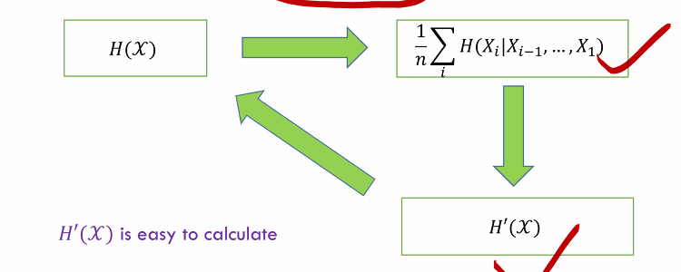

### Entropy Rate for Markov Chain

For a _**stationary**_ **Markov chain**, the entropy rate is given by
$$
\begin{aligned}
H(x) &=H^{\prime}(x)=\lim H\left(X_{n} | X_{n-1}, \ldots, X_{1}\right)=\lim H\left(X_{n} | X_{n-1}\right) \\
&=H\left(X_{2} | X_{1}\right)
\end{aligned}
$$
where the conditional entropy is calculated using the given stationary distribution.

Recall that the stationary distribution $\mu$ is the solution of the equations
$$
\mu_{j}=\sum_{i} \mu_{i} P_{i j} \text { for all } j
$$

**Theorem** Let $\left\{X_{i}\right\}$ be a stationary Markov chain with stationary distribution $\mu$ and transition matrix $P .$
Let $X_{1} \sim \mu$. Then the entropy rate is
$$
H(x)=-\sum_{i j} \mu_{i} P_{i j} \log P_{i j}
$$
**Proof.** 
$$H(x)=H\left(X_{2} | X_{1}\right)=\sum_{i} p\left(x_{i}\right) H\left(X_{2} | X_{1}=x_{i}\right)=\sum_{i} \mu_{i}\left(\sum_{j}-P_{i j} \log P_{i j}\right)$$

### Example: Random Walk

Undirected graph with weight $W_{i j} \geq 0$ and $W_{i j}=W_{j i}$
我们计算如下参量, 解题思路:
$$
\begin{array}{c}
P_{i j}=W_{i j} / \sum_{k} W_{i k} \\
W_{i}=\sum_{j} w_{i j}
\end{array}
$$
$W=\sum_{i} \frac{W_{i}}{2}$
The stationary distribution is
$$
\mu_{i}=\frac{W_{i}}{2 W}
$$
Verify it by $\mu P=\mu$
$$
\begin{array}{l}
H(x)=H\left(X_{2} | X_{1}\right) \\
=H\left(\ldots \frac{W_{i j}}{2 W}, \ldots\right)-H\left(\ldots, \frac{W_{i}}{2 W}, \ldots\right)
\end{array}
$$

## Second Law of Thermodynamics

Intuition: 我们观测的状态会受到基本原则的控制. 我们将物理过程抽象成马尔可夫链, 基本原理则抽象成转移矩阵

- One of the basic laws of physics, the second law of thermodynamics, states that the entropy of an isolated system is nondecreasing.
- We model the isolated system as a **Markov chain with transitions obeying the physical laws governing the system**.
  - Implicit in this assumption is the notion of an overall state of the system and the fact that knowing the present state, the future of the system is independent of the past.

Some Results
- Relative entropy $\mathrm{D}\left(\mu_{\mathrm{n}} \| \mu_{\mathrm{n}}^{\prime}\right)$ decreases with $n$ 
  (Pf. by 相对熵链式法则, 因为转移矩阵是不变的, 系统会趋于稳定)
- The conditional entropy $H\left(X_{n} | X_{1}\right)$ increases with $n$ for a stationary Markov process
- Shuffles increase entropy: $H(TX) \geq H(X)$ 

Reference: Neri Merhav (2010), “Statistical Physics and Information Theory,” Foundations and Trends® in Communications and Information Theory

## Extension: Functions of Markov Chains
本节的重点是熵率的性质, 此处介绍一个算法, 了解即可.

问题背景: 我们通过一些现象知道了一些看不见物质的存在. 我们用$X$表示看不到的现象, 他们通过一些物理法则, $\Phi$ 生成了现象$Y$. 如果$X$是稳态的, 我们如何计算观测结果的熵率?

> $$
> \begin{array}{ccccc}
> X_{1} & X_{2} & \ldots & X_{n} & \ldots \\
> \downarrow & \downarrow & \ldots & \downarrow & \ldots \\
> Y_{1}=\phi\left(X_{1}\right) & Y_{2}=\phi\left(X_{2}\right) & \ldots & Y_{n}=\phi\left(X_{n}\right) & \ldots
> \end{array}
> $$
> Let $X_{1}, X_{2}, \ldots, X_{n}, \ldots$ be a stationary Markov chain, and let $Y_{i}=\phi\left(X_{i}\right)$ be a process each term of which is a function of the corresponding state in the Markov chain. What is the entropy rate of $H(y)$ ?

- $\left\{Y_{i}\right\}:$ A very special case of hidden Markov model (HMM) 隐马尔科夫模型, 在信号处理等情况下十分常见
- $\left\{Y_{i}\right\}$ is not a Markov chain in general 并不一定是马尔可夫链, 因为Y取决于单个X的取值. 我们是无法直接得到Y之间的状态转移矩阵.
- $\left\{X_{i}\right\}$ is stationary $\Rightarrow\left\{Y_{i}\right\}$ is stationary, 但稳态分布是肯定的, 熵率还是可以通过求条件熵的极限获得
$$
H(\boldsymbol{y})=\lim _{\boldsymbol{n} \rightarrow \infty} \boldsymbol{H}\left(\boldsymbol{Y}_{\boldsymbol{n}} | \boldsymbol{Y}_{\boldsymbol{n}-\mathbf{1}}, \ldots, \boldsymbol{Y}_{\mathbf{1}}\right)
$$
- Drawback: Hard to ensure the convergence by $n$
- Solution: We have already known that $H\left(Y_{n} | Y_{n-1}, \ldots, Y_{1}\right)$ is lower bounded by $H(Y)$ 已知熵率是条件熵的下界.
  - Find a lower bound for $H(y)$ which is close to $H\left(Y_{n} | Y_{n-1}, \ldots, Y_{1}\right)$
- Let's have a look at $X_{1}$
  - $X_{1}$ contains much information about $Y_{n}$ as $Y_{1}, Y_{0}, Y_{-1}, \ldots \ldots$
$$
\boldsymbol{H}\left(\boldsymbol{Y}_{\boldsymbol{n}} | \boldsymbol{Y}_{\boldsymbol{n}-\mathbf{1}}, \ldots, \boldsymbol{Y}_{\mathbf{1}}, \boldsymbol{X}_{\mathbf{1}}\right)
$$
$\left(Y_{1} \text { could be ignored }\right)$ 这是没问题的, 因为$Y_1$是$X_1$的函数.

**Theorem.** If $X_{1}, X_{2}, \ldots, X_{n}$ form a stationary Markov chain, and $Y_{i}=\phi\left(X_{i}\right),$ then
$$
H\left(Y_{n} | Y_{n-1}, \ldots, Y_{1}, X_{1}\right) \leq H(y) \leq H\left(Y_{n} | Y_{n-1}, \ldots, Y_{1}\right)
$$
and $\lim {\boldsymbol{H}\left(\boldsymbol{Y}_{\boldsymbol{n}} | \boldsymbol{Y}_{\boldsymbol{n}-\mathbf{1}}, \ldots, \boldsymbol{Y}_{\mathbf{1}}, \boldsymbol{X}_{\mathbf{1}}\right)}=\boldsymbol{H}(\boldsymbol{y})=\lim \boldsymbol{H}\left(\boldsymbol{Y}_{\boldsymbol{n}} | \boldsymbol{Y}_{\boldsymbol{n}-\mathbf{1}}, \ldots, \boldsymbol{Y}_{\mathbf{1}}\right)$ 我们希望运用夹逼定理.

**Proof.** 
1. (handled) Y的条件熵是熵率的上界
2. 带$X_1$的条件熵是熵率的下界
   运用马尔可夫链的性质添加负项, 挪去条件熵增大, 应用平移不变性, 发现递减, 运用MCT
$$\begin{aligned}
& H\left(Y_{n} | Y_{n-1}, \ldots, Y_{2}, X_{1}\right) \\
=& H\left(Y_{n} | Y_{n-1}, Y_{2}, Y_{1}, X_{1}\right) \\
=& H\left(Y_{n} | Y_{n-1}, \ldots, Y_{1}, X_{1}, X_{0}, X_{-1}, \ldots, X_{-k}\right) \\
=& H\left(Y_{n} | Y_{n-1}, \ldots, Y_{1}, X_{1}, X_{0}, X_{-1}, \ldots, X_{-k}, Y_{0}, \ldots, Y_{-k}\right) \\
\leq & H\left(Y_{n} | Y_{n-1}, \ldots, Y_{1}, Y_{0}, \ldots, Y_{-k}\right) \\
=& H\left(Y_{n+k+1} | Y_{n+k}, \ldots, Y_{1}\right) \\
k & \rightarrow \infty \\
& H\left(Y_{n} | Y_{n-1}, \ldots, Y_{2}, X_{1}\right) \leq H(\mathcal{Y})
\end{aligned}$$
3. 带$X_1$条件下, 随着$n$的增大, 不等式两边熵无限接近, 即研究互信息趋向于0. 
$$H\left(Y_{n} | Y_{n-1}, \ldots, Y_{1}\right)-H\left(Y_{n} | Y_{n-1}, \ldots, Y_{1}, X_{1}\right) = I\left(X_{1} ; Y_{n} | Y_{n-1}, \ldots, Y_{1}\right)$$
首先注意到互信息小于熵
$$
I\left(X_{1} ; Y_{1}, Y_{2}, \ldots, Y_{n}\right) \leq H\left(X_{1}\right)
$$
这在极限条件下也成立, 运用链式法则展开
$$\begin{aligned}
H\left(X_{1}\right) &\geq \lim _{n \rightarrow \infty} I\left(X_{1} ; Y_{1}, Y_{2}, \ldots, Y_{n}\right)\\
&=\lim _{n \rightarrow \infty} \sum_{i=1}^{n} I\left(X_{1} ; Y_{i} | Y_{i-1}, \ldots, Y_{1}\right)\\
&=\sum_{i=1}^{\infty} I\left(X_{1} ; Y_{i} | Y_{i-1}, \ldots, Y_{1}\right)\\
\end{aligned}$$
无穷级数, 每一项都是正的, 极限存在, 那么对n足够大级数项趋向于0.
$$\begin{aligned}
&\begin{array}{c}
I\left(X_{1} ; Y_{n} | Y_{n-1}, \ldots, Y_{2}, Y_{1}\right) \rightarrow 0 \\
\| \\
\left(Y_{n} | Y_{n-1}, \ldots, Y_{2}, Y_{1}\right)-H\left(Y_{n} | Y_{n-1}, \ldots, Y_{1}, X_{1}\right)
\end{array}
\end{aligned}$$

# 0323 Data Compression (1)

## Example of Codes

Let $X$ be a random variable with the following distribution and codeword assignment:
$$\begin{array}{ll}
\operatorname{Pr}(X=1)=1 / 2, & \text { codeword } C(1)=0 \\
\operatorname{Pr}(X=2)=1 / 4, & \text { codeword } C(2)=10 \\
\operatorname{Pr}(X=3)=1 / 8, & \text { codeword } C(3)=110 \\
\operatorname{Pr}(X=4)=1 / 8, & \text { codeword } C(4)=111
\end{array}$$

- Without of loss of generality, we can assume that the $D$ -ary alphabet is $\mathcal{D}=$ $\{0,1, \ldots, D-1\}$. 二进制中,D=2
- 信源编码 $C$ for a random variable $X$ is a mapping from $X$ to $D^{*}$, the set of finite-length strings of symbols from a D-ary (D元组) alphabet.
- Let $C(x)$ denote the codeword corresponding to $x$ and let $l(x)$ denote the length of $C(x)$
- The expected length $L(C)$ of a source code $C(x)$ for a random variable $X$ with probability mass function $p(x)$ is given by
$$L(C)=\sum_{x \in X} p(x) l(x)$$
  - What is min $L(C)$
  - How to construct such an optimal code
- Recall 在AEP中,码率大于等于熵

## Nonsingular Code
- 编码系统不希望两个字母有同样的编码. A code is said to be nonsingular if every element of the range of $X$ maps into $a$ different string in $D^{*} ;$ that is,
$$x \neq x^{\prime} \Rightarrow C(x) \neq C\left(x^{\prime}\right)$$
- 定义编码的连接 The extension $C^{*}$ of a code $C$ is the mapping from finite length strings of $X$ to finite-length strings of $D,$ defined by
  $$C\left(x_{1} x_{2} \ldots x_{n}\right)=C\left(x_{1}\right) C\left(x_{2}\right) \ldots C\left(x_{n}\right)$$

唯一可解码, 在扩展是非奇异的情况下, 编码是可解码的. A code is called uniquely decodable if its extension is nonsingular.
- In other words, any encoded string in a uniquely decodable code has only one possible source string producing it.

在对系统要求更高的情况下, 我们希望实时的解码, 
- 前缀码: 任意编码都不是另一个码的前缀
- 后缀码: 任意编码都不是另一个码的后缀
How to construct?\

### Prefix Code

由前缀码的性质, 我们可以用一些良好的结构描述编码方式.

如, 我们用三叉树表示三进制的码制.
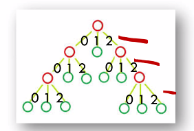

我们也可以用区间来表示.
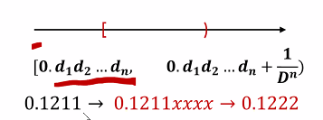
各个码制对应的左闭右开区间是$[0,1)$的一个互不相交的分割.

### Kraft Inequality
从数学上解决了前缀码存在的一个重要条件.
(Kraft Inequality 1949 ) For any instantaneous code (prefix code) over an alphabet of size
$D,$ the codeword lengths $l_{1}, l_{2}, \ldots, l_{m}$ must satisfy the inequality 
$$\sum_{i=1}^{m} D^{-l_{i}} \leqq 1$$
Conversely, given a set of codeword lengths that satisfy this inequality, there exists an instgntgneous code with these word lengths.

任意两个码制对应的路径是互相不能覆盖的. 当我选定一个路径之后, 我就不可能再将路径的终点展开(叶子转换成子树).

任意两个码制对应的路径是互相不能覆盖的. 当我选定一个路径之后, 我就不可能再将路径的终点展开(叶子转换成子树).

Assume $l_{1} \leq l_{2} \ldots \leq l_{m}$ (The maximum depth is $\left.l_{m}\right)$

- For $l_{i},$ it "occupied" a subtree in size $D^{l_{m}-l_{i}}$ 它把接下来的空间覆盖了

- The aggregate size of subtrees $$ \sum_{i=1}^{m} D^{l_{m}-l_{i}} $$

- 对D叉树, 在$l_m$层有必要条件 $$ \sum_{i=1}^{m} D^{l_{m}-l_{i}} \leq D^{l_{m}} \Rightarrow \text { "only } i f^{\prime \prime} $$

- "if": mathematical induction 利用对m进行数学归纳法证明充分性

- m-1: 

   $$ \sum_{i=1}^{m-1} D^{l_{m}-l_{i}} < D_{l_m} $$

- 一定存在没有覆盖的m

### Extended Kraft Inequality

(Extended Kraft Inequality) For any countably infinite set of codewords that form a prefix code, the codeword lengths satisfy the extended Kraft inequality,
$$\sum_{i=1}^{\infty} D^{-l_{i}} \leq 1$$
Conversely, given any $l_{1}, l_{2}, \ldots$ satisfying the extended Kraft inequality, we can construct a prefix code with these codeword lengths.

证明上, 树的表示不再适用. 我们用区间的方法.

必要性:

Let the D-ary alphabet be $\{0,1, \ldots, D-1\} .$ Consider the $i$ th codeword $y_{1} y_{2} \ldots y_{l_{i}}$
Let $0 . y_{1} y_{2} \ldots y_{l_{i}}$ be the real number given by the D-ary expansion
$$0 . y_{1} y_{2} \dots y_{l_{i}}=\sum_{j=1}^{l_{i}} y_{l_{j}} D^{-j}$$

This codeword corresponds to the interval
$$
\left[0 . y_{1} y_{2} \dots y_{i_{i}}, 0 . y_{1} y_{2} \dots y_{l_{i}}+\frac{1}{D^{l_{i}}}\right)
$$
- This is a subinterval of the unit interval [0,1
- By the prefix condition, these intervals are disjoint.

充分性:
将$l_1,l_2$递增排序, 从左往右依次切割[0,1]区间, 就可以构造前缀码.

## Optimal Codes

### Problem Formulation
Kraft inequality gives a mathematical expression on the existence of prefix code The problem of finding the prefix code with the minimum expected length could be formulated as a standard optimization problem
$$
\min L=\sum p_{i} l_{i}
$$
such that $\sum D^{-l_{i}} \leq 1$

考虑到$l_i$是整数较为复杂, 我们首先考虑实数的情况

By Lagrange, their gradient vectors are parallel $\nabla f(X)=\lambda \nabla g$

### Solution

The Lagrange multipliers
$$J=\sum p_{i} l_{i}+\lambda\left(\sum D^{-l_{i}}-1\right)$$
Differentiating with respect to $l_{i},$ we obtain
$$
\frac{\partial J}{\partial l_{i}}=p_{i}-\lambda D^{-l_{i}} \log _{e} D
$$
Setting the derivatives to $0,$ we obtain
$$
D^{-l_{i}}=\frac{p_{i}}{\lambda \log _{e} D}
$$
又因为$\sum D^{-l_i} = 1$

Substituting this in the constraint to find $\lambda$, we find $\lambda=1 / \log _{e} D,$ and hence
$$
\boldsymbol{p}_{i}=\boldsymbol{D}^{-\boldsymbol{l}_{i}}
$$
yielding optimal code lengths,
$$
l_{i}^{*}=-\log _{D} p_{i}
$$
This noninteger choice of codeword lengths yields expected codeword length
$$
L^{*}=\Sigma p_{i} l_{i}^{*}=\Sigma-p_{i} \log p_{i}=H_{D}(X)
$$
不一定是整数取得到, 但这可以是一个下界.
In general, $H_{D}(X)$ cannot be attained
$$
\boldsymbol{L}^{*} \geq \boldsymbol{H}_{\boldsymbol{D}}(\boldsymbol{X})
$$

然而, 我们通过推导得知, 在最优情况下, 有下面的关键关系.
$$\begin{aligned}
&p_{i}=D^{-l_{i}}\\
&l_{i}=-\log p_{i}
\end{aligned}$$

### Bounds

进一步, 码制在最优情况下的平均情况能满足以下不等式, 得到最优编码的上界是熵+1bit
Let $l_{1}^{*}, l_{2}^{*}, \ldots, l_{m}^{*}$ be optimal codeword lengths for a source distribution $\mathbf{p}$ and $D$ - ary alphabet, and let $L^{*}$ be the associated expected length of an optimal code $\left(L^{*}=\sum p_{i} l_{i}^{*}\right)$ Then
$$H_{D}(X) \leq L^{*}<H_{D}(X)+1$$

**Proof.**
向上取整
Recall that $p_{i}=D^{-l_{i}}$ and $l_{i}=-\log _{\mathrm{D}} p_{i}$
since $\log _{D} \frac{1}{p_{i}}$ may not equal to an integer, we round it up to give integer word-length assignments,
$$
l_{i}=\left|\log _{D} \frac{1}{p_{i}}\right| \Rightarrow \text { Shamon codes }
$$
我们可以验证新的编码长度满足Kraft不等式(由prefix区间不相交的性质保证)
Check $l_{i}^{\prime}$ s satisfying Kraft inequality.
$$
\log _{D} \frac{1}{p_{i}} \leq l_{i}<\log _{D} \frac{1}{p_{i}}+1
$$
Take expectations
$$
H_{D}(X) \leq L<H_{D}(X)+1
$$
下节课我们会继续介绍能否消除一个bit

## Approach the limit
将n个随机变量一同统一处理
Encode $n$ symbols $X_{1}, X_{2}, \ldots, X_{n}$ on $X$ together, where $X_{i}^{\prime} s$ are i.i.d $\sim p(x)$ Denote the alphabet by $\mathcal{X}^{n}$整体字母表, the expected codeword length by $L_{n},$ the length of codeword associated with $\left(x_{1}, x_{2}, \ldots, x_{n}\right)$ by $l\left(x_{1}, x_{2}, \ldots, x_{n}\right)$
$$
L_{n}=\frac{1}{n} \sum p\left(x_{1}, x_{2}, \ldots, x_{n}\right) l\left(x_{1}, x_{2}, \ldots, x_{n}\right)=\frac{1}{n} E l\left(X_{1}, X_{2}, \ldots, X_{n}\right)
$$
我们计算的是per symbol,所以记得除以n
Treat $X_{1}, X_{2}, \ldots, X_{n}$ as a whole and apply the lower bound aforementioned
$$
H\left(X_{1}, X_{2}, \ldots, X_{n}\right) \leq E l\left(X_{1}, X_{2}, \ldots, X_{n}\right)<H\left(X_{1}, X_{2}, \ldots, X_{n}\right)+1
$$
since $X_{i}^{\prime} s$ are i.i.d, $H\left(X_{1}, X_{2}, \ldots, X_{n}\right)=n H(X)$
$$
H(X) \leq L_{n} \leq H(X)+\frac{1}{n}
$$

定理: 区块编码
(Theorem.) The minimum expected codeword length per symbol statisfies
$$
\frac{H\left(X_{1}, X_{2}, \ldots, X_{n}\right)}{n} \leq L^{*}<\frac{H\left(X_{1}, X_{2}, \ldots, X_{n}\right)}{n}+\frac{1}{n}
$$
Moreover, if $X_{1}, X_{2}, \ldots, X_{n}$ is a stationary stochastic process,
$\rightarrow 11$

当n很大时, 期望以熵率为极限, 通过这种方式, 我们可以通过逼近的方式把+1bit去掉, 但坏处是字母表太大了$|\mathcal{X}|^n$码制数量是指数级的. 但至少, 系统的熵率是编码问题的极限.

## Wrong Code

What happens to the expected description length if the code is designed for the wrong distribution $(q(x)) .$ For example, the wrong distribution may be the best estimate that we can make of the unknown true distribution.

Recall 相对熵衡量随机变量之间的距离. 

(Wrong code) The expected length under $p(x)$ of the code assignment $l(x)=\log \frac{1}{q(x)}$ satisfies
$$
H(p)+D(p \| q) \leq E_{p} l(x)<H(p)+D(p \| q)+1
$$

$D(p \| q)$ 是我们估计产生偏差的惩罚项, 这是难以避免的, 但我们可以用数值量化.

$$\begin{aligned}
E l(x) &=\sum_{x} p(x)\left[\log \frac{1}{q(x)}\right] \\
&<\sum_{x} p(x)\left(\log \frac{1}{q(x)}+1\right) \\
&=\sum_{x} p(x) \log \frac{p(x)}{q(x)} \frac{1}{p(x)}+1 \\
&=\sum_{x} p(x) \log \frac{p(x)}{q(x)}+\sum_{x} p(x) \log \frac{1}{p(x)}+1 \\
&=D(p \| q)+H(p)+1
\end{aligned}$$

## Kraft Inequality For Uniquely Decodable Codes
我们进一步说明, Kraft不等式可以描述任意唯一可解码的编码方式, 因此我们仅研究前缀码就够了.
对任意可解码的编码方式， Kraft都成立。推论，对任意满足的$l_i$，如果没有其他特殊要求，前缀码就够了。
(McMillan) The codeword lengths of **any uniquely decodable** D-ary code must satisfy the Kraft inequality $\sum D^{-l_{i}} \leq 1$
Conversely, given a set of codeword lengths that satisfy this inequality, it is possible to construct a uniquely decodable code with these codeword lengths.

- Consider $C^{k} = C(x_1,\ldots,x_k)$, the $k$ th extension of the code (i.e., the code formed by the concatenation of $k$ repetitions of the given uniquely decodable code $C$ ). 考虑每一种编码方式的k次扩展，连在一起作为新的码制。
- By the definition of unique decodability, the $k$ th extension of the code is nonsingular. 由于可以解码，那么k次扩展也是可解码的。
- since there are only $D^{n}$ different D-ary strings of length $n,$ unique decodability implies that the number of code sequences of length $n$ in the $k$ th extension of the code must be no greater than $D^{n}$.考虑D元字符串中，最多有$D^{n}$不同的字符串，唯一可解码性意味着k次扩展码制的长度不能超过$D^{n}$

以上三个结论有助于我们进一步的证明。

- Let the codeword lengths of the symbols $x \in X$ be denoted by $l(x) .$ For the extension code, the length of the code sequence is $l\left(x_{1}, x_{2}, \ldots, x_{k}\right)=\sum_{i=1}^{k} l\left(x_{i}\right)$ 由于扩展是直接相连
- The inequality we wish to prove is $\sum_{x \in X} D^{-l(x)} \leq 1$ 
- Consider the $k$ th power of this quantity
  $$
  \begin{aligned}
  \left(\sum_{x \in X} D^{-l(x)}\right)^{k} &=\sum_{x_{1} \in X} \sum_{x_{2} \in X} \ldots \sum_{x_{k} \in X} D^{-l\left(x_{1}\right)} D^{-l\left(x_{2}\right)} \ldots D^{-l\left(x_{k}\right)} \\
  &=\sum_{x_{1}, x_{2}, \ldots, x_{k} \in X^{k}} D^{-l\left(x_{1}\right)} D^{-l\left(x_{2}\right)} \ldots D^{-l\left(x_{k}\right)} \\
  &=\sum_{x^{k} \in X^{k}} D^{-l\left(x^{k}\right)}=\sum_{m=1}^{k l_{\max }} a(m) D^{-m} \\
  & \leq \sum_{m=1}^{k l_{\max }} D^{m} D^{-m}=k l_{\max }
  \end{aligned}
  $$
  第一行，展开，第二行，合并，第三行，对不同的k，$l(x_k)$可能是相同的，我们合并同类项。
  - $a(m)$用到了生成函数的一些性质，即长度为m的编码方式所对应的数目。概念上类似二项式定理中的组合数。
  - $l \max$ is the maximum codeword length and $a(m)$ is the number of source sequences $x^{k}$ mapping into codewords of length $m$
  - 由于我们考虑的是k次扩展，最长长度是$kl_{max}$，
  - $a(m)\le D^m$是我们之前证明了的结论
  - 由于k任取，极限可以趋向于1。
  $$\sum_{x \in X} D^{-l(x)} \leq\left(k l_{\max }\right)^{\frac{1}{k}} \rightarrow 1, \text { as } k \rightarrow \infty$$
以上是必要性的证明，充分性的证明与唯一可分解码类似。
idea：k次扩展刚好对应于$\left(\sum_{x \in X} D^{-l(x)}\right)^{k}$

因此，Kraft可以约束所有可解码的方式
## Summary

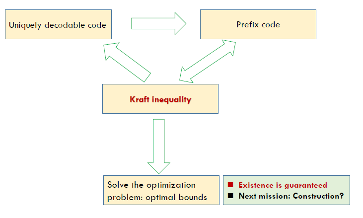

本节我们介绍了最优编码的存在性, 下节课我们介绍最优编码的算法.

### Rate and Capacity

- The **rate** $R$ of $(M, n)$ code is
  $$
  R=\frac{\log M}{n} \text { bits per transmission. }
  $$
  因为信息M一定能用长度为$\log M$的码进行编码, 可以通过n次传输.
- A rate $R$ is said to be **achievable** if there exists a sequence of $\left(2^{n R}, n\right)$ codes such that **the maximal probability of error $\lambda(n)$ tends to 0** as $n \rightarrow \infty$
  码率可取, if 我们能找到一个编码, 使**最大**错误概率,在码长很长时可以趋向于0.
- The capacity of a channel is the supremum of all achievable rates.
  信道容量: 所有可取码率的上确界.

> (Channel coding theorem) For a **discrete memoryless channel**, all rates below capacity $C$ are achievable. Specifically, for every rate $R<C,$ there exists a sequence of $\left(2^{n R}, n\right)$ codes with maximum probability of error $\lambda^{(n)} \rightarrow 0 .$ Conversely, any sequence of $\left(2^{n R}, n\right)$ codes with $\lambda^{(n)} \rightarrow 0$ must have $R \leq C$

即,我们要证明$C=\max _{p(x)} I(X ; Y)$
就要证明两点
1. Achievability
   For any $r<C,$ there exists an $\left(2^{n r}, n\right)$ code
2. Converse
   For any $r>c, \lambda_{e}>0$

## Joint Typicality
定义联合典型集.

Roughly speaking, we decode a channel output $Y^{n}$ as the $i$ th index if the codeword $X^{n}(i)$ is "jointly typical" with the received signal $Y^{n}$
现在我们有两组随机变量, The set $A_{\epsilon}^{(n)}$ of jointly typical sequences 联合典型集序列 $\left\{\left(x^{n}, y^{n}\right)\right\}$ with respect to the distribution $p(x, y)$ is the set of n-sequences with empirical entropies $\epsilon$ -close to the true entropies:
$$
\begin{aligned}
A_{\epsilon}^{(n)}=\left\{\left(x^{n}, y^{n}\right) \in X^{n} \times Y^{n}:\right.&-\frac{1}{n} \log p\left(x^{n}\right)-H(X) |<\epsilon \\
&\left|-\frac{1}{n} \log p\left(y^{n}\right)-H(Y)\right|<\epsilon \\
&\left.\left|-\frac{1}{n} \log p\left(x^{n}, y^{n}\right)-H(X, Y)\right|<\epsilon\right\}
\end{aligned}
$$
我们要求, 典型集元素要求满足单个元素在典型集中, 合起来看也要在典型集不等式中.

注意, 一般情况下,$X^{n} \in A_{\epsilon}^{(n)}, Y^{n} \in A_{\epsilon}^{(n)}$ cannot imply $\left(X^{n}, Y^{n}\right) \in A_{\epsilon}^{(n)}$

有了典型集, 顺理成章我们要证明联合AEP.

- $\operatorname{Pr}\left(\left(X^{n}, Y^{n}\right) \in A_{\epsilon}^{(n)}\right) \rightarrow 1 \text { as } n \rightarrow \infty$
- $\left|A_{\epsilon}^{(n)}\right| \leq 2^{n(H(X, Y)+\epsilon)}$ 证明类似单个随机变量的AEP
- $\left|A_{\epsilon}^{(n)}\right| \geq (1-\epsilon) 2^{n(H(X, Y)-\epsilon)}$ 证明类似单个随机变量的AEP
- $\text { If }\left(\tilde{X}^{n}, \tilde{Y}^{n}\right) \sim p\left(x^{n}\right) p\left(y^{n}\right), \text { then }$ 
  $$(1-\epsilon) 2^{-n(I(X, Y)+3 \epsilon)} \leq \operatorname{Pr}\left(\left(\tilde{X}^{n}, \tilde{Y}^{n}\right) \in A_{\epsilon}^{(n)}\right) \leq 2^{-n(I(X, Y)-3 \epsilon)}$$
  (即对典型集中特殊的$X_n,Y_n$, 上下界用互信息衡量, 而不是熵)

我们主要证明第三个性质.
定义展开, 根据典型集大小放缩. 右侧得证
$$\begin{aligned}
\operatorname{Pr}\left(\left(\tilde{X}^{n}, \tilde{Y}^{n}\right) \in A_{\epsilon}^{(n)}\right)=& \sum_{\left(x^{n}, y^{n}\right) \in A_{\varepsilon}^{(n)}} p\left(x^{n}\right) p\left(y^{n}\right) \\
\leq & 2^{n(H(X, Y)+\epsilon)} 2^{-n(H(X)-\epsilon)} 2^{-n(H(Y)-\epsilon)}=2^{-n(I(X, Y)+3 \epsilon)}
\end{aligned}$$

左侧, 先证性质3
$$1-\epsilon \leq \operatorname{Pr}\left(A_{\epsilon}^{(n)}\right)=\sum_{\left(x^{n}, y^{n}\right) \in A_{\epsilon}^{(n)}} p\left(x^{n}, y^{n}\right) \leq\left|A_{\epsilon}^{(n)}\right| 2^{-n(H(X, Y)-\epsilon)}$$

用类似的方法, 
$$\begin{array}{c}
\operatorname{Pr}\left(\left(\tilde{X}^{n}, \tilde{Y}^{n}\right) \in A_{\epsilon}^{(n)}\right)=\sum_{\left(x^{n}, y^{n}\right) \in A_{\varepsilon}^{(n)}} p\left(x^{n}\right) p\left(y^{n}\right) \\
\geq(1-\epsilon) 2^{n(H(X, Y)-\epsilon)} 2^{-n(H(X)+\epsilon)} 2^{-n(H(Y)+\epsilon)}=(1-\epsilon) 2^{-n(I(X ; Y)+3 \epsilon)}
\end{array}$$

为什么信道编码中会出现互信息? 
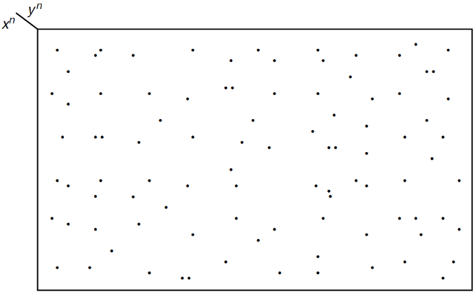
因为在所有$X^n$,$Y^n$中,能够符合典型集性质3的必须用互信息衡量.
$$\frac{2^{n H(X . Y)}}{2^{n H(X)} 2^{n H(Y)}}=2^{-n I(X: Y)}$$

## Intuition for Channel Capacity

- X与Y的关系类似$X^n$驱动了$Y^n$, 由于噪声的作用, $X^n$的点变成了$Y^n$的区域.
- 那我们最好希望, no two $X$ sequences produce the same $Y$ output sequence.
  - 那比较好的做法就是把Y^n的投影分成越来越多的不相交的小集合.
- 从典型集的角度, 当$X^n$给定的情况下, 也就对应的会有 $2^{nH(Y|X)}$的$Y^n$个序列可能会构成典型性.
- 由于$Y^n$的典型性, 我们最多能找到互不相交的集合数目就是, $2^{n(H(Y)-H(Y | X))}=2^{n I(X ; Y)}$
- 因此, 优化目标是最大化 $I(X ; Y)$

# 0413 Channel Capacity (3)

## Coverse Proof Special Case: Zero-Error Codes

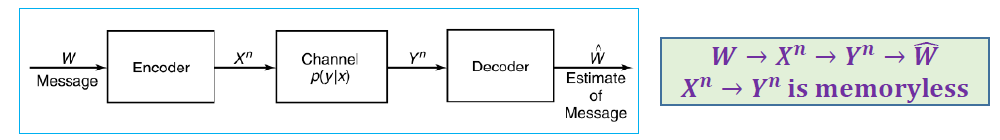

我们希望证明，对于任何合格的编码方案，码率要小于等于信道容量。

先考虑一个特殊情况：$Y^{n}$可以完美地恢复出$W$。即$H(W|Y^{n})=0$.

The outline of the proof of the converse is most clearly motivated by going through the argument when absolutely no errors are allowed.
$$
\begin{aligned}
n R=H(W) &=H\left(W | Y^{n}\right)_{=0}+I\left(W ; Y^{n}\right) \\
&=I\left(W ; Y^{n}\right) \\
& \leq I\left(X^{n} ; Y^{n}\right) \quad\left(W \rightarrow X^{n} \rightarrow Y^{n}\right) \\
& \leq \sum_{i} I\left(X_{i} ; Y_{i}\right) \\
& \leq n C \\
& R \leq C
\end{aligned}
$$
In general, $H\left(W | Y^{n}\right)>0:$ Fano's inequality

$$\begin{aligned}
I\left(X^{n} ; Y^{n}\right) &=H\left(Y^{n}\right)-H\left(Y^{n} | X^{n}\right)=H\left(Y^{n}\right)-\sum H\left(Y_{i} | X_{i}\right) \\
& \leq \Sigma H\left(Y_{i}\right)-\Sigma H\left(Y_{i} | X_{i}\right)=\sum I\left(X_{i} ; Y_{i}\right)
\end{aligned}$$

注意，在这个问题（DMC）中，$Y_i$与$X_i$相互独立，但不代表$Y_i$之间相互独立。

上面的证明中，我们加强的条件简化了不等式的证明，in general$H(W|Y^{n})>0$，我们就要用到Fano's Inequality。

## Coverse Proof: Channel Coding Theorem

我们假设错误概率率趋小，即根据fano不等式，$H(W | W) \leq 1+P_{e}^{(n)} n R$

$$\begin{aligned}
n R &=H(W) \\
&=H(W | \widehat{W})+I(W ; \widehat{W}) \\
& \leq 1+P_{\epsilon}^{(n)} n R+I(W ; \widehat{W}) \\
& \leq 1+P_{\epsilon}^{(n)} n R+I\left(X^{n} ; Y^{n}\right) \quad \text{马尔可夫链性质，数据处理不等式}\\
& \leq 1+P_{\epsilon}^{(n)} n R+n C
\end{aligned}$$

因此我们有

$$R \leq P_{\epsilon}^{(n)} R+\frac{1}{n}+c \rightarrow C$$

反证法，如果$R>C$，则$P_{\epsilon}^{(n)}$不会趋向于0.
$$P_{\epsilon}^{(n)} \geq 1-\frac{c}{R}-\frac{1}{n R}>0 \text { as } R>C$$

接下来我们证明，对任意小于$C$的编码，我们都能找到一种编码（可达性）

## Achievability

### Code Construction
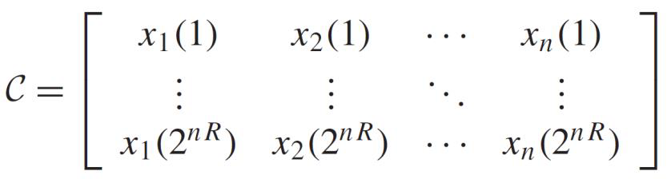
编码的构造：实际上就是随机生成码本矩阵$\mathcal{C}$。
行：消息，列：编码。

Fix $p(x) .$ Generate $a\left(2^{n R}, n\right)$ code at random according to $p(x)$
$$
p\left(x^{n}\right)=\prod_{i=1}^{n} p\left(x_{i}\right)
$$

The probability the we generate a particular code $C$ is 对任意编码，生成该编码（码本）的概率是 $\operatorname{Pr}(C)=\prod_{w=1}^{2^{n R}} \prod_{i=1}^{n} p\left(x_{i}(w)\right)$
The code $C$ will be shared both by the sender and receiver, both know $p(y|x)$.

A message $W$ is chosen according to a uniform distribution暂时忽略$nR$不是整数的问题。 $\operatorname{Pr}(W=w)=2^{-n R}, w=1,2, \ldots, 2^{n R}$
The $w$ th codeword $X^{n}(w)$ is sent over the channel The receiver receives a sequence $Y^{n}$ according to the distribution
$$
P\left(y^{n} | x^{n}(w)\right)=\prod_{i=1}^{N} p\left(y_{i} | x_{i}(w)\right)
$$

### Joint Decoding
如何解码，我们要用联合AEP解码。

The receiver guess which message was sent. In jointly typical decoding, the receiver declares that the index $\widehat{W}$ was sent if the following conditions are satisfied:
- $\left(X^{n}(\widehat{W}), Y^{n}\right)$ is jointly typical 存在
- There is no other index $W^{\prime} \neq W,$ such that $\left(X^{n}\left(W^{\prime}\right), Y^{n}\right) \in A_{\epsilon}^{(n)}$ 唯一

If no such $\hat{W}$ exists or if there is more than one such, an error is declared. (We may assume that the receiver **outputs a dummy index such as 0** in this case.)
Let $\mathcal{E}$ be the event $\{\widehat{W} \neq W\}$

**We need to show that**
$$
\operatorname{Pr}(\mathcal{E}) \rightarrow \mathbf{0}
$$

## $\operatorname{Pr}(\mathcal{E}) \rightarrow 0$

> Main idea: If we could prove that for all the codebook (all the possible $C$ ), the average $\operatorname{Pr}(\varepsilon) \leq \epsilon_{i}$  **then the error probability of the best code** (one of $C^{\prime}$s $\leq \epsilon$）

We let $W$ be drawn according to a uniform distribution over $\left\{1,2, \ldots, 2^{n R}\right\}$ and use jointly typical decoding $\hat{W}\left(y^{n}\right)$

Let $\mathcal{E}=\left\{\hat{W}\left(y^{n}\right) \neq W\right\}$ denote the error event

We will calculate the average probability of error, averaged over all codewords in the codebook, and averaged over all codebooks 每一个码本、每一个码制上的平均错误率。
$$
\begin{aligned}
&\operatorname{Pr}(\varepsilon)=\sum_{c} \operatorname{Pr}(C) P_{e}^{(n)}(C) \text{\quad 定义展开} \\
&=\sum_{c} \operatorname{Pr}(C) \frac{1}{2^{n R}} \sum_{w=1}^{2^{n R}} \lambda_{w}(C) \text{\quad 码制均匀分布}\\
&=\frac{1}{2^{n R}} \sum_{w=1}^{2^{n R}} \sum_{c} \operatorname{Pr}(C) \lambda_{w}(C) \text{\quad 求和交换位置}
\end{aligned}
$$

我们分析第二个求和表达式。
$$\sum_{C} \operatorname{Pr}(C) \lambda_{1}(C)=\operatorname{Pr}(\mathcal{E} | W=1)$$
是在传递信息1的情况下的平均错误概率，也即
$$\operatorname{Pr}(\mathcal{E})=\frac{1}{2^{n R}} \sum_{w=1}^{2^{n R}} \operatorname{Pr}(\mathcal{E} | W=w)$$

由对称性，我们以证明信息为1时的结论为例。

$$E_{i}=\left\{\left(\left(X^{n}(i), Y^{n}\right) \text { is in } A_{\epsilon}^{(n)}\right), i \in\left\{1,2, \ldots, 2^{n R}\right\}\right\}$$

定义集合$E_{i}$，那么解码错误的概率可以形式化地表达为

$$\begin{aligned}
\operatorname{Pr}(\mathcal{E} | W=1) &=P\left(E_{1}^{c} \cup E_{2} \cup E_{3} \cup \ldots \cup E_{2^{n} R} | W=1\right) \\
& \leq P\left(E_{1}^{c} | W=1\right)+\sum_{i=2}^{2^{n R}} P\left(E_{i} | W=1\right)
\end{aligned}$$

要么不在典型集中，要么在其他典型集中。我们直接对集合进行放缩。并$\rightarrow$不相交并。

我们具体分析两个部分有多大。
- 由联合AEP，By Joint $\mathrm{AEP}, P\left(E_{1}^{c} | W=1\right) \rightarrow 0,$ and hence $\mathrm{P}\left(\mathrm{E}_{1}^{\mathrm{c}} | \mathrm{W}=1\right) \leq \epsilon,$ for $n$ sufficiently large
- For $i \geq 2,\left(E_{i} | W=1\right):$
  - since by the code generation process, $X^{n}(1)$ and $X^{n}(i)$ are independent for $i \neq 1,$，源码的生成相互独立
  - so are $Y^{n}$ and $X^{n}(i) .$
  - Hence, the probability that $X^{n}(i)$ and $Y^{n}$ are jointly typical is $\leq 2^{-n(I(X ; Y)-3 \epsilon)}$ by the joint AEP

$$\begin{aligned}
\operatorname{Pr}(\mathcal{E} | W=1) & \leq \epsilon+\sum_{i=2}^{2^{n R}} 2^{-n(I(X ; Y)-3 \epsilon)} \\
&=\epsilon+\left(2^{n R}-1\right) 2^{-n(I(X ; Y)-3 \epsilon)} \\
& \leq \epsilon+2^{n R} 2^{-n(I(X ; Y)-3 \epsilon)} \\
&=\epsilon+2^{-n(I(X ; Y)-R-3 \epsilon)}
\end{aligned}$$

If $n$ is sufficiently large and $R<I(X ; Y)-3 \epsilon$
$$
\begin{aligned}
\operatorname{Pr}(&\varepsilon | W=1) \leq 2 \epsilon \\
& \operatorname{Pr}(\mathcal{E}) \leq 2 \epsilon
\end{aligned}
$$

这样，我们就证明了，给定$p(x)$情况下，随机编码的错误概率$\le 2\epsilon$。这样也就证明了一定存在这样的编码。

注意到$p(x)$的选择是不受限的，因此Choose $p(x)$ in the proof to be $p^{*}(x),$ the distribution on $X$ that achieving capacity. Then
$$
\begin{aligned}
R \leq I\left(X^{*} ; Y\right) &=C \\
\lambda^{(n)} \leq 4 \epsilon
\end{aligned}
$$

### $\operatorname{Pr}(\mathcal{E}) \rightarrow 0 \Rightarrow \lambda^{(n)} \rightarrow 0$
从平均概率为0到最大错误概率为0.

在前面的证明中，我们说明了There exists a best codebook $C^{*}$ such that
$$
\operatorname{Pr}\left(\varepsilon | C^{*}\right)=\frac{1}{2^{n R}} \sum_{i=1}^{2^{n R}} \lambda_{i}\left(C^{*}\right) \leq 2 \epsilon
$$

根据上一节的定义，By the definition of $\left(n, 2^{n R}\right)$ code, we need to further show that
$$
\lambda^{(n)} \rightarrow 0
$$

Without loss of generality, assume $\lambda_{1} \leq \lambda_{2} \leq \cdots \leq \lambda_{2} n_{R}$
By $\operatorname{Pr}\left(\varepsilon | C^{*}\right) \leq 2 \epsilon,$ we have 我们知道前一半一定足够小
$$\lambda_{1} \leq \lambda_{2} \leq \cdots \leq \lambda_{2} n_{R-1} \leq 4 \epsilon$$
反证法： $\left(\text { Or } \lambda_{2^{n R-1}}>4 \epsilon, \frac{1}{2^{n R}} \sum_{i=1+2^{n R-1}}^{2^{n R}} \lambda_{i}\left(C^{*}\right)>\frac{1}{2} 4 \epsilon=2 \epsilon, \text { contradiction! }\right)$

只需对码本进行微调，就可以达到最大错误概率的降低。把最坏的一半码制直接扔掉。（考虑平均再通过扔掉一半证明最坏，这是一个很general的证明做法，在很多地方都很常见）Further refine the codebook $C^{*}$
- Throw away the worst half of the codewords in the best codebook $C^{*}$
- The best half of the codewords have a maximal probability of error less than $4 \epsilon$
- If we reindex these codewords, we **have $2^{n R-1}$ codewords**. Throwing out half the codewords has changed the rate from $R$ to $R-\frac{1}{n},$ which is negligible for large $n$。在极限情况下不会对码率产生影响。

## (Introduction) Feedback Capacity

Recall，DMC中，收到的信息是什么情况我们是不知情的。信号的发送端与接收端在物理上是隔离开的。

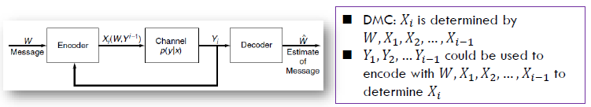

- We assume that **all the received symbols are sent back immediately and noiselessly** to the transmitter, which can then use them to decide **which symbol to send next** 即，在有反馈的情况下，我们有更高的灵活性生成码制。这里我们假设输出的信号马上会发到输入端，输入端可以根据该反馈生成下一个信号。
- We define $a\left(2^{n R}, n\right)$ *feedback code* as a sequence of mappings $x_{i}\left(W, Y^{i-1}\right),$ where each $x_{i}$ is **a function only of** the message $W \in 2^{n R}$ and the previous received values, $Y_{1}, Y_{2}, \ldots, Y_{i-1},$ and a sequence of decoding functions $g: \mathcal{Y}^{n} \rightarrow\left\{1,2, \ldots, 2^{n R}\right\} .$ Thus, 定义解码器没有得到正确结果的概率
$$
P_{e}^{(n)}=\operatorname{Pr}\left(g\left(Y^{n}\right) \neq W\right)
$$
when $W$ is uniformly distributed over $\left\{1,2, \ldots, 2^{n R}\right\}$

我们发现：Feedback capacity
$$
C_{F B}=C=\max _{p(x)} I(X ; Y)
$$

> Feedback cannot increase capacity. （因为该问题中，无**记忆性仍然是保留的**）

### TODO:看一下证明

## (Introduction) Source-Channel Separation
信源信道分离定理

Recall，我们学习了数据的压缩与数据的传输

- In data compression: $R>H$
- In data transmission: $R<C$

> Is the condition $H<C$ sufficient and necessary?
> 是不是$H<C$就保证了我们可以以很低的错误概率？
> **YES**

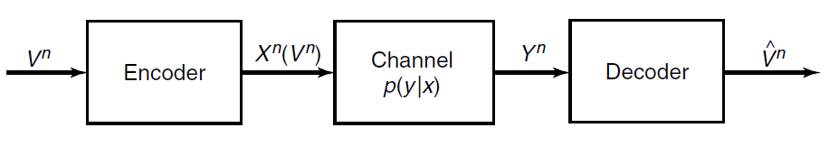

### Formal Problem

- We want to send the sequence of symbols $V^{n}=V_{1}, V_{2}, \ldots, V_{n}$ over the channel so that the receiver can reconstruct the sequence
- To do this, we map the sequence onto a codeword $X^{n}\left(V^{n}\right)$ and send the codeword over the channel
- The receiver looks at his received sequence $Y^{n}$ and makes an estimate $\hat{V}^{n}$ of the sequence $V^{n}$ that was sent. The receiver makes an error if $V^{n} \neq \hat{V}^{n} .$ We define the probability of error as
  $$
  \operatorname{Pr}\left(V^{n} \neq \hat{V}^{n}\right)=\sum_{y^{n}} \sum_{v^{n}} p\left(v^{n}\right) p\left(y^{n} | x^{n}\left(v^{n}\right)\right) I\left(g\left(y^{n}\right) \neq v^{n}\right)
  $$
  Where $I$ is the indicator function and $g\left(y^{n}\right)$ is the decoding function

### TODO: Theorem

**Theorem (Source-channel coding theorem).** If $V_{1}, V_{2}, \ldots, V_{n}$ is a finite alphabet stochastic process that satisfies the AEP and $H(\mathcal{V})<C,$ there exists a source-channel code with probability of error $\operatorname{Pr}\left(\hat{V}^{n} \neq V^{n}\right) \rightarrow 0 .$ Conversely, for any stationary stochastic process, if $H(v)>C,$ the probability of error is bounded away from zero, and it is not possible to send the process over the channel with arbitrarily low probability of error.

## Error Correction Code

The object of coding is to introduce redundancy so that even if some of the information is lost or corrupted, it will still be possible to recover the message at the receiver. 在前面的学习中，我们知道，我们可以用冗余抵抗噪声的干扰，下面列出一些冗余手段。

- Repetition code: For example, to send a $1,$ we send 11111 , and to send a $0,$ we send 00000. The decoding scheme is to take the majority vote. 接收端数0多还是1多，少数服从多数。
- Parity check code: Starting with a block of $n-1$ information bits, we choose the $n$ th bit so that the parity of the entire block is 0. 奇偶校验位。
- The code does not detect an even number of errors and does not give any information about how to correct the errors that occur.

## Hamming Code

RECALL: BSC信道
由大数定律，因为我们会以$p$的概率翻转，如果信息量够大，那么会有大约np个bits被修改，我们可以证明，$d(x,y)\le np$（曼哈顿距离）。另一种意义上，也就是说，All the points $y$ are within the sphere with center $x$ and radius $n p$

- Deonte the codeword by $x,$ then the noisy version $y$ of $x$ stays inside the sphere with center $x$ and radius $r$
- Sphere packing: the art of error correction code
- https://en.wikipedia.org/wiki/Sphere_packing

# 0415 Differential Entropy (1)

## Differential Entropy

### Definition

概率论中的一些概念

- Let $X$ be a random variable with **cumulative distribution function** $F(x)=\operatorname{Pr}(X \leq x)$
- If $F(x)$ is continuous, the random variable is said to be **continuous**.
- Let $f(x)=F^{\prime}(x)$ when the derivative is defined. If $\int_{-\infty}^{\infty} f(x)=1, f(x)$ is called the **probability density function** for X.
- The set where $f(x)>0$ is called the **support set** of $X .$

微分熵的定义

> The differential entropy $h(X)$ of a continuous random variable $X$ with density $f(x)$ is defined as
> $$
> h(X)=-\int_{S} f(x) \log f(x) d x
> $$
> where $S$ is the support set of the random variable. The differential entropy is sometimes written as $h(f)$ rather than $h(X)$

平移不改变微分熵.
$h(X+c)=h(X)$ (Translation does not change the differential entropy)

对比离散熵
$$\begin{aligned}
&p(x) \Rightarrow f(x)\\
&\sum=\int\\
&H(X) \Rightarrow h(X)
\end{aligned}$$

$H(X)$ is always non-negative. $h(X)$ may be negative

### Example

> Consider a random variable distributed uniformly from 0 to $a$, then $h(X)=\log a$.
> Let $X \sim \mathcal{N}\left(\mu, \sigma^{2}\right),$ then $\boldsymbol{h}(\boldsymbol{X})=\frac{1}{2} \log 2 \pi e \sigma^{2}$

When $X$ is uniformly distributed in $[0, a]$
$$
\begin{array}{c}
f(x)=1 / a \\
h(X)=-\int_{0}^{a} \frac{1}{a} \log \frac{1}{a} d x=\log a
\end{array}
$$
发现, 微分熵已经可以小于0了.

When $X$ is Gaussian $\mathcal{N}\left(\mu, \sigma^{2}\right),$ then
$$
f(x)=\frac{1}{\sqrt{2 \pi \sigma^{2}}} e^{-\frac{(x-\mu)^{2}}{2 \sigma^{2}}}
$$
$$
\begin{aligned}
h(f(x))&=-\int f(x) \log f(x) d x \\
=&-\int f(x) \log \frac{1}{\sqrt{2 \pi \sigma^{2}}}+f(x)\left(-\frac{(x-\mu)^{2}}{2 \sigma^{2}}\right) d x \\
\end{aligned}
$$
$$
\int f(x) d x=1 \text { and } \operatorname{Var}(X)=\int(x-\mu)^{2} f(x) d x=\sigma^{2}
$$
用代入方差的方法, 简化运算.
$$
h(f(x))=\frac{1}{2} \log 2 \pi \sigma^{2}+\frac{1}{2}=\frac{1}{2} \log 2 \pi e \sigma^{2}
$$
我们用e为底, 方便代入概率密度函数.

## h(X): infinite information

连续变量不加以任何限制, 它的信息是无穷大的. 微分熵无法再度量系统中的信息量了.

- Differential entropy does not serve as a measure of the average amount of information contained in a continuous random variable.
- In fact, a continuous random variable generally contains an infinite amount of information

我们计算连续型随机变量的离散熵:
Let $X$ be uniformly distributed on $[0,1) .$ Then we can write
$$
X=0 . X_{1} X_{2}, \dots
$$
The dyadic expansion of $X,$ where $X_{i}^{\prime} s$ is a sequence of i.i.d bits. Then
$$
\begin{aligned}
H(X) &=H\left(X_{1}, X_{2}, \ldots\right) \\
&=\sum_{i=1}^{\infty} H\left(X_{i}\right) \\
&=\sum_{i=1}^{\infty} 1 \\
&=\infty
\end{aligned}
$$

## h(aX): Stretching Random Variable

> $$\begin{array}{c}
> \boldsymbol{h}(\boldsymbol{a} \boldsymbol{X})=\boldsymbol{h}(\boldsymbol{X})+\log |\boldsymbol{a}| \\
> \boldsymbol{h}(\boldsymbol{A X})=\boldsymbol{h}(\boldsymbol{X})+\log |\operatorname{det} \boldsymbol{A}|
> \end{array}$$

Let $Y=a X .$ Then $f_{Y}(y)=\frac{1}{|a|} f_{X}\left(\frac{y}{a}\right),$ and
$$
\begin{aligned}
h(a X) &=-\int f_{Y}(y) \log f_{Y}(y) d y \\
&=-\int \frac{1}{|a|} f_{X}\left(\frac{y}{a}\right) \log \left(\frac{1}{|a|} f_{X}\left(\frac{y}{a}\right)\right) d y \\
&=-\int f_{X}(x) \log f_{X}(x) d x+\log |a| \\
&=h(X)+\log |a|
\end{aligned}
$$

## Differential and Discrete Entropy

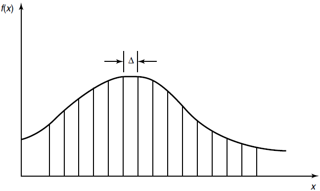

Suppose that we divide the range of $X$ into bins of length $\Delta .$ 
By the mean value theorem, there exists a value $x_{i}$ within each bin such that
$$f\left(x_{i}\right) \Delta=\int_{i \Delta}^{(i+1) \Delta} f(x) d x$$

Consider the quantized random variable $X^{\Delta}$, which is defined by
$$X^{\Delta}=x_{i}$ if $i \Delta \leq x<(i+1) \Delta$$

基于连续随机变量定义一个切割意义上的离散随机变量. Then the probability that $X^{\Delta}=x_{i}$ is
$$p_{i}=\int_{i \Delta}^{(i+1) \Delta} f(x) d x=f\left(x_{i}\right) \Delta$$

$$H\left(X^{\Delta}\right)=-\sum \Delta f\left(x_{i}\right) \log f\left(x_{i}\right)-\log \Delta$$

结论:
这里说的是$-\infty +\infty \rightarrow h(f)$.
$$H\left(X^{\Delta}\right)+\log \Delta \rightarrow h(f)=h(X), \text { as } \Delta \rightarrow 0$$

## AEP For Continuous Random Variable

- AEP for continuous random variables: Let $X_{1}, X_{2}, \ldots, X_{n}$ be a sequence of random variables drawn i.i.d. according to the density $f(x) .$ Then
  $$
  -\frac{1}{n} \log f\left(X_{1}, X_{2}, \ldots, X_{n}\right) \rightarrow E(-\log f(X))=h(f)
  $$
  in probability

- For $\epsilon \geq 0$ and any $n,$ we define the typical set $A_{\epsilon}^{(n)}$ with respect to $f(x)$ as follows:
  $$
  A_{\epsilon}^{(n)}=\left\{\left(x_{1}, x_{2}, \ldots, x_{n}\right) \in S^{n}:\left|-\frac{1}{n} \log f\left(x_{1}, x_{2}, \ldots, x_{n}\right)-h(X)\right| \leq \epsilon\right\}
  $$
  where $f\left(x_{1}, x_{2}, \ldots, x_{n}\right)=\prod_{i=1}^{n} f\left(x_{i}\right)$

连续情况,考虑元素的体积
The volume of a set $A \subset \mathcal{R}^{n}$ is defined as
$$
\operatorname{Vol}(A)=\int_{A} d x_{1} d x_{2} \ldots d x_{n}
$$
在这里, $2^{n h(X)}$ is the volume

The typical set $A_{\epsilon}^{(n)}$ has the following properties:
1. $\operatorname{Pr}\left(A_{\epsilon}^{(n)}\right)>1-\epsilon$ for $n$ sufficiently large.
2. Vol $\left(A_{\epsilon}^{(n)}\right) \leq 2^{n(h(X)+\epsilon)}$ for all $n$
3. Vol $\left(A_{\epsilon}^{(n)}\right) \geq(1-\epsilon) 2^{n(h(X)-\epsilon)}$ for $n$ sufficiently large.

## Joint and Conditional Differential Entropy

> - The differential entropy of a set $X_{1}, X_{2}, \ldots, X_{n}$ of random variables with density $f\left(x_{1}, x_{2}, \ldots, x_{n}\right)$ is defined as
>   $$
>   h\left(X_{1}, X_{2}, \dots, X_{n}\right)=-\int f\left(x^{n}\right) \log f\left(x^{n}\right) d x^{n}
>   $$
> - If $X, Y$ have a ioint density function $f(x, y),$ we can define the conditional differential entropy $h(X | Y)$ as
>   $$
>   \begin{array}{c}
>   h(X) | Y)=-\int f(x, y) \log f(x | y) d x d y \\
>   h(X | Y)=h(X, Y)-h(Y)
>   \end{array}
>   $$

考虑到,很多情况下,积分是没法求/不存在的,我们在本课程中仅假设积分是存在的. 但是这在研究中是需要特别谨慎的地方.

可以证明条件减少熵, chain rule, 联合熵的结论依然成立
Pf by expectation (虽然定义的方式不同,但期望的写法依然成立)

- $h(X | Y) \leq h(X)$
  with equality iff $X$ and $Y$ are independent.
- (Chain rule for differential entropy)
  $$
  h\left(X_{1}, X_{2}, \ldots, X_{n}\right)=\sum_{i=1}^{n} h\left(X_{i} | X_{1}, X_{2}, \ldots, X_{i-1}\right)
  $$
- $h\left(X_{1}, X_{2}, \ldots, X_{n}\right) \leq \sum_{i=1}^{n} h\left(X_{i}\right)$
  with equality iff $X_{1}, X_{2}, \ldots, X_{n}$ are independent.

## Entropy of Multivariate Normal Distribution

### Covariance Matrix

> - The **covariance** between two random variables $X$ and $Y$ is defined as
>   $$
>   \operatorname{cov}(X ; Y)=E(X-E X)(Y-E Y)=E(X Y)-(E X)(E Y)
>   $$
> - For a random vector $X=\left[X_{1}, X_{2}, \ldots, X_{n}\right]^{T},$ the **covariance matrix** 相关矩阵 is defined a $=$
>   $$
>   K_{x}=E(X-E X)(X-E X)^{T}=\left[\operatorname{cov}\left(X_{i} ; X_{j}\right)\right]
>   $$
>   and the **correlation matrix** is defined as $\widetilde{K}_{X}=E X X^{T}=\left[{E} {X}_{{i}} {X}_{{j}}\right]$
> - $K_{X}=E X X^{T}-(E X)\left(E X^{T}\right)=\widetilde{K}_{X}-(E X)\left(E X^{T}\right)$

- A covariance matrix is both symmetric and positive semidefinite. 协方差矩阵半正定
  - The eigenvalues of a positive semidefinite matrix are non-negative. 特征值非负
- 线性变换作用于协方差矩阵和关联矩阵. Let $Y=A X,$ where $X$ and $Y$ are column vectors of $n$ random variables and $A$ is an $n \times n$ matrix. Then
  $$K_{Y}=A K_{X} A^{T}$$
  and
  $$\widetilde{K}_{Y}=A \tilde{K}_{Y} A^{T}$$

> A set of correlated random variables can be regarded as an orthogonal
> transformation of a set of uncorrelated random variables. (Ref : Ch. 10.1 Yeung, Information theory and network coding)

### Multivariate Normal Distribution

> - In probability theory and statistics, the multivariate normal distribution, multivariate Gaussian distribution, or joint normal distribution is a generalization of the onedimensional (univariate) normal distribution to higher dimensions.
> - 原始定义: 向量的任意线性组合都是高斯分布 ~ 向量服从多元高斯分布
> - More generally, let $\mathcal{N}(\mu, K)$ denote the multivariate Gaussian distribution with mean $\mu$ and covariance matrix $K,$ i.e., the joint pdf of the distribution is given by
>   $$f(x)=\frac{1}{(\sqrt{2 \pi})^{n}|K|^{1 / 2}} e^{-\frac{1}{2}(x-\mu)^{T} K^{-1}(x-\mu)}$$
> - One definition is that a random vector is said to be **k-variate normally** distributed if every linear combination of its k components has a univariate normal distribution. 

多元高斯分布良好的性质
- In general, random variables may be uncorrelated but statistically dependent. 
- 两个事件不相关不代表两个事件独立. 但对多元高斯分布 一定成立. But if a random vector has a multivariate normal distribution then any two or more of its components that are uncorrelated are independent .
- 两两独立推出联合独立. This implies that any two or more of its components that are pairwise independent are independent.

### Entropy

> (Entropy of a multivariate normal distribution) Let $X_{1}, X_{2}, \ldots, X_{n}$ have a multivariate normal distribution with mean $\mu$ and covariance matrix $K$
> $$h\left(X_{1}, X_{2}, \dots, X_{n}\right)=h(\mathcal{N}(\mu, K))=\frac{1}{2} \log (2 \pi e)^{n}|K|$$
> where $|K|$ denotes the determinant of $K .$
记住,对于多元高斯分布,微分熵是可以计算出来的, 且和协方差矩阵对数值相关即可.
$$f(\mathbf{x})=\frac{1}{(\sqrt{2 \pi})^{n}|K|^{\frac{1}{2}}} e^{-\frac{1}{2}(\mathbf{x}-\mu)^{T} K^{-1}(\mathbf{x}-\mu)}$$

证明不作具体要求, 与一元情况类似.
技巧:期望和求和进行交换
$$\begin{aligned}
h(f) &=-\int f(\mathbf{x})\left[-\frac{1}{2}(\mathbf{x}-\mu)^{T} K^{-1}(\mathbf{x}-\mu)-\ln (\sqrt{2 \pi})^{n}|K|^{\frac{1}{2}}\right] d \mathbf{x} \\
&=\frac{1}{2} E\left[\sum_{i, j}\left(X_{i}-\mu_{i}\right)\left(X_{j}-\mu_{j}\right)\left(K^{-1}\right)_{i j}\right]+\frac{1}{2} \ln (2 \pi)^{n}|K| \\
&=\frac{1}{2} \sum_{i, j} E\left[\left(X_{j}-\mu_{j}\right)\left(X_{i}-\mu_{i}\right)\right]\left(K^{-1}\right)_{i j}+\frac{1}{2} \ln (2 \pi)^{n}|K| \\
&=\frac{1}{2} \sum_{j} \sum_{i} K_{j i}\left(K^{-1}\right)_{i j}+\frac{1}{2} \ln (2 \pi)^{n}|K| \\
&=\frac{1}{2} \sum_{j}\left(K K^{-1}\right)_{j j}+\frac{1}{2} \ln (2 \pi)^{n}|K| \\
&=\frac{1}{2} \sum_{j} I_{j j}+\frac{1}{2} \ln (2 \pi)^{n}|K|\\
&=\frac{n}{2}+\frac{1}{2} \ln (2 \pi)^{n}|K|\\
&=\frac{1}{2} \ln (2 \pi e)^{n}|K|\\
&=\frac{1}{2} \log (2 \pi e)^{n}|K|
\end{aligned}$$

## Relative Entropy and Mutual Information

> - The **relative entropy (or Kullback-Leibler distance) $D(f \| g)$** between two densities $f$ and $g$ is defined by
>   $$D(f \| g)=\int f \log \frac{f}{g}$$
> - The **mutual information $I(X ; Y)$** between two random variables with joint density $f(x, y)$ is defined as
>   $$I(X ; Y)=\int f(x, y) \log \frac{f(x, y)}{f(x) f(y)} d x d y$$

有关相对熵和互信息的性质:
- $I(X ; Y)=h(X)-h(X | Y)=h(Y)-h(Y | X)=h(X)+h(Y)-h(X, Y)$,
  $I(X ; Y)=D(f(x, y) \| f(x) f(y))$
  信息图依然可用,但对非负部分需要考虑.
- $D(f \| g) \geq 0$ with equality iff $f=g$ almost everywhere (a.e.). 与此前证明类似
- $I(X ; Y) \geq 0$ with equality iff $X$ and $Y$ are independent. 从相对熵推出

### Mutual Information: Master Definition

互信息和熵还是有很大区别的. 我们考虑进阶的定义方式:

The mutual information between two random variables is the limit of the mutual information between their quantized versions
$$
\begin{aligned}
I\left(X^{\Delta} ; Y^{\Delta}\right) &=H\left(X^{\Delta}\right)-H\left(X^{\Delta} | Y^{\Delta}\right) \\
& \approx h(X)-\log \Delta-(h(x | y)-\log \Delta) \\
&=I(X ; Y)
\end{aligned}
$$

我们发现, 离散型随机变量与连续型随机变量的互信息(离散化)是近似相等的.

> **Definition**. The mutual information between two random variables $X$ and $Y$ is given by
> $$I(X ; Y)=\sup _{\mathcal{P}, Q} I\left([X]_{\mathcal{P} ;}[Y]_{Q}\right)$$
> where the supremum is over all finite partitions $\mathcal{P}$ and $Q$
> 这里, $X$ 和 $Y$ 既可以是离散的也可以是连续的(4种情况), 但定义是通用的.

- Let $\mathcal{X}$ be the range of a random variable $X .$ A partition $\mathcal{P}$ of $\mathcal{X}$ is a finite collection of disjoint sets $P_{i}$ such that $U_{i} P_{i}=\mathcal{X}$. The quantization of $X$ by $\mathcal{P}$ (denoted $[X]_{\mathcal{P}}$ ) is the discrete random variable defined by
  $$\operatorname{Pr}\left([X]_{P}=i\right)=\operatorname{Pr}\left(X \in P_{i}\right)=\int_{P_{i}} d F(x)$$
- For two random variables $X$ and $Y$ with partitions $\mathcal{P}$ and $Q,$ we can calculate the mutual information between the quantized versions of $X$ and $Y$

> This is the master definition of mutual information that always applies, even to joint distributions with atoms, densities, and singular parts.

# 0420 Differential Entropy (2)

## Correlated Gaussian
我们计算两个随机变量的互信息，这里以联合高斯分布为例。
(Mutual information between correlated Gaussian random variables with correlation $\rho$ ) Let $(X, Y) \sim \mathcal{N}(0, K),$ where
$$
\boldsymbol{K}=\left[\begin{array}{cc}
\boldsymbol{\sigma}^{2} & \boldsymbol{\rho} \boldsymbol{\sigma}^{2} \\
\boldsymbol{\rho} \boldsymbol{\sigma}^{2} & \boldsymbol{\sigma}^{2}
\end{array}\right]
$$
$I(X ; Y) ?$

$$
\begin{array}{c}
h(X)=h(Y)=\frac{1}{2} \log 2 \pi e \sigma^{2} \\
h(X, Y)=\frac{1}{2} \log (2 \pi e)^{2}|K|=\frac{1}{2} \log (2 \pi e)^{2} \sigma^{4}\left(1-\rho^{2}\right) \\
I(X ; Y)=h(X)+h(Y)-h(X, Y)=-\frac{1}{2} \log \left(1-\rho^{2}\right)
\end{array}
$$
- $\rho=0, X$ and $Y$ are independent and $I$ is 0
- $\rho=\pm 1, X$ and $Y$ are perfectly correlated and $I$ is $\infty$

## Maximum Entropy with Constraints

$E(X^2),Var(X)$给定的情况下，高斯分布最大化微分熵。

> - Let the random variable $X \in R$ have mean $\mu$ and variance $\sigma^{2}$. Then
>   $$
>   h(X) \leq \frac{1}{2} \log 2 \pi e \sigma^{2}
>   $$
>   with equality iff $X \sim \mathcal{N}\left(\boldsymbol{\mu}, \boldsymbol{\sigma}^{2}\right)$
> - Let the random variable $X \in R$ satisfy $E X^{2} \leq \sigma^{2} .$ Then
>   $$
>   h(x) \leq \frac{1}{2} \log 2 \pi e \sigma^{2}
>   $$
>   with equality iff $X \sim \mathcal{N}\left(0, \sigma^{2}\right)$

证明域平均分布最大化离散熵的证明如下，我们用相对熵推出。

1. Let $X_{G} \sim \mathcal{N}\left(\mu, \sigma^{2}\right) .$ Consider 
   $$\boldsymbol{D}\left(X \| X_{G}\right) \geqq \mathbf{0}$$
    Then
$$
  \int f \log \frac{f}{g} \geq 0
$$
  把对数函数展开，由于$g$是高斯分布，可以进一步展开。
  $$h(X)=h(f) \leq-\int f \log g=-\int f \log \frac{1}{\sqrt{2 \pi \sigma^{2}}}+f\left(-\frac{(x-\mu)^{2}}{2 \sigma^{2}}\right)$$
  由于右侧都是常数，可代入化简。
  $$h(X) \leq \frac{1}{2} \log 2 \pi \sigma^{2}+\frac{1}{2}=\frac{1}{2} \log 2 \pi e \sigma^{2}$$
2. $\operatorname{Var}(X)=E\left(X^{2}\right)-E(X)^{2} \leq \sigma^{2} \cdot \Rightarrow$ Case 1

使用这两个结论时一定要注意是否存在确定的均值、方差或二阶矩是否存在上界。

## Maximum Entropy

最大熵原理在不同的限制下可以得到不同的结论。（详见Cover Ch.12）

Consider the following problem: Maximize the entropy $h(f)$ over all probability densities $f$ satisfying （$++$条件）
1. $f(x) \geq 0,$ with equality outside the support 非负性
2. $\int_{s} f(x) d x=1$ 规范性
3. $\int_{S} f(x) r_{i}(x) d x=\alpha_{i}$ for $1 \leq i \leq m .\left(r_{i}(x) \text { is a function of } \right) x$. Thus, $f$ is a density on support set $S$ meeting certain moment constraints $\alpha_{1}, \alpha_{2}, \ldots, \alpha_{m}$ 即某些关于$x$的函数的均值是一定的。

> Theorem 12.1.1 (Maximum entropy distribution) Let 
> $$f^{*}(x)=f_{\lambda}(x)=e^{\lambda_{0}+\sum_{i=1}^{m} \lambda_{i} r_{i}(x)}$$
> $x \in S,$ where $\lambda_{0}, \ldots, \lambda_{m}$ are chosen so that $f^{*}$ satisfies $(++) .$ Then $f^{*}$ uniquely maximizes $h(f)$ over all probability densities $f$ satisfying constraints $(++)$
> 最大熵的分布是$f^{*}$取到的，但其中一些系数需要通过$\lambda_i$作为待定系数，还需更多条件可确定待定系数。

**Proof.**
$$\begin{aligned}
h(g) &=-\int_{S} g \ln g \\
&=-\int_{S} g \ln \frac{g}{f^{*}} f^{*} \\
&=-D\left(g \| f^{*}\right)-\int_{S} g \ln f^{*} \\
& \stackrel{(a)}{\leq}-\int_{S} g \ln f^{*} \\
& \stackrel{(b)}{=}-\int_{S} g\left(\lambda_{0}+\sum \lambda_{i} r_{i}\right) \\
& \stackrel{(c)}{=}-\int_{S} f^{*}\left(\lambda_{0}+\sum \lambda_{i} r_{i}\right) \\
&=-\int_{S} f^{*} \ln f^{*} \\
&=h\left(f^{*}\right)
\end{aligned}$$

where (a) follows from the nonnegativity of relative entropy, (b) follows from the definition of $f^{*},$ and $(\mathrm{c})$ follows from the fact that both $f^{*}$ and $g$ satisfy the constraints. Note that equality holds in (a) if and only if $g(x)=f^{*}(x)$ for all $x,$ except for a set of measure $0,$ thus proving uniqueness.

The same approach holds for discrete entropies and for multivariate distributions.

**Examples.**
- Let $S=[a, b],$ with no other constraints. Then the maximum entropy distribution is the uniform distribution over this range.
- $S=[0, \infty)$ and $E X=\mu .$ Then the entropy-maximizing distribution is
  $$
  f(x)=\frac{1}{\mu} e^{-\frac{x}{\mu}}, \quad x \geq 0
  $$
- $S=(-\infty, \infty), E X=\alpha_{1},$ and $E X^{2}=\alpha_{2} .$ The maximum entropy distribution is $\mathcal{N}\left(\alpha_{1}, \alpha_{2}-\alpha_{1}^{2}\right)$

## Hadamard's Inequality

$K$ is a nonnegative definite symmetric $n \times n$ matrix. Let $|K|$ denote the determinant of $K$
> Theorem (Hadamard) $|K| \leq \prod K_{i i},$ with equality iff $K_{i j}=0, \quad i \neq j$

**Proof.**
Let $X \sim \mathcal{N}(0, K) .$ Then
$$
\frac{1}{2} \log (2 \pi e)^{n}|K|=h\left(X_{1}, X_{2}, \ldots, X_{n}\right) \leqq \Sigma h\left(X_{i}\right)=\sum_{i=1}^{n} \frac{1}{2} \log 2 \pi e\left|K_{i i}\right|
$$
with equality iff $\left.X_{1}, X_{2}, \ldots, X_{n} \text { are independent (i.e., } K_{i j}=0, i \neq j\right)$

idea：矩阵转化为多元高斯分布，联合分布熵小于边缘分布熵的和。
remark：熵是一个基础的物理量，可以用来证明很多不等式(Cover Ch 17.9, 17.10)，比如一系列有关正定矩阵的性质
- $\log |K|$ is concave
- $\log \left(\left|K_{n}\right| /\left|K_{n-p}\right|\right)$ is concave in $K_{n}$
- $\left|K_{n}\right| /\left|K_{n-1}\right|$ is concave in $K_{n}$

## Balanced Information Inequality

平衡信息不等式：离散熵与微分熵的同和不同
Differences between inequalities of the discrete entropy and differential entropy
- Both $H(X, Y) \leq H(X)+H(Y)$ and $h(X, Y) \leq h(X)+h(Y)$ are valid
- $H(X, Y) \geq H(X)$ but neither $h(X, Y) \geq h(X)$ nor $h(X, Y) \leq h(X)$ is valid
Take $H(X, Y, Z) \leq \frac{1}{4} H(X)+\frac{1}{2} H(Y, Z)+\frac{3}{4} H(Z, X)$ for example.
Count the weights of random variables $X, Y, Z$ in both sides $X: 1,1 ; Y: 1, \frac{1}{2} ; Z: 1, \frac{5}{4}$ 定义$X,Y,Z$的净权重。
The net weights of $X, Y, Z$ are $0, \frac{1}{2},-\frac{1}{4}$

比如，下面的不等式是平衡的：
Balanced: If the net weights of $X, Y, Z$ are all zero.
$$
h(X, Y) \leq h(X)+h(Y) \text { and } h(X, Y, Z) \leq \frac{1}{2} h(X, Y)+\frac{1}{2} h(Y, Z)+\frac{1}{2} h(Z, X)
$$

> 对更为一般的情况，
> Let $[n]:=\{1,2, \ldots, n\} .$ For any $\alpha \subseteq[n],$ denote $\left(X_{i}: i \in \alpha\right)$ by $X_{\alpha} .$ For example, $\alpha=\{1,3,4\},$ we denote $X_{1}, X_{3}, X_{4}$ by $X_{(1,3,4)}$ for simplicity.
> - We could write any information inequality in the form $\Sigma_{\alpha} w_{\alpha} H\left(X_{\alpha}\right) \geq 0$ or $\Sigma_{\alpha} w_{\alpha} h\left(X_{\alpha}\right) \geq 0$
> - An information inequality is called balanced if for any $i \in[n]$, the net weight of $X_{i}$ is zero.
> - The linear continuous inequality $\Sigma_{\alpha} w_{\alpha} h\left(X_{\alpha}\right) \geq 0$ is valid if and only if its corresponding discrete counterpart $\Sigma_{\mathrm{g}} w_{\mathrm{g}} H\left(X_{\mathrm{g}}\right) \geq 0$ is valid and balanced.
> 由此，我们可以建立微分熵不等式和离散熵不等式的关系。这个不等式是正确的**当且仅当**它对应的离散熵不等式是正确的且平衡的。

Ref: Balanced Information Inequalities, T. H. Chan, IEEE Transactions
on Information Theory, Vol. 49 , No. 12 , December 2003

## Han’s Inequality

Let $\left(X_{1}, X_{2}, \ldots, X_{n}\right)$ have a density, and for every $S \subseteq\{1,2, \ldots, n\},$ denoted by $X(S)$ the subset $\left\{X_{i}: i \in S\right\} .$ Let
$$
\begin{array}{c}
h_{k}^{(n)}=\frac{1}{\left(\begin{array}{c}
n \\
k
\end{array}\right)} \sum_{S:[S]=k} \frac{h(X(S))}{k} \\
g_{k}^{(n)}=\frac{1}{\left(\begin{array}{l}
n \\
k
\end{array}\right)} \sum_{S:|S|=k} \frac{h\left(X(S) | X\left(S^{c}\right)\right)}{k}
\end{array}
$$

从n个随机变量中取k个，求联合熵、条件熵。

When $n=3$,
$$\begin{aligned}
h_{1}^{(3)} &=\frac{H\left(X_{1}\right)+H\left(X_{2}\right)+H\left(X_{3}\right)}{3} \geq h_{2}^{(3)}=\frac{H\left(X_{1}, X_{2}\right)+H\left(X_{2}, X_{3}\right)+H\left(X_{3}, X_{1}\right)}{3} \\
& \geq h_{3}^{(3)}=H\left(X_{1}, X_{2}, X_{3}\right)
\end{aligned}$$

$$\begin{aligned}
g_{1}^{(3)} &=\frac{H\left(X_{1} | X_{2}, X_{3}\right)+H\left(X_{2} | X_{1}, X_{3}\right)+H\left(X_{3} | X_{1}, X_{2}\right)}{3} \\
& \leq g_{2}^{(3)}=\frac{H\left(X_{1}, X_{2} | X_{3}\right)+H\left(X_{2}, X_{3} | X_{1}\right)+H\left(X_{3}, X_{1} | X_{2}\right)}{3} \\
& \leq g_{3}^{(3)}=H\left(X_{1}, X_{2}, X_{3}\right)
\end{aligned}$$

> Han's inequality:
> $h_{1}^{(n)} \geq h_{2}^{(n)} \ldots \geq h_{n}^{(n)}=H\left(X_{1}, X_{2}, \ldots, X_{n}\right)=g_{n}^{(n)} \geq \cdots \geq g_{2}^{(n)} \geq g_{1}^{(n)}$

## Information Heat

### Heat Equation

- Heat equation (Fourier): Let $x$ be the position and $t$ be the time, 热传导方程。**（它与高斯信道是等价的）**
  $$\frac{\partial}{\partial t} f(x, t)=\frac{1}{2} \frac{\partial^{2}}{\partial x^{2}} f(x, t)$$
- Let $X$ be any random variable with a density $f(x)$. Let $Z$ be an independent normally distributed random variable with zero mean and unit variance, $Z \sim \mathcal{N}(0,1) .$ Let
  $$Y_{t}=X+\sqrt{t} Z$$
  The **probability density function** $f(y ; t)(f(y ; t) \text { is a function in } y, \text { not } t)$ of $Y_{t}$ **satisfies heat equation**
  $$f(y ; t)=\int f(x) \frac{1}{\sqrt{2 \pi t}} e^{\frac{(y-x)^{2}}{2 t}} d x$$
  高斯信道的输出信号与热传导方程具有一一对应的关系。

### Entropy and Fisher Information
对连续型随机变量定义一个新的信息量， Fisher Information

> Fisher information: Let $X$ be any random variable with density $f(x)$. Its Fisher information is given by
> $$
> I(x)=\int_{-\infty}^{+\infty} f(x)\left[\frac{\frac{\partial}{\partial x} f(x)}{f(x)}\right]^{2} d x
> $$
- Let $X$ be any random variable with a density $f(x)$. Let $Z$ be an independent normally distributed random variable with zero mean and unit variance. Let $Y_{t}=X+\sqrt{t} Z$
  $$\frac{\partial}{\partial t} h\left(Y_{t}\right)=\frac{1}{2} I\left(Y_{t}\right)$$ 表明信息量与统计量之间也存在关联。
- Let $f(y, t) \text { (or } f)$ be the p.d.f of $Y_{t}$
  $$\begin{array}{c}
  \frac{\partial}{\partial t} h\left(Y_{t}\right)=\frac{1}{2} I\left(Y_{t}\right)=\frac{1}{2} \int \frac{f_{y}^{2}}{f} d y \geq 0 \\
  \frac{\partial^{2}}{\partial t^{2}} h\left(Y_{t}\right)=-\frac{1}{2} \int f\left(\frac{f_{y y}}{f}-\frac{f_{y}^{2}}{f^{2}}\right)^{2} d y \leq 0
  \end{array}$$
  $h(Y_t)$关于t是一个递增的凹函数。

- When $X$ is Gaussian $\mathcal{N}(0,1)$
  $$h\left(Y_{t}\right)=\frac{1}{2} \log 2 \pi e(1+t)$$
  对高斯分布的输入，n阶导数可求，且符号为
  All the derivatives alternate in signs: $+,-,+,-, \dots$

### Higher Order Derivatives of ℎ(𝑌𝑡)

(Cheng 2015) Let $X$ be any random variable with a density $f(x)$. Let $Z$ be an independent normally distributed random variable with zero mean and unit variance. Let $Y_{t}=X+\sqrt{t} Z$ and $f(y, t) \text { (or } f)$ be the p.d.f of $Y_{t} .$ Then
$$
\frac{\partial^{3}}{\partial t^{3}} h\left(Y_{t}\right) \geq 0 \text { and } \frac{\partial^{4}}{\partial t^{4}} h\left(Y_{t}\right) \leq 0
$$
Conjecture: When $n$ is even, $\frac{\partial^{n}}{\partial t^{n}} h\left(Y_{t}\right) \leq 0,$ otherwise $\frac{\partial^{n}}{\partial t^{n}} h\left(Y_{t}\right) \geq 0$

Ref: F. Cheng and Y. Geng, Higher Order Derivatives in Costa's Entropy Power Inequality

## EPI and FII

> (Shannon 1948, Entropy power inequality (EPI)) If $X$ and $Y$ are independent random $n$ -vectors with densities, then
> $$e^{\frac{2}{n} h(X+Y)} \geq e^{\frac{2}{n} h(X)}+e^{\frac{2}{n} h(Y)}$$
若对随机变量：
$$e^{2 h(X+Y)} \geq e^{2 h(X)}+e^{2 h(Y)}$$
- 也可以互推FII不等式，Fisher information inequality (FII)
  $$\frac{1}{I(X+Y)} \geq \frac{1}{I(X)}+\frac{1}{I(Y)}$$
- Most profound result in Shannon's 1948 paper
- EPI can imply some very fundamental results 
  - Uncertainty principle in quantom physics
  - Young's inequality 
  - Nash's inequality 
  - Cramer-Rao bound

References:
- T. Cover, Information theoretic inequalities, 1990
- O. Rioul , “Information Theoretic Proofs of Entropy Power Inequalities,” 2011

# 0422 Gaussian Channel

## Gaussian Channel
连续信道中最常见的是高斯信道，背景噪声服从高斯分布。
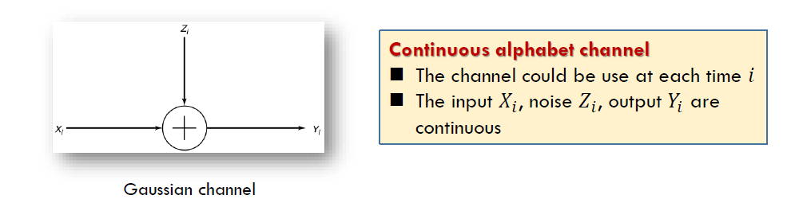

- the most important continuous alphabet channel is the Gaussian channel. For example, wireless telephone channels and satellite links
- The noise $Z_{i}$ is drawn i.i.d. from **a Gaussian distribution** with variance $N$
- The noise $Z_{i}$ is assumed to be **independent** of the signal $X_{i}$
- This is a time-discrete channel with output $Y_{i}$ at time $i,$ where $Y_{i}$ is the sum of the input $X_{i}$ and the noise $Z_{i}$ ，
  $$Y_{i}=X_{i}+Z_{i}, \quad Z_{i} \sim \mathcal{N}(0, N)$$
  对连续随机变量，两个随机变量的和的概率密度函数是它们的卷积。
- Without further conditions, the capacity of this channel may be $\infty$.
  - The values of $X$ may be very sparse
  - 一个例子：Assume the variance of noise $N$ is neglected compared to the distances of the values of $X$ Then $Y=X+Z \approx X .$ Thus $I(X ; Y) \approx H(X),$ which may be $\infty$。连续型随机变量的离散熵有可能是无穷大的，信道容量此时也失去了意义。

为进一步研究信道容量，我们需要从实际出发，为信道增加一些功能、限制。

## Energy Constraint

高斯信道中常见的一个限制是能量限制。能量通常与方差相关。在一些研究中，有关“能量”可以用其他更复杂或更精细的模型进行定义，从而得到类似的推导和结论。

- The most common limitation on the input is **an energy or power constraint**
- We assume an average power constraint. For any codeword $\left(x_{1}, x_{2}, \ldots, x_{n}\right)$ transmitted over the channel, we require that （假设码制中的符号均匀分布）
  $$\frac{1}{n} \sum_{i=1}^{n} x_{i}^{2} \leq P$$
  - within the sphere $\sqrt{n P}$
  - $P$ per channel use 每次信道使用功率消耗最大为P
  - 如果码制不均匀分布，只需改成$EX^2 \leq P$
- This communication channel models many practical channels, including radio and satellite links.

> The information capacity of the Gaussian channel with power constraint $P$ is
> $$C=\max _{f(x): E X^{2} \leq P} I(X ; Y)$$

下面求解该优化问题。
$$\begin{aligned}
I(X ; Y) &=h(Y)-h(Y | X) \\
&=h(Y)-h(X+Z | X) \\
&=h(Y)-h(Z | X) \\
&=h(Y)-h(Z) \\
h(Z)&=\frac{1}{2} \log 2 \pi e N
\end{aligned}$$

$$\begin{array}{l}
E Y^{2}=E(X+Z)^{2}=E X^{2}+2 E X E Z+E Z^{2}\leq P+N \\
h(Y) \leq \frac{1}{2} \log 2 \pi e(P+N)
\end{array}$$

$$\begin{aligned}
I(X ; Y) &=h(Y)-h(Z) \leq \frac{1}{2} \log 2 \pi e(P+N)-\frac{1}{2} \log 2 \pi e N \\
&=\frac{1}{2} \log \left(1+\frac{P}{N}\right)
\end{aligned}$$

综上：
$$
C=\frac{1}{2} \log \left(1+\frac{P}{N}\right)
$$
The maximum is attained when $X \sim \mathcal{N}(\mathbf{0}, P)$，$P\over N$也被称为信道比。

## Intuition

每个输入信号都会在接收端产生一定的区域。考虑一个给定的码制$x_n$
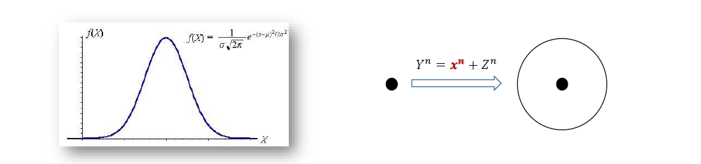

- The received vector is **normally distributed** with mean equal to the true codeword and variance equal to the noise variance.
- With high probability, the received vector is contained **in a sphere of radius $\sqrt{n(N+\epsilon)}$ around the true codeword**.
- 任何码制在高斯噪声的影响下，接收端都产生一个球体
- 我们在解码时，只要获得的$Y_n$在球体内，我们就认为$Y_n$对应$X_n$，为了降低错误率，我们希望任意两个球都是不相交的。
- If we assign everything within this sphere to the given codeword, when this codeword is sen there will be an error only if the received vector falls outside the sphere, which has low probability.
  - Each codeword is represented by a sphere 
  - Low decoding error requires no intersection between any spheres
那么填充满的小球空间率越大，码率就越高

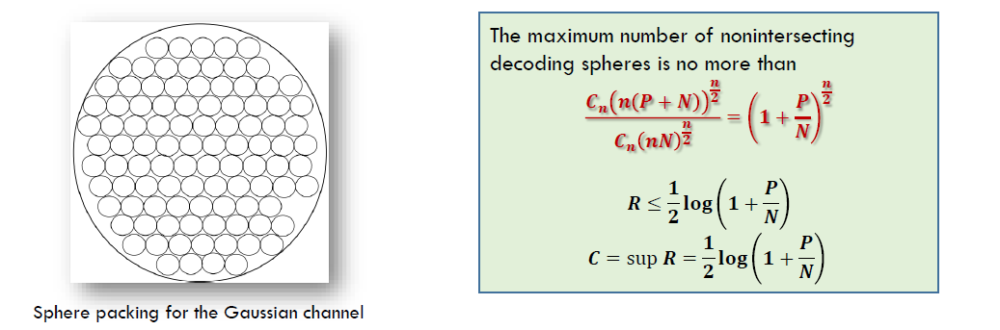

- The received vectors $(Y=X+Z)$ have energy no greater than $n(P+N),$ so they lie in a sphere of radius $\sqrt{n(P+N)}$
- The volume of an n-dimensional sphere is of the form $C_{n} r^{n}$, where $r$ is the radius of the sphere.
  $$2 \pi r, \pi r^{2} \text { and } \frac{4}{3} \pi r^{3}$$
- The volumes are approximated by
  $$C_{n}(n N)^{\frac{n}{2}} \text { and } C_{n}(n(P+N))^{\frac{n}{2}}$$
  我们不需要把球体的公式算的特别细，忽略前面的系数，计算高阶的情况。
  我们完成了上界的推算。当然，高维空间小球的堆放问题，其实际的构造是一个非常复杂的问题。

## Theorems

证明思路与DMC一致，定义编码，定义错误概率，定义可达区域，证明converse和achievability

### Definition

对能量限制P的信道定义编码函数。

**Definition**. An $(M, n)$ code for the Gaussian channel with power constraint $P$ consists of the following:
1. An index set $\{1,2, \ldots, M\}$
2. An encoding function $x:\{1,2, \ldots, M\} \rightarrow X^{n}$, yielding codewords $x^{n}(1), x^{n}(2), \ldots$ $x^{n}(M),$ satisfying the power constraint $P$; that is, for every codeword
   $$\sum_{i=1}^{n} x_{i}^{2}(w) \leq n P, \quad w=1,2, \dots, M$$
3. A decoding function
   $$g: y^{n} \rightarrow\{1,2, \ldots, M\}$$

The arithmetic average of the probability of error is defined by
$$P_{e}^{(n)}=\frac{1}{2^{n R}} \sum \lambda_{i}$$

A rate $R$ is said to be achievable for a Gaussian channel with a power constraint $P$ if there exists a sequence of $\left(2^{n R}, n\right)$ codes with codewords satisfying the power constraint such that the maximal probability of error $\lambda^{(n)}$ tends to zero. The capacity of the channel is the supremum of the achievable rates.

### Code Construction

#### Generation of the codebook
We generate the codewords $\left(x_{1}, x_{2}, \ldots, x_{n}\right)$ with each element i.i.d. according to a normal distribution with variance $P-\epsilon .$ since for large $n$
$$
\frac{1}{n} \sum x_{i}^{2} \rightarrow P-\epsilon
$$
The probability that a codeword does not satisfy the power constraint will be small. 根据方差的定义，超过能量限制的概率是非常小的。
Let $X_{i}(w), \quad i=1,2, \ldots, n, w=1,2, \ldots, 2^{n R}$ be i.i.d. $\sim \mathcal{N}(0, P-\epsilon),$ forming codewords $X^{n}(1), X^{n}(2), \ldots, X^{n}\left(2^{n R}\right) \in \mathcal{R}^{n}$ 完成了码本的生成
#### Encoding
- The codebook is revealed to both the sender and the receiver.
- To send the message index $w$, sends the $w$ th codeword $X^{n}(w)$ in the codebook.
#### Decoding:
根据联合典型性解码，The receiver looks down the list of codewords $\left\{X^{n}(w)\right\}$ and searches for one that is jointly typical with the received vector.
- If there is one and only one such codeword $X^{n}(w)$, the receiver declares $\widehat{W}=w$ to be the transmitted codeword.
- Otherwise, the receiver declares an error. The receiver also declares an error **if the chosen codeword does not satisfy the power constraint.**（除了不满足典型性，错误还可能是超过了能量限制）

### Probability of Error

WLOG，假设我们发送了码制1.

Without loss of generality, assume that codeword 1 was sent. Thus,
$$
Y^{n}=X^{n}(1)+Z^{n}
$$
现在我们要分析两种限制。Define the following events:
$$E_{0}=\left\{\frac{1}{n} \sum_{j=1}^{n} X_{j}^{2}(1)>P\right\}$$
and
$$E_{i}=\left\{\left(X^{n}(i), Y^{n}\right) \text { is in } A_{\epsilon}^{(n)}\right\}$$

$$\operatorname{Pr}(\mathcal{E} | W=1)=P\left(E_{0} \cup E_{1}^{c} \cup E_{2} \cup E_{3} \ldots \cup E_{2^{n R}}\right) \leq P\left(E_{0}\right)+P\left(E_{1}^{c}\right)+\sum_{i=2}^{2^{n R}} P\left(E_{i}\right)$$

$E_0$表示违背了能量约束。

但根据我们前面的分析，$P\left(E_{0}\right) \rightarrow 0$， $P\left(E_{1}^{c}\right) \leq \epsilon$，又根据联合典型性，

$$\sum_{i=2}^{2^{n R}} P\left(E_{i}\right)=\left(2^{n R}-1\right) 2^{-n(I(X ; Y)-3 \epsilon)} \leq 2^{-n(I(X ; Y)-R-3 \epsilon)}$$

所以我们有$P_{e}^{(n)} \leq 3 \epsilon$。利用DMC中类似的减一半方法，我们可以证明最大错误概率也是趋向于0的。

### Converse

Let $W$ be distributed uniformly over $\left\{1,2, \ldots, 2^{n R}\right\}$
$$
W \rightarrow X^{n}(W) \rightarrow Y^{n} \rightarrow \widehat{W}
$$

By Fano's inequality
$$H(W | \widehat{W}) \leq 1+n R P_{e}^{(n)}=n \epsilon_{n}$$
where $\epsilon_{n} \rightarrow 0$ as $P_{e}^{(n)} \rightarrow 0$

$$\begin{aligned}
n R &=H(W)=I(W ; \widehat{W})+H(W | \widehat{W}) \\
& \leq I(W ; \widehat{W})+n \epsilon_{n} \\
& \leq I\left(X^{n} ; Y^{n}\right)+n \epsilon_{n} \\
&=h\left(Y^{n}\right)-h\left(Y^{n} | X^{n}\right)+n \epsilon_{n} \\
&=h\left(Y^{n}\right)-h\left(Z^{n}\right)+n \epsilon_{n} \quad \text{去除信号}Y_n = X_n + Z_n \\
& \leq \sum_{i=1}^{n} h\left(Y_{i}\right)-\sum_{i=1}^{n} h\left(Z_{i}\right)+n \epsilon_{n}
\end{aligned}$$

Let $P_{i}$ be the average power of the $i$ th column of the codebook
$$
P_{i}=\frac{1}{2^{n R}} \sum_{w} x_{i}^{2}(w) \text { and } \frac{1}{n} \sum_{i} P_{i} \leq P
$$

since $X_{i}$ and $Z_{i}$ are independent, then 建立微分熵$h(Y_i)$的上界
$$
E Y_{i}^{2}=P_{i}+N, h\left(Y_{i}\right) \leq \frac{1}{2} \log 2 \pi e\left(P_{i}+N\right)
$$

$$\begin{aligned}
n R &\leq \sum_{i=1}^{n} h\left(Y_{i}\right)-\sum_{i=1}^{n} h\left(Z_{i}\right)+n \epsilon_{n} \\
&\leq \sum\left(\frac{1}{2} \log 2 \pi e\left(P_{i}+N\right)-\frac{1}{2} \log 2 \pi e N\right)+n \epsilon_{n} \\
&=\sum \frac{1}{2} \log 2 \pi e\left(1+\frac{P_{i}}{N}\right)+n \epsilon_{n}
\end{aligned}$$

利用凹函数的性质，$f(x)= \frac{1}{2} \log (1+x) \text { is concave }$

$$\begin{aligned}
& \frac{1}{n} \sum_{i=1}^{n} \frac{1}{2} \log \left(1+\frac{P_{i}}{N}\right) \\
& \leq \frac{1}{2} \log \left(1+\frac{1}{n} \sum_{i=1}^{n} \frac{P_{i}}{N}\right) \leq \frac{1}{2} \log \left(1+\frac{P}{N}\right)
\end{aligned}$$

所以
$$R \leq \frac{1}{2} \log \left(1+\frac{P}{N}\right)+\epsilon_{n}$$

这里我们借用凹函数的性质处理了能量的问题，完成了converse的证明。

## Parallel Gaussian Channel

### Problem

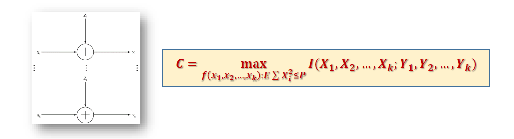

高斯信道的扩展：n个信道，可以同时使用。仍然存在能量的限制。

Assume that we have a set of Gaussian channels in parallel. The output of each channel is the sum of the input and Gaussian noise. For channel $j$
$$Y_{j}=X_{j}+Z_{j}, \quad j=1,2, \dots, k$$
The noise is assumed to be independent from channel to channel. We assume that there is a common power constraint on the total power used, that is
$$E \sum_{j=1}^{k} X_{j}^{2} \leq P$$
We wish to **distribute the power among the various channels** so as to maximize the total capacity. 将问题更细化一步，我们需要对单个信道的能量做一定的分配。
$$ P_{i}=E X_{i}^{2},\text{ and }\sum P_{i} \leq P$$

### Solution

$$\begin{aligned}
& I\left(X_{1}, X_{2}, \ldots, X_{k} ; Y_{1}, Y_{2}, \ldots, Y_{k}\right) \\
=& h\left(Y_{1}, Y_{2}, \ldots, Y_{k}\right)-h\left(Y_{1}, Y_{2}, \ldots, Y_{k} | X_{1}, X_{2}, \ldots, X_{k}\right) \\
=& h\left(Y_{1}, Y_{2}, \ldots, Y_{k}\right)-h\left(Z_{1}, Z_{2}, \ldots, Z_{k} | X_{1}, X_{2}, \ldots, X_{k}\right) \\
=& h\left(Y_{1}, Y_{2}, \ldots, Y_{k}\right)-h\left(Z_{1}, Z_{2}, \ldots, Z_{k}\right) \\
=& h\left(Y_{1}, Y_{2}, \ldots, Y_{k}\right)-\sum_{i} h\left(Z_{i}\right) \\
\leq & \sum h\left(Y_{i}\right)-h\left(Z_{i}\right) \\
\leq & \sum_{i} \frac{1}{2} \log \left(1+\frac{P_{i}}{N_{i}}\right) \quad \text{高斯噪声最大化微分熵}
\end{aligned}$$

where $P_{i}=E X_{i}^{2},$ and $\sum P_{i}=P .$ 等号是可以取到的，Equality is achieved by
$$
\left(X_{1}, X_{2}, \ldots, X_{k}\right) \sim \mathcal{N}\left(0,\left[\begin{array}{cccc}
P_{1} & 0 & \cdots & 0 \\
0 & P_{2} & \cdots & \vdots \\
\vdots & \vdots & \ddots & \vdots \\
0 & 0 & \cdots & P_{k}
\end{array}\right]\right)
$$

优化目标：
$$\begin{array}{c}
\max \sum_{i} \log \left(1+\frac{P_{i}}{N_{i}}\right) \\
\sum P_{i}=P
\end{array}$$

凸优化问题，可解。我们发现，在并行高斯信道中，我们需要专门分配能量。
Extension：分配能量算法：water-filling

## Worst Additive Noise

推广到噪声的一般分布，信道容量定理依然成立。

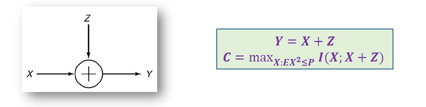

### Problem

- Under the energy constraint $P,$ the channel capacity of additive channel $Y=X+Z$ is
  $$
  \begin{aligned}
  C(Z) &=\max _{X: E X^{2} \leq P} I(X ; Y) \\
  &=\max _{X: E X^{2} \leq P} h(X+Z)-h(Z)
  \end{aligned}
  $$
  后一项需要根据具体情况具体分析。

- 加一个限制？What is the minimum of $C(Z),$ if we could choose $Z: E Z^{2} \leq N$
  - That is, to play a max-min game between $X$ and $Z$ 在Z给定的情况下设定X
    $$\begin{aligned}
    \max _{Z: E Z^{2} \leq N} C(Z)&:=\min _{Z: E Z^{2} \leq N} \max _{X: E X^{2} \leq P} I(X ; X+Z)\\
    &=\min _{Z: E Z^{2} \leq N}\left(\max _{X: E X^{2} \leq P} I(X ; X+Z)\right)
    \end{aligned}
    $$
  - 对多重优化问题，把内部看成一个函数，分两步走。We need to find a $Z^{*} .$ When $C\left(Z^{*}\right)$ is attained by $X^{*}$
    $$
    I\left(X^{*} ; X^{*}+Z^{*}\right) \leq \max _{X: E X^{2} \leq P} I(X ; X+Z)
    $$

- The $\min _{Z: E Z^{2} \leq N} C(Z)$ is attained iff $Z=Z_{G} \sim \mathcal{N}\left(0, \sigma^{2}\right)$ (Shannon, 1948)

### Entropy power inequality
在给定信道能量的情况下，高斯噪声是最坏的加性噪声。EPI，熵幂不等式

> Entropy power inequality (EPI, Shannon 1948 ): If $X$ and $Y$ are independent random $n$ vectors with densities, then
> $$
> e^{\frac{2}{n} h(X+Y)} \geq e^{\frac{2}{n} h(X)}+e^{\frac{2}{n} h(Y)}
> $$
> 证明略

利用EPI，我们证明前一节的定理
- Recall $I(X ; X+Z)=h(X+Z)-h(Z)$
- By EPI, $h(X+Z) \geq \frac{1}{2} \log \left(e^{2 h(X)}+e^{2 h(Z)}\right)$
- 我们有$I(X ; X+Z) \geq \frac{1}{2} \log \left(e^{2 h(X)}+e^{2 h(Z)}\right)-h(Z)$
- $f(t, s)=\frac{1}{2} \log \left(e^{2 t}+e^{2 s}\right)-s,$ where

$$\begin{array}{l}
t=h(X) \leq \frac{1}{2} \log 2 \pi e P \\
s=h(Z) \leq \frac{1}{2} \log 2 \pi e N
\end{array}$$

- In $f(t, s)$ is increasing and convex in $t,$ and is decreasing and convex in $S$
- Fix $s, f(t, s)$ is maximized if $t=\frac{1}{2} \log 2 \pi e P$
- Fix $t, f(t, s)$ is minimized if $s=\frac{1}{2} \log 2 \pi e N$
- $X^{*} \sim \mathcal{N}(0, P), Z \sim \mathcal{N}\left(0, N^{*}\right)$

In Gaussian channel

$$I\left(X ; X+Z^{*}\right) \leq I\left(X^{*} ; X^{*}+Z^{*}\right)=C\left(Z^{*}\right)$$

$$\begin{aligned}
& I\left(X^{*} ; X^{*}+Z\right) \\
=& h\left(X^{*}+Z\right)-h(Z) \\
\geq & \frac{1}{2} \log \left(e^{2 h\left(X^{*}\right)}+e^{2 h(Z)}\right)-h(Z) \\
\geq & \min f(t, s) \\
=& I\left(X^{*} ; X^{*}+Z^{*}\right)
\end{aligned}$$

综合起来，我们获得了一个不等式链，高斯分布位于中间。同时作为下界和上界而存在。这也揭示了我们在很多问题中，以高斯信道为例的意义。

$$\boldsymbol{I}\left(\boldsymbol{X} ; \boldsymbol{X}+\boldsymbol{Z}^{*}\right) \leq \boldsymbol{I}\left(\boldsymbol{X}^{*} ; \boldsymbol{X}^{*}+\boldsymbol{Z}^{*}\right) \leq \boldsymbol{I}\left(\boldsymbol{X}^{*} ; \boldsymbol{X}^{*}+\boldsymbol{Z}\right)$$

$$\begin{aligned}
\min _{Z} \max _{X} I(X ; X+Z) &=\max _{X} \min _{Z} I(X ; X+Z) \\
&=\frac{1}{2} \log \left(1+\frac{P}{N}\right)
\end{aligned}$$

完结撒花~

