# 0325 Data Compression (2)

## Huffman coding

### Algorithm

本质是一种贪心算法, D元组(字符串可以不仅是二进制)
> **D-ary Huffman codes (prefix code)** for a given distribution:
> Each time **combine $D$ symbols** with the **lowest probabilities** into a single source symbol, until there is only one symbol

对三元组, 二元组编码的Huffman编码实现
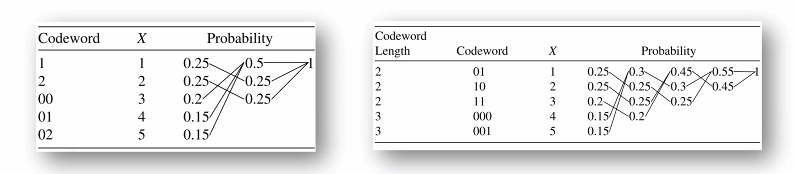

- Huffman Coding is optimal: $\min \sum p_{i} l_{i}$
- Huffman coding for weighted codewords $w_{i}$
  $$
  p_{i} \Rightarrow w_{i} \rightarrow \frac{w_{i}}{\sum w_{i}}
  $$
  等价问题: 用贪心策略取带权重期望长度的最小值. Huffman's algorithm for minimizing $\sum w_{i} l_{i}$ can be applied to any set of numbers $w_{i} \geq 0$

> If $D \geq 3,$ we may not have a sufficient number of symbols so that we can combine them $D$ at a time. In such a case, we **add dummy symbols to the end of the set of symbols**. The dummy symbols have probability o and are inserted to fill the tree.

- 如何计算哑符号的数量: since at each stage of the reduction, the number of symbols is reduced by $D-1$, we want the total number of symbols to be $1+k(D-1),$ where $k$ is the number of merges.
- 本质上原理是一致的 Morse Vs. Huffman Morse code could be regarded as a certain Huffman code when $p_{i}^{\prime} s$ are estimated
- Adaptive Huffman coding

### Extension

> Huffman code is not unique: $l_{i}, 1 \leq i \leq n$

- Counterexample: $0 \rightarrow 1,1 \rightarrow 0$ 一个简单的方式, 交换0,1的编码
- For $p(X)=\left(\frac{1}{3}, \frac{1}{3}, \frac{1}{4}, \frac{1}{12}\right),$ both (2,2,2,2) and (1,2,3,3) are optimal Huffman code. 即便是从码长不同的角度看, 我们也可能得到最优情况下不同的码长分布.
- 对number of different huffman trees, 还没有完善的结论

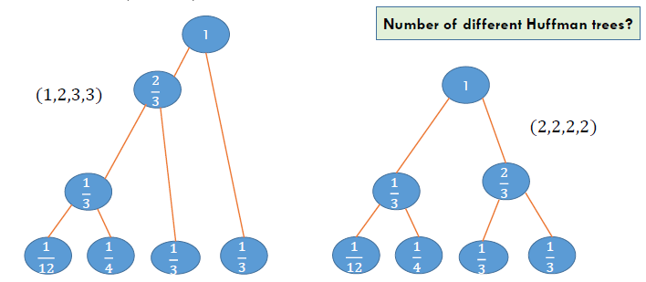

> A probability distribution $\operatorname{Pr}(X)$ is called **$D$ -adic** if each of the probabilities
> $$
> \operatorname{Pr}\left(X=x_{i}\right)=D^{-n}
> $$
> for some $n$
>
> - 因为如果概率分布满足D-adic, 那么可以保证取完对数后可以得到整数值. For a $D$ -adic distribution, the optimal solution in Lagrange is unique: $l_{i}=\log \frac{1}{p_{i}}=n_{i}$ 与上一节的香农码的优化问题对应.

- Huffman Vs. Shannon codes
  - Shannon codes $\left|\log \frac{1}{p_{i}}\right|$ attain optimality within 1 bit. If the prob. distribution is $D$ adic, **Shannon codes are optimal** 香农码有些情况可以取到最优值
  - **Shannon codes may be much worse when $p_{i} \rightarrow 0:$** Consider two symbols, one with probability 0.9999 and the other with probability $0.0001 .$ The optimal codeword length is 1 bit for both symbols. The lengths of Shannon codes are 1 and 14. 但Huffman整体情况下比香农码好
- Huffman codes in application
  - JPEG, PNG, ZIP, MP3
  - Cryptography
  - Internet protocol, HTTP header (RFC)

## Canonical Codes
我们希望证明哈弗曼编码的最优性, 我们先讨论一些有关最优编码(规范化编码)的基本性质

基本假设: Without loss of generality, we will assume that the probability masses are ordered, so that $p_{1} \geq p_{2} \geq \cdots \geq p_{m} .$ Recall that a code is **optimal if $\sum p_{i} l_{i}$ is minimal**.

Then, For any optimal coding scheme

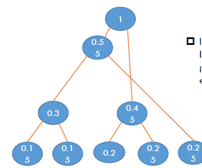

> 1\. **概率越大,码长越小** The lengths are ordered inversely with the probabilities (i.e., if $p_{j}>p_{k}$, then $l_{j} \leq l_{k}$ ).

If $p_{j}>p_{k},$ then $l_{j} \leq l_{k}$ 反证法: 交换一下就发现码长期望变小了,contradict.
If not, swap the codewords of $j$ and $k$ Denote the new code by $C_{m}^{\prime}$
$$
\begin{aligned}
L\left(C_{m}^{\prime}\right)-L\left(C_{m}\right) &=\sum p_{i} l_{i}^{\prime}-\sum p_{i} l_{i} \\
&=p_{j} l_{k}+p_{k} l_{j}-p_{j} l_{j}-p_{k} l_{k} \\
&=\left(p_{j}-p_{k}\right)\left(l_{k}-l_{j}\right)<0
\end{aligned}
$$

> 2\. **最长的两个码码制长度一致** The two longest codewords have the same length

If the two longest codewords are not of the same length, one can delete the last bit of the longer one, preserving **the prefix property** and achieving lower expected codeword length. 因为去除最后一位后, 由前缀码的性质, 依然是合法的编码, 但却降低了码长

> 3\. **最长码制一定是兄弟姐妹** Two of the longest codewords differ only in the last bit and correspond to the two least likely symbols.

If there is a maximal length codeword without a sibling( 兄弟姐妹 ), we can delete the last bit of the codeword and still satisfy the prefix property. 如果存在这样的孤儿, 那么根据前缀码的性质, 去掉最后的bit, 依然是合法的编码, 但却降低了码长

### Optimality: Strategy

> We prove the optimality of Huffman coding **for a binary alphabet**
> - When $m=2,$ it is trivial
> - For any probability mass function for an alphabet of size $m, p=\left(p_{1}, p_{2}, \ldots, p_{m}\right)$ with $p_{1} \geq p_{2} \geq \cdots \geq p_{m},$ we define $\mathrm{p}^{\prime}=\left(p_{1}, p_{2}, \ldots, p_{m-2}, p_{m-1}+p_{m}\right)$ over an alphabet of size $m-1$
> Now we need to prove the optimality Huffman coding on $\mathrm{p}$ by the Huffman code on $\mathrm{p}^{\prime}$ Challenge: Not so obvious 归纳证明.

For any probability mass function for an alphabet of size $m, p=\left(p_{1}, p_{2}, \ldots, p_{m}\right)$ with $p_{1} \geq p_{2} \geq \cdots \geq p_{m},$ we define $\mathrm{p}^{\prime}=\left(p_{1}, p_{2}, \ldots, p_{m-2}, p_{m-1}+p_{m}\right)$ over an alphabet of size $m-1$.
Let $C_{m-1}^{*}\left(\mathrm{p}^{\prime}\right)$ be an optimal code for $\mathrm{p}^{\prime}$. Let $C_{m}(\mathrm{p})$ be a code for $\mathrm{p}$ $$C_{m-1}^{*}\left(\mathrm{p}^{\prime}\right) \Rightarrow C_{m}(p)$$

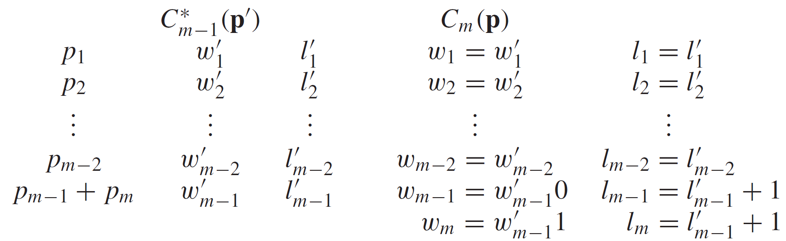

假设左边是最优的编码方案, 我们希望构造出右边的构造方案, 一个简单的操作是把后者的概率分布拆开. 新的码制都是原本码制基础上分别加0和1, 通过这样的操作, 我们可以计算出它们的平均码长符合如下的性质.

>  Expand an optimal code for $\mathrm{p}^{\prime}$ to construct a code for $\mathrm{p}$
>  $$
>  L(\mathbf{p})=L^{*}\left(\mathbf{p}^{\prime}\right)+p_{m-1}+p_{m}
>  $$
>  $\left(L \text { and } L^{*}\right)$ $L^{*}$是已知的最优编码,$L$是通过huffman方法构造出的编码
>  $C_{m}(p)$ is a Huffman code. Maybe not optimal

From the canonical code for $\mathbf{p},$ we construct a code for $\mathbf{p}^{\prime}$ by merging the codewords for the two lowest-probability symbols $m-1$ and $m$ with probabilities $p_{m-1}$ and $p_{m},$ which are siblings by the properties of the canonical code. 由此前的规范化编码性质, 我们可以说明最长两者是兄弟节点, 因此这样的操作是合法的. The new code for $\mathbf{p}^{\prime}$ has average length:

$$\begin{aligned}
L\left(\mathbf{p}^{\prime}\right) &=\sum_{i=1}^{m-2} p_{i} l_{i}+p_{m-1}\left(l_{m-1}-1\right)+p_{m}\left(l_{m}-1\right) \\
&=\sum_{i=1}^{m} p_{i} l_{i}-p_{m-1}-p_{m} \\
&=L^{*}(\mathbf{p})-p_{m-1}-p_{m}
\end{aligned}$$

- Expand an optimal code for $p^{\prime}$ to construct a code for $p$ 
  $$L(\mathrm{p})=L^{*}\left(\mathrm{p}^{\prime}\right)+p_{m-1}+p_{m}$$
- Condense an optimal canonical code for $p$ to construct a code for the reduction $p^{\prime}$ 
  $$L\left(\mathrm{p}^{\prime}\right)=L^{*}(\mathrm{p})-p_{m-1}-p_{m}$$
- 两式相加, Together, 
  $$L(\mathrm{p})+L\left(\mathrm{p}^{\prime}\right)=L^{*}(\mathrm{p})+L^{*}\left(\mathrm{p}^{\prime}\right)$$
  since $L(\mathrm{p}) \geq L^{*}(\mathrm{p}), L\left(\mathrm{p}^{\prime}\right) \geq L^{*}\left(\mathrm{p}^{\prime}\right)$ 假设中的最优性
  $$L(\mathbf{p})=L^{*}(\mathbf{p}) \text{\quad and \quad} L\left(\mathbf{p}^{\prime}\right)=L^{*}\left(\mathbf{p}^{\prime}\right)$$
- 由此, 我们通过双向构造完成了归纳证明. 即如果p'上哈夫曼编码是最优的, 那么p上面的最优性也是保证的. **Let the optimal code on $\mathbf{p}^{\prime}$ be a Huffman code, then the expanded code on $p$ is also $a$ Huffman code and it is optimal for $p$**.
- 哈夫曼编码最优性的表述: Huffman coding is optimal; that is, if $C^{*}$ is a Huffman code and $C^{\prime}$ is any other uniquely decodable code, $L\left(C^{*}\right) \leq L\left(C^{\prime}\right)$

## Shannon-Fano-Elias coding

### Formulation

> Motivation: 虽然在平均码长上不如哈夫曼编码, 但提出了一种全新的构造方式, 且在后续的应用中获得了更高的改进. the codeword lengths $l(x)=\left\lceil\log \frac{1}{p(x)}\right\rceil \Rightarrow$ Kraft's inequality
> Without loss of generality, we can take $x=\{1,2, \ldots, m\} .$ Assume that $p(x)>0$ for all $x .$ The **cumulative(累积) distribution function** $F(\boldsymbol{x})$ is defined as $F(x)=\sum_{a \leq x} p(a)$
> Consider the modified cumulative distribution function
> $$
> \bar{F}(x)=\sum_{a<x} p(a)+\frac{1}{2} p(x)=F(x)-\frac{1}{2} p(x)
> $$
> 折线段上,我们取中间的节点. 这样设置的好处:
> - The step size is $p(x) . F(x)$ is the midpoint.
> - $\bar{F}(x)$ can determine $x .$ **Thus is a code for $x$**
> 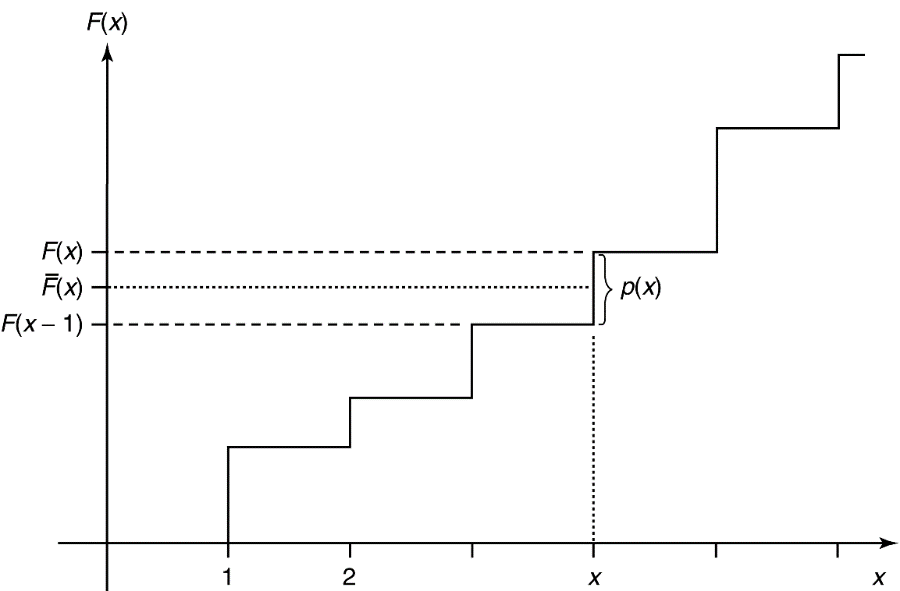

- $\bar{F}(x)$ is a real number. Truncate $\bar{F}(x)$ to $l(x)$ bits and use the first $l(x)$ bit of $\bar{F}(x)$ as a code for $x .$ Denote by $\lfloor\bar{F}(x)\rfloor_{l(x)}$
- We have: $\bar{F}(x)-\left\lfloor\bar{F}(x)\right\rfloor_{l(x)} \leq \frac{1}{2^{l(x)}}$
If $l(x)=\left\lceil\log \frac{1}{p(x)}\right\rceil+1$
$$
\frac{1}{2^{l(x)}} \leq \frac{p(x)}{2}=\bar{F}(x)-\bar{F}(x-1)
$$
$\lfloor\bar{F}(x)\rfloor_{l(x)}$ lies within the step corresponding to $x .$ Thus, $l(x)$ bits suffice to describe $x$. (Prefix-free code)
$$
L=\sum p(x) l(x)<H(X)+2
$$

> ROADMAP: CDF -> improved CDF
> $$p(x) \Rightarrow F(x)=\sum_{a \leq x} p(a) \Rightarrow \bar{F}(x)=F(x)-\frac{1}{2} p(x) \Rightarrow l(x)+1 \text { bits }$$

### Example

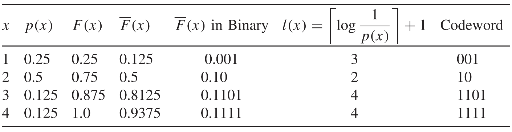

The average codeword length is 2.75 bits and the entropy is 1.75 bits. The Huffman code for this case achieves the entropy bound.
- Direct application of Shannon-Fano-Elias coding would also need arithmetic **whose precision grows with the block size**, which is not practical when we deal with long blocks.
- Shannon-Fano-Elias $\Rightarrow$ 改进 Arithmetic coding

### Optimality

> (Optimality) Let $l(x)$ be the codeword lengths associated with the Shannon code, and let $l^{\prime}(x)$ be the codeword lengths associated with any other uniquely decodable code. Then
> $$
> \operatorname{Pr}\left(l(x) \geq l^{\prime}(x)+c\right) \leq \frac{1}{2^{c-1}}
> $$
> Hence, no other code can do much better than the Shannon code most of the time 注意,是具体码制的随机变量,而不是平均码长, 不与Huffman矛盾.

For example, the probability that $l^{\prime}(X)$ is 5 or more bits shorter than $l(X)$ is less than $\frac{1}{16}$
$$
\begin{aligned}
\operatorname{Pr}\left(l(X) \geq l^{\prime}(X)+c\right) &=\operatorname{Pr}\left(\left\lceil\log \frac{1}{p(X)}\right\rceil \geq l^{\prime}(X)+c\right) \\
& \leq \operatorname{Pr}\left(\log \frac{1}{p(X)} \geq l^{\prime}(X)+c-1\right) \\
&=\operatorname{Pr}\left(p(X) \leq 2^{-l^{\prime}(X)-c+1}\right) \\
&=\sum_{x: p(x) \leq 2^{-l^{\prime}(x)-c+1}} p(x) \\
& \leq \sum_{x: p(x) \leq 2^{-l^{\prime}(x)-c+1}} 2^{-l^{\prime}(x)-(c-1)} \\
& \leq \sum_{x} 2^{-l^{\prime}(x)} 2^{-(c-1)} \\
& \leq 2^{-(c-1)}
\end{aligned}
$$
since $\sum 2^{-l^{\prime}(x)} \leq 1$ by the Kraft inequality.

Hence, no other code can do much better than the Shannon code most of the time. We now strengthen this result. In a game-theoretic setting, one would like to ensure that $l(x)<l^{\prime}(x)$ more often than $l(x)>l^{\prime}(x)$ The fact that $l(x) \leq l^{\prime}(x)+1$ with probability $\geq \frac{1}{2}$ does not ensure this. We now show that even under this stricter criterion, Shannon coding is optimal. Recall that the probability mass function $p(x)$ is dyadic if $\log \frac{1}{p(x)}$ is an integer for all $x$

# 0330 Data Compression (3)

## Random Variable Generation

### Introduction

> We are given a sequence of fair coin tosses $Z_{1}, Z_{2}, \ldots,$ and we wish to generate $X$ on $X=\{1,2, \ldots, m\}$ with probability mass function $\mathbf{p}=$ $\left(p_{1}, \ldots, p_{m}\right)$
> 直观上, 只要我们抛的够多, 就可以生成X的分布.
> 但我们希望不要抛太多.
> Let the random variable $T$ denote the number of coin flips used in the algorithm

Generate a random variable according the outcome of fair coin flips:

HHHH, TTTTT, HTHTHT, THTHTH 
比如,我们要构造这样的概率分布, If $X=\{0,1,2\}, p(X)=\left(\frac{1}{2}, \frac{1}{4}, \frac{1}{4}\right)$, 利用抛硬币的结果, 我们可以设置这样的生成机制.
$\mathrm{H}: X=0$
$\mathrm{TH}: X=1$
$\mathrm{TT}: X=2$

> 算法优化的目标: How many fair coin flips to generate $X$?
> Recall: The entropy of $X$ $H(X)=1.5$
> 如果一个问题跟信息有关系, 联想到熵
> The expected number of coin flips $E(T)=1.5$

### Formulation

> Representation of a generation algorithm 
> We can describe the algorithm mapping strings of bits $Z_{1}, Z_{2}, \ldots,$ to possible outcomes $X$ by **a binary tree** 
> The **leaves** of the tree are marked by output symbols $X$, and the path to the leaves is given by the sequence of bits produced by the fair coin

The tree representing the algorithm must satisfy certain properties:
- The tree should be **complete** (i.e., every node is either a leaf or has two descendants in the tree). The tree may be infinite, as we will see in some examples. 
- The probability of a leaf **at depth $k$ is $2^{-k}$.** **Many leaves may be labeled with the same output symbol** 不同的叶子节点可能对应同一个随机变量 - the total probability of all these leaves should equal the desired probability of the output symbol.
- The expected number of fair bits $E T$ required to generate $X$ is equal to the expected depth of this tree.

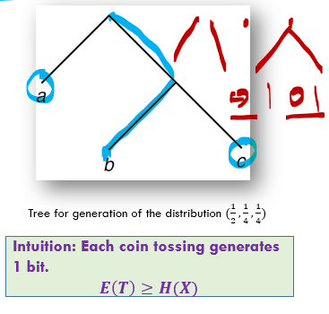

### Properties

> Let $\mathcal{y}$ denote the set of leaves of a complete tree. Consider a distribution on the leaves such that the probability of a leaf at depth $k$ on the tree is $2^{-k} .$ Let $Y$ be a random variable with this distribution. 
> (Lemma). For any complete tree, consider a probability distribution on the leaves such that the probability of a leaf at depth $k$ is $2^{-k} .$ Then **the expected depth of the tree is equal to the entropy of this distribution $(H(Y)=E T)$.**

Proof. trivial.

$$E(T)=\sum_{y \in y} k(y) 2^{-k(y)}$$

The entropy of the distribution of $Y$ is
$$
\begin{aligned}
H(Y) &=-\sum_{y \in \mathcal{Y}} \frac{1}{2^{k(y)}} \log \frac{1}{2^{k(y)}} \\
&=\sum_{y \in y} k(y) 2^{-k(y)}
\end{aligned}
$$
where $k(y)$ denotes the depth of leaf $y .$ 在这里, 暂时不考虑$Y$有相同的情况. Thus,

**在$Y$的样本空间和叶子节点一一对应时**, $H(Y)=E T$.

> (Theorem). 考虑任意生成算法 For any algorithm generating $X$, the expected number of fair bits used is greater than the entropy $H(X),$ that is, $E(T)\geq H(X)$

- Any algorithm generating $X$ from fair bits can be represented by a complete binary tree. 生成算法其实是给没一个叶子节点编号. Label all the leaves of this tree by distinct symbols $y \in Y=\{1,2, \ldots\} .$ 特别的, 考虑If the tree is **infinite**, the alphabet $Y$ is also **infinite**.
- Now consider the random variable $Y$ defined on the leaves of the tree, such that for any leaf $y$ at depth $k$, the probability that $Y=y$ is $2^{-k}$. The expected depth of this tree is equal to the entropy of $Y:$
  $$E T=H(Y)$$
- Now the random variable $X$ is **a function of $Y$** (one or more leaves map onto an output symbol), and hence we have $H(X) \leq H(Y) \leq E(T)$

给出了基本下界, 证明是在上一页基本lemma上, 将算法的生成描述成了一个函数关系.

### Algorithm

> (Theorem). 下界是否可以取到 Let the random variable $X$ have a **dyadic distribution**. (每一个概率分布都可以写作$D^{-n}$) The optimal algorithm to generate $X$ from fair coin flips requires an expected number of coin tosses precisely equal to the entropy:
> $$E T=H(X)$$

- For the constructive part, we use the Huffman code tree for $X$ as the tree to generate the random variable. Each $X=x$ will correspond to a leaf.
- For a dyadic distribution, the Huffman code is the same as the Shannon code and achieves the entropy bound. *(Recall Lagrange Formula, 最优解可以取到)*
  $$- l_{i}=\log D^{-n_{i}}=n_{i}$$
- 又, 每个事件只对应一个节点, For any $x \in X,$ the depth of the leaf in the code tree corresponding to $x$ is the length of the corresponding codeword, which is $\log \frac{1}{p(x)} .$ Hence, when this code tree is used to generate $X,$ the leaf will have a probability 
  $$2^{-\log _{p}(x)}=p(x)$$
- The expected number of coin flips is the expected depth of the tree, which is equal to the entropy (because the distribution is dyadic). Hence, for a dyadic distribution, the optimal generating algorithm achieves
  $$- E T=H(X)$$

一般情况?

- If the distribution is not dyadic? In this case we cannot use the same idea, since **the code tree for the Huffman code will generate a dyadic distribution on the leaves, not the distribution** with which we started 样本空间不再与叶子节点一一对应.
- since all the leaves of the tree have probabilities of the form $2^{-k},$ it follows that **we should split any probability $p_{i}$ that is not of this form into atoms of this form**. We can then allot these atoms(原子形式) to leaves on the tree

$$p(x)=\frac{7}{8}=\frac{1}{2}+\frac{1}{4}+\frac{1}{8}$$

> **Finding the binary expansions of the probabilities $p_{i}^{\prime} s$.**二进制展开式 Let the binary expansion of the probability $p_{i}$ be
> $$p_{i}=\sum_{j \geq 1} p_{i}^{(j)}$$
> 对应叶子节点 where $p_{i}^{(j)}=2^{-j}$ or $0 .$ Then the atoms of the expansion are the $\left\{p_{i}^{(j)}: i=1,2, \ldots, m, j \geq 1\right\}$
> Since $\sum_{i} p_{i}=1,$ **the sum of the probabilities of these atoms is $1 .$** We will allot an atom of probability $2^{-j}$ to a leaf at depth $j$ on the tree.
> The **depths (j) of the atoms satisfy the Kraft inequality**, we can always construct such a tree with all the atoms at the right depths.

### Example

Let $X$ have distribution
$$X=\left\{\begin{array}{l}
a \text { with prob. } \frac{2}{3} \\
b \text { with prob. } \frac{1}{3}
\end{array}\right.$$
We find the binary expansions of these probabilities:
$$
\begin{array}{l}
\frac{2}{3}=0.10101010 \ldots 2 \\
\frac{1}{3}=0.01010101 \ldots 2
\end{array}
$$
Hence, the atom for the expansion are:
$$
\begin{array}{l}
\frac{2}{3} \rightarrow\left(\frac{1}{2}, \frac{1}{8}, \frac{1}{32}, \ldots\right) \\
\frac{1}{3} \rightarrow\left(\frac{1}{4}, \frac{1}{16}, \frac{1}{64}, \ldots\right)
\end{array}
$$

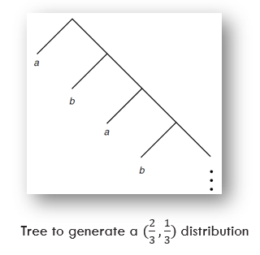

> This procedure yields a tree that generates the random variable $X$. We have argued that this procedure is optimal (gives a tree of minimum expected depth) 因为是最优的, 所以也是完全的.
> 我们也可以从理论上证明, 期望深度的最小值具有上界.
> (Theorem) The expected number of fair bits required by the optimal algorithm to generate a random variable $X$ lies between $H(X)$ and $H(X)+2$:
> $$ H(X) \leq E T<H(X)+2 $$

## Universal Source Coding
理论应用实际的限制: Challenge: For many practical situations, however, the probability distribution underlying the source may be unknown 信源的分布是未知的
- One possible approach is to wait until we have seen all the data, **estimate the distribution** from the data, use this distribution to construct the best code, and then **go back** to the beginning and compress the data using this code.
  - This two-pass procedure is used in some applications where there is a fairly small amount of data to be compressed.
- In yet other cases, there is no probability distribution underlying the data-all we are given is an individual sequence of outcomes. How well can we compress the sequence?
  - If we do not put any restrictions on the class of algorithms, we get a meaningless answer- there always exists a function that compresses a particular sequence to one bit while leaving every other sequence uncompressed. This function is clearly "overfitted" to the data. 我们需要构造通用的算法. 为此, 压缩算法要有一些限制(counter.e.g.: 1 bit)

> Assume we have a random variable $X$ drawn according to a distribution from the family $\left\{p_{\theta}\right\},$ **where the parameter $\theta \in\{1,2,3, \ldots, m\}$ is unknown** We wish to find an efficient code for this source

### Minmax Redundancy

根据上面的问题假设, 我们进行如下分析
- **If we know $\theta$**, we can construct a code with codeword length $l(x)=\log \frac{1}{p_{\theta}(x)}$ 为了分析的方便, 我们省略向上取整的一步.(+1 bit)
  $$\min _{l(x)} E_{p}[l(X)]=E_{p}\left[\log \frac{1}{p_{\theta}(X)}\right]=H\left(p_{\theta}\right)$$
- What happens if **we do not know the true distribution $p_{\theta}$**, yet wish to code as efficiently as possible? In this case, using a code with codeword lengths $l(x)$ and implied probability $q(x)=2^{-l(x)},$ we define the redundancy of the code as the difference between the expected length of the code and the lower limit for the expected length: 定义冗余
  $$
  \begin{aligned}
  R\left(p_{\theta}, q\right) &=E_{p_{\theta}}[l(x)]-E_{p_{\theta}}\left[\log \frac{1}{p_{\theta}(x)}\right]=\sum_{x} p_{\theta}(x)\left(l(x)-\log \frac{1}{p_{\theta}(x)}\right) \\
  &=\sum_{x} p_{\theta}(x)\left(\log \frac{1}{q(x)}-\log \frac{1}{p_{\theta}(x)}\right)=D\left(p_{\theta} \| q\right)
  \end{aligned}
  $$
- 这样, 我们定义了在不知道真实分布的情况下, 某种编码的冗余程度是它和真实分布之间的相对熵
- 目标:最大冗余最小化, We wish to find a code that does well irrespective of the true distribution $p_{\theta},$ and thus we define the **minimax redundancy as**
  $$
  R^{*}=\min _{a} \max _{n e} R=\min _{a} \max _{n e} D\left(p_{\theta} \| q\right)
  $$

### Redundancy and Capacity

对任意冗余我们可以构造一个信道. 任意最小最大冗余的计算可以归结为信道容量的计算.

> (Theorem) The capacity of a channel $p(x | \theta)$ with rows $p_{1}, p_{2}, \ldots, p_{m}$ is given by
> $$ C=R^{*}=\min _{q} \max _{\theta} D\left(p_{\theta} \| q\right) $$

将信源的所有可能分布写作一个状态转移矩阵, 看作一个信道

How to compute $R^{*}$ : Take $\left\{p_{\theta}: 1 \leq \theta \leq m\right\}$ as a transition a matrix 
$$
\boldsymbol{\theta} \rightarrow\left[\begin{array}{c}\ldots p_{1}(x) \ldots \\ \ldots p_{2}(x) \ldots \\ \vdots \\ \ldots p_{\theta}(x) \ldots \\ \ldots p_{m}(x) \ldots\end{array}\right] \rightarrow X
$$

This is a channel $\left\{\theta, p_{\theta}(x), x\right\}$. The capacity of this channel is given by

$$
C=\max _{\pi(\theta)} I(\theta ; X)=\max _{\pi(\theta)} \sum_{\theta} \pi(\theta) p_{\theta}(x) \log \frac{p}{q}
$$

where $q_{\pi}(x)=\sum_{\theta} \pi(\theta) p_{\theta}(x)$

信道和相对熵是等价的

## Arithmetic Coding

> Recall: Shannon-Fano-Elias Coding: $F(a)=\operatorname{Pr}(x \leq a)$
> $$l(x)=\left\lceil\frac{1}{p(x)}\right\rceil+1$$
> $$H(X) \leq E(l(x))<H(X)+2$$
> Motivation: using intervals to represent symbols

Consider a random variable $X$ with a ternary alphabet $\{A, B, C\},$ with probabilities $0.4,0.4,$ and 0.2 respectively. $F(x)=(0.4,0.8,1.0)$.
Let the sequence to be encoded by **ACAA**
- $A \rightarrow[0,0.4)$
- $AC \rightarrow[0.32,0.4) \text { (scale with ratio }(0.4,0.8,1.0))$ 在上一区间的基础上进一步缩放
- $A C A \rightarrow[0.32,0.352)$
- $ACAA \rightarrow[0.32,0.3328)$

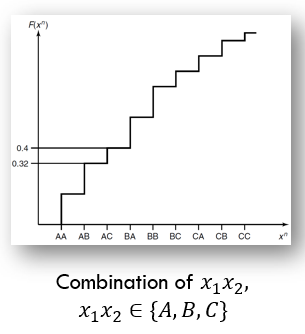

## Lempel-Ziv Coding: Introduction

基于字典的适应性的编码, 动态调整字典大小

Use dictionaries for compression dates back to the invention of the telegraph.
- ".25: Merry Christmas"
- "26: May Heaven's choicest blessings be showered on the newly married couple."

The idea of **adaptive dictionary-based** schemes was not explored until Ziv and Lempel wrote their papers in 1977 and $1978 .$ The two papers describe two distinct versions of the algorithm. We refer to these versions as LZ77 or sliding window Lempel-Ziv and LZ78 or tree-structured Lempel-Ziv.

Gzip, pkzip, compress in unix, GIF

LZ编码有两种方式: 滑动窗口/

### Sliding Window

The key idea of the Lempel-Ziv algorithm is to **parse the string into phrases** and to replace phrases by pointers to where the same string has occurred in the past. 重复出现的短语用记号替代它

> Sliding Window Lempel-Ziv Algorithm
> We assume that we have a string $x_{1}, x_{2}, \ldots$ to be compressed from a finite alphabet. A **parsing** $S$ of a string $x_{1} x_{2} \cdots x_{n}$ is a division of the string into phrases, separated by commas.Let $W$ be the **length of the window**.
> Assume that we have compressed the string until time $i-1 .$
> - Then to find the next phrase, find the largest $k$ such that for some $j, i-W \leq j \leq i-1,$ the string of length $k$ starting at $x_{j}$ is equal to the string (of length $k$ ) starting at $x_{i}$ (i.e., $x_{j+l}=x_{i+l}$ for all $0 \leq l<k$ ). The next phrase is then of length $k$ (i.e., $x_{i} \ldots x_{i+k-1}$ ) and is represented by the pair (P, $L$ ), where $P$ is the location of the beginning of the match and $L$ is the length of the match. 
> If a match is not found in the window, the next character is sent uncompressed.

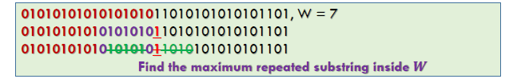

For example, if $W=4$ and the string is ABBABBABBBAABABA and the initial window is empty, the string will be parsed as follows: $\mathrm{A}, \mathrm{B}, \mathrm{B}, \mathrm{ABBABB}, \mathrm{BA}, \mathrm{A}, \mathrm{BA}, \mathrm{BA},$ which is represented by the sequence of "pointers": $(0, \mathrm{A}),(0, \mathrm{B}),(1,1,1),(1,3,6),(1,4,2),(1,1,1),(1,3,2),(1,2,2),$ where the flag bit is 0 if there is no match and 1 if there is a match, and the location of the match is measured backward from the end of the window. [In the example, we have represented every match within the window using the $(P, L)$ pair; however, it might be more efficient to represent short matches as uncompressed characters. See Problem 13.8 for details.]

We can view this algorithm as using a dictionary that consists of all substrings of the string in the window and of all single characters. The algorithm finds the longest match within the dictionary and sends a pointer to that match. We later show that a simple variation on this version of LZ77 is asymptotically optimal. Most practical implementations of LZ77, such as gzip and pkzip, are also based on this version of LZ77.

### Tree-Structure

思想一致, 解析标准改变了:
each phrase is the shortest phrase not seen earlier.

我们用搜索树为字典建模.
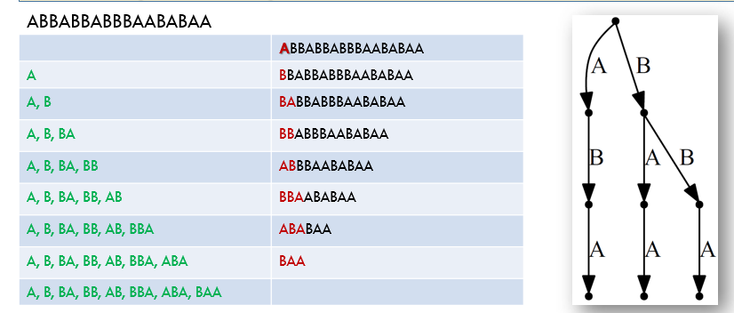

"Trie" in data structure.

Since this is the shortest such string, all its prefixes must have occurred earlier. (Thus, we can build up a tree of these phrases.) In particular, the string consisting of all but the last bim of this string must have occurred earlier. We code this phrase by givine the location of the prefix and the value of the last symbol. Thus, the string above would be represented as $(0, \mathrm{A}),(0, \mathrm{B}),(2, \mathrm{A}),(2, \mathrm{B}),(1, \mathrm{B}),(4, \mathrm{A}),(5, \mathrm{A}),(3, \mathrm{A})$

# 0401 Channel Capacity

Noise cannot be eliminated from our life. We should learn how to cope with it.

## Noise in Information Transmission

When you send your friend a message via Email/QQ/wechat, you might experience the following failures due to current network environment. 将信息传递中的噪音干扰问题用数学建模

> For each task, the message is $M$ with alphabet $\mathcal{M}$ 将信息用字母表表示
> How to model the end-to-end pipeline between the sender and the receiver
> - The input is $X$ with alphabet $\mathcal{X}$, the output is $Y$ with alphabet $\mathcal{Y} . \mathcal{X}$ and $\mathcal{Y}$ may be disjoint
> - The change from $X \rightarrow Y$ can be modeled as a transition matrix between $X$ and $Y$
>   $$p(Y | X)$$
> The channel is just like a phone. Each time, you could use it to make a call (M)
> The message may be too large to send in just one use of the channel. Thus
>  $$M \rightarrow X_{1}, \ldots, X_{n}$$
> That is, the channel is used $n$ times and we use a random process $\left\{X_{i}\right\}$ to denote it.
> Does $\mathrm{p}(Y | X)$ remain the same for each $X_{i}^{2}$. Or we need to define $p_{i}(Y | X)$ for $X_{i}$
> 无论背景噪声如何变化, 我们都定义成状态转移矩阵

## Discrete Memoryless Channel
离散无记忆信道(DMC)

> Discrete memoryless channel
> A discrete channel is a system consisting of an input alphabet $\mathcal{X}$ and output alphabet $\mathcal{Y}$ and a probability transition matrix $p(y | x)$ that expresses the probability of observing the output symbol $y$ given that we send the symbol $x$
> 根据我们的实际需求, 我们要求$\Pr (W \neq \hat{W}) \rightarrow 0$
> The channel is said to be **memoryless** 即第二次与第一次无影响 if the probability distribution of the output depends only on the input at that time and is conditionally independent of previous channel inputs or outputs. (Each time, it is a new channel)

$(\mathcal{X}, p(y | x), \mathcal{Y)$: When you try to send $x$, with probability $p(y | x)$, the receiver will get $y$ DMC被定义为一个三元组

## Channel Capacity

> We define the "information" channel capacity of a discrete memoryless channel as
> $$C=\max _{p(x)} I(X ; Y)$$
> where the maximum is taken over all possible input distributions $p(x)$
> 通常,$p(x)$的实际意义是编码方式, 因此我们实际上是在对给定的信道进行优化, 得到最好的编码目标

- $C \geq 0$ since $I(X ; Y) \geq 0$
- $C \leq \log |X|$ since $C=\max I(X ; Y) \leq \max H(X)=\log |X|$
- $C \leq \log |y|$ for the same reason
- $I(X ; Y)$ is a continuous function of $p(x)$
- $I(X ; Y)$ is a concave function of $p(x)$ (recall 信息熵)
  - since $I(X ; Y)$ is a concave function over a closed convex set, a local maximum is a global maximum
  - 因此, 在这个意义上(闭区间凹函数): $\sup I(X ; Y)=\max I(X ; Y)$

"$C=I(X ; Y)$" the most important formula in information age

## Properties Of Channel Capacity

General strategy to calculate $C:$
- $I(X ; Y)=H(Y)-H(Y | X)$
  - Estimate $H(Y | X)=\sum_{x} H(Y | X=x) p(x)$ by the given transition probability matrix
  - Estimate $H(Y)$
- In very few situations, $I(X ; Y)=H(X)-H(X | Y)$
  - Estimate $H(X | Y)$ by the given conditions in the problem
  - Estimate $H(X)$

In general, we do not have a closed form expression ( 显式表达式 ) for channel capacity except for some special $p(y | x)$

## Examples

### Noiseless Binary Channel
Suppose that we have a channel whose the binary input is reproduced exactly at the output
In this case, any transmitted bit is received without error

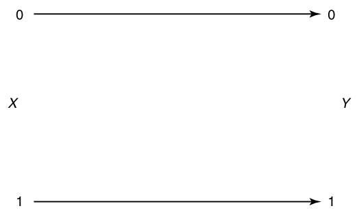

> $$C=\max I(X ; Y)=\max I(X ; X)=\max H(X) \leq 1$$
> which is achieved by using $p(x)=\left(\frac{1}{2}, \frac{1}{2}\right)$

### Noisy Channel with Nonoverlapping Outputs

This channel has two possible outputs corresponding to each of the two inputs. 噪音没有使信号叠加在一起
The channel appears to be noisy, but really is not.

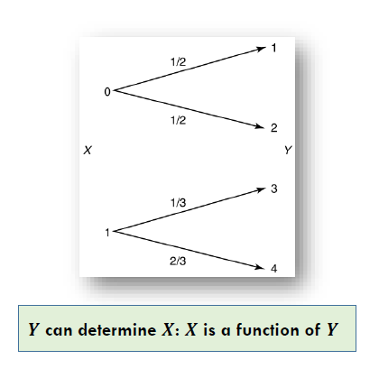

$$C=\max I(X ; Y)=H(X) \leq 1$$

### Noisy Typewriter

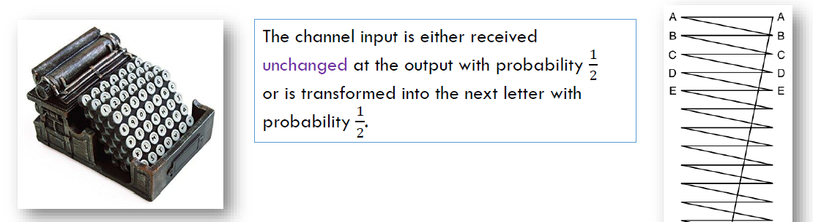

The transition matrix: For each $x \in\{A, B, \ldots ., Z\}$
$$
p(x | x)=\frac{1}{2}, \quad p(x+1 | x)=\frac{1}{2}
$$
The channel looks symmetric (由对称性)
$$
\begin{array}{c}
H(Y | X=x)=1 \\
H(Y | X)=\sum p(x) H(Y | X=x)=1
\end{array}
$$
The capacity
$$
\begin{array}{c}
C=\max I(X ; Y) \\
=\max (H(Y)-H(Y | X))=\max H(Y)-1=\log 26-1=\log 13 \\
p(x)=\frac{1}{26}
\end{array}
$$

### Example: Binary Symmetric Channel
错误率为$p$

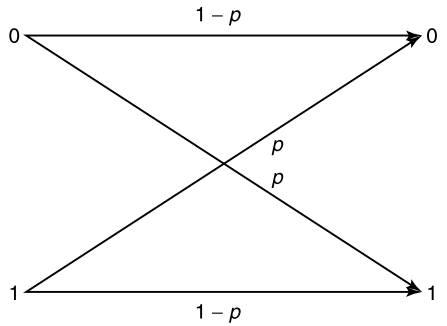

由信道的特殊性, 我们可以用单独的随机变量表示噪声, 吧噪声的影响建模为数学取模过程.

$$\begin{array}{c}
X, Y, Z \in\{0,1\} \\
\operatorname{Pr}(Z=0)=1-p \\
Y=X+Z(\bmod 2) \\
H(Y | X=x)=H(p)
\end{array}$$

$$\begin{array}{l}
C=\max I(X ; Y) \\
\quad=\max H(Y)-H(Y | X) \\
\quad=\max H(Y)-\sum p(x) H(Y | X=x) \\
\quad=\max (Y)-\sum p(x) H(p) \\
=\max H(Y)-H(p) \\
\leq 1-H(p) \\
\quad C=1-H(p)
\end{array}$$

> **BSC** is the simplest model of a channel with errors, yet it captures most of the complexity of the general problem 记住$C = 1-H(p)$的结论

### Example: Binary Erasure Channel

The analog of the binary symmetric channel in which some bits are lost (rather than corrupted) is the binary erasure channel. In this channel, a fraction α of the bits are erased. 
The receiver knows which bits have been erased. The binary erasure channel has two inputs and three outputs

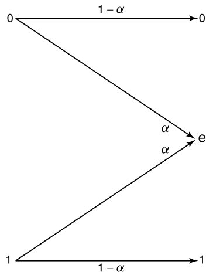

$$H(Y | X=x)=H(\alpha)$$

$$\begin{aligned}
C &=\max _{p(x)} I(X ; Y) \\
&=\max _{p(x)}(H(Y)-H(Y | X)\\
&=\max _{p(x)} H(Y)-H(\alpha)
\end{aligned}$$

$$\begin{aligned}
&\text { By letting } \operatorname{Pr}(X=1)=\pi\\
&\begin{array}{l}
H(Y)=H((1-\pi)(1-\alpha), \alpha, \pi(1-\alpha)) \\
\quad=H(\alpha)+(1-\alpha) H(\pi) \\
\mathrm{C}=\max _{p(x)} H(Y)-H(\alpha)=\max _{\pi}((1-\alpha) H(\pi)+
\end{array}\\
&H(\alpha)-H(\alpha))=\max _{\pi}(1-\alpha) H(\pi)=1-\alpha
\end{aligned}$$

注意, 这里不能将$H(Y)$看作均匀分布, 否则取不到.

## Symmetric Channel

考虑一般性质

A channel is said to be **symmetric** if the rows of the channel transition matrix $p(y | x)$ are permutations of each other and the columns are permutations of each other. 状态矩阵的每一行和每一列都是其他行/列的排列. (如左例) A channel is said to be **weakly symmetric** if every row of the transition matrix $p(\cdot | x)$ is a permutation (如右例)
$$
p(y | x)=\left[\begin{array}{ccc}
0.3 & 0.2 & 0.5 \\
0.5 & 0.3 & 0.2 \\
0.2 & 0.5 & 0.3
\end{array}\right], \quad p(y | x)=\left[\begin{array}{ccc}
\frac{1}{3} & \frac{1}{6} & \frac{1}{2} \\
\frac{1}{3} & \frac{1}{2} & \frac{1}{6}
\end{array}\right]
$$

> Letting $\mathbf{r}$ be a row of the transition matrix, we have
> $$
> \begin{aligned}
> I(X ; Y) &=H(Y)-H(Y | X) \\
> &=H(Y)-H(\mathbf{r}) & \text{行对称性} \\
> & \leq \log |\mathcal{Y}|-H(\mathbf{r}) &\text{列对称性}
> \end{aligned}
> $$
> When $p(x)=\frac{1}{|x|}$
> $$C=\log |y|-H(\mathbf{r})$$

## Computation Of Channel Capacity

信道容量公式的算法(ref\[cover\]Ch10.8)

优化目标, 两个凸集间最近的点对.
> Given two convex sets $A$ and $B$ in $\mathcal{R}^{n}$, we would like to find the minimum distance between them:
> $$
> d_{\min }=\min _{a \in A, b \in B} d(a, b)
> $$
> where $d(a, b)$ is the Euclidean distance between $a$ and $b$

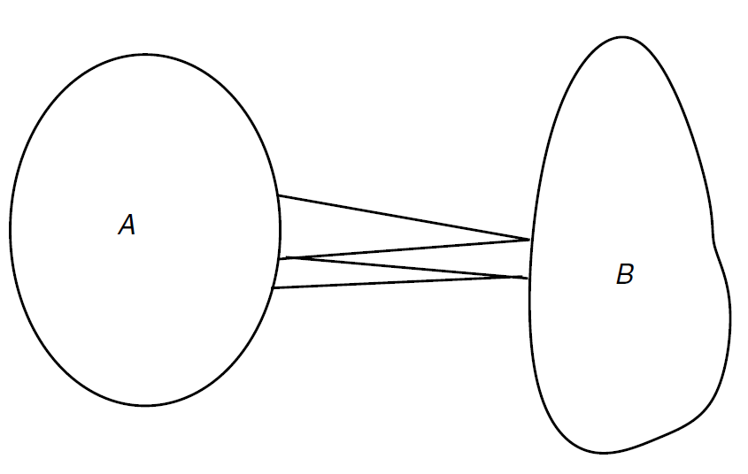

> An intuitively obvious algorithm to do this would be to take any point $x \in A,$ and find the $y \in B$ that is closest to it. Then fix this $y$ and find the closest point in $A$. Repeating this process, it is clear that the distance decreases at each stage.

是否收敛?

In particular, if the sets are sets of **probability distributions** and the **distance measure is the relative entropy**, the algorithm does converge to the minimum relative entropy between the two sets of distributions.

# 0408 Channel Capacity (2)

## Recall: Channel Model for Telegraph

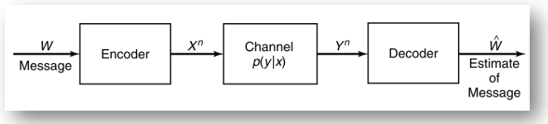
- **Codebook** shared by two sides: e.g. a:110, b:111 ...
- 将发电报的过程抽象如下, 由于系统存在随机性, 我们可能解码错误或失败

> - $\boldsymbol{W} \rightarrow \boldsymbol{X}^{\boldsymbol{n}}, \boldsymbol{Y}^{\boldsymbol{n}} \rightarrow \widehat{\mathbf{W}}$ **could be designed** by us
> - $X^{n} \rightarrow Y^{n}: p(y | x)$ is **out of our control**. (Physical law)
> - Aim: a good design with $n(=40)$ as small as possible
>
> $$
> \max \frac{H(W)}{n}
> $$

- 我们希望信息发送的速率(信道容量)越大越好
- 我们不能改变的是信道的状态转移矩阵, 但我们能改变的是编码方式.
- 进一步, 我们发现具有马尔可夫链性质. $\boldsymbol{W} \rightarrow \boldsymbol{X}^{\boldsymbol{n}}, \boldsymbol{Y}^{\boldsymbol{n}} \rightarrow \widehat{\boldsymbol{W}}$

## Memory and Feedback

### Definition

以磁带为例, 我们翻录磁带的时候, 由于设备原因, 有时翻录能听到原声. 我们把磁带看作一个信道, 反复读写可能会使当前传输的信息受上一次信息保留的影响. 我们在模型中忽略这一因素. (memoryless channel)

- Notation: $y^{k-1} := y_{k-1}, y_{k-2}, \ldots ,y_{1}$
- 定义信道的n阶扩展. **The nth extension of the discrete _memoryless_ channel (DMC) is the channel $\left(x^{n}, p\left(y^{n} | x^{n}\right), y^{n}\right),$ where**
  $$
  p\left(y_{k} | x^{k}, y^{k-1}\right)=p\left(y_{k} | x_{k}\right)
  $$
  When $x_{k}$ is given, $y_{k}$ is determined by $p(y | x)$ and is independent of all the generated before time $k: x_{1}, \ldots, x_{k-1}, y_{1}, \ldots, y_{k-1}$
- If the channel is used **without feedback**, i.e., if the input symbols do not depend on the past output symbols, namely, $p\left(x_{k} | x^{k-1}, y^{k-1}\right)=p\left(x_{k} | x^{k-1}\right)$. 定义无反馈, 表明随机变量的生成也是独立于此前的y的.
- When we refer to the discrete memoryless channel, we mean the **discrete memoryless channel without feedback** unless we state explicitly otherwise, 当我们谈论DMC时, 我们是默认无反馈的.

### Analysis

Memoryless: $p\left(y_{k} | x^{k}, y^{k-1}\right)=p\left(y_{k} | x_{k}\right)$
No feedback: $p\left(x_{k} | x^{k-1}, y^{k-1}\right)=p\left(x_{k} | x^{k-1}\right)$
Memoryless $+$ No Feedback $\implies$
$$
\begin{aligned}
  p\left(y^{n} | x^{n}\right) &= p\left(y^{n-1} | x^{n}\right) p\left(y_{n} | y^{n-1}, x^{n}\right) & \text{条件概率定义式} \\
  &=p\left(y^{n-1} | x^{n-1}, x_{n}\right) p\left(y_{n} | y^{n-1}, x^{n}\right) & x_n\text{展开} \\
  &=p\left(y^{n-1} | x^{n-1}\right) p\left(y_{n} | y^{n-1}, x^{n-1}, x_{n}\right) & \text{无反馈性质的变形} \\
  &=p\left(y^{n-1} | x^{n-1}\right) p\left(y_{n} | x_{n}\right)& \text{无记忆性展开} \\
  &=\prod_{i=1}^{n} p\left(y_{i} | x_{i}\right)  &\text{数学归纳法}\\
\end{aligned}
$$
从信息度量的角度看,
$$\begin{aligned}
&\boldsymbol{p}\left(\boldsymbol{y}^{n} | \boldsymbol{x}^{n}\right)=\prod_{i=1}^{n} \boldsymbol{p}\left(\boldsymbol{y}_{i} | \boldsymbol{x}_{i}\right)\\
&H\left(Y^{n} | X^{n}\right)=\sum_{i=1}^{n} H\left(Y_{i} | X_{i}\right)
\end{aligned}$$

Furthermore, 我们将左侧用链式法则展开, 可以得到更有意思的结论.

### Interpretation
reformulate: 信息传输过程

- A message $W,$ drawn from the index set $\{1,2, \ldots, M\},$ results in the signal $X^{n}(W)$, which is received by the receiver as a random sequence $Y^{n} \sim p\left(y^{n} | x^{n}\right)$
- The receiver **guesses** the index $W$ from $Y^{n}: \widehat{W}=g\left(Y^{n}\right) .$ **An error** if $\widehat{W} \neq W$

> - A discrete channel, denoted by $(x, p(y | x), y)$ 
> - **Memoryless**: The **$n$ th extension** of the discrete **memoryless** channel (DMC) is the channel $\left(x^{n}, p\left(y^{n} | x^{n}\right), y^{n}\right),$ where
>   $$
>   p\left(y_{k} | x_{k}, y^{k-1}\right)=p\left(y_{k} | x_{k}\right), k=1,2, \ldots, n
>   $$
> - NO Feedback: If the channel is used without feedback [i.e, if the input symbols do not depend on the past output symbols, namely, $\left.p\left(x_{k} | x^{k-1}, y_{k-1}\right)=p\left(x_{k} | x^{k-1}\right)\right]$
>   $$
>   p\left(y^{n} | x^{n}\right)=\prod_{i=1}^{n} p\left(y_{i} | x_{i}\right)
>   $$
> - Markov chain
>   $$
>   \boldsymbol{w} \rightarrow \boldsymbol{X}^{n} \rightarrow \boldsymbol{Y}^{n} \rightarrow \widehat{\boldsymbol{w}}
>   $$

recall 上节课中, $C = \max I(X;Y)$
接下来我们要证明, 为什么信道容量是最大互信息.

## Channel Model
下面我们定义信道模型中的编码

### Code

- A code consists of **the message set** $\mathcal{M},$ an **encoder** and a **decoder**
- Encoder: The channel is used $n$ times to send a symbol $\mathrm{w} \in \mathcal{M}$
  - An encoder is a function $f$ such that $f(w): M \rightarrow \mathcal{X}^{n}$ **(one-to-one)** 要求编码/解码函数一一对应
    - $f$ yields a distribution on $x^{n}=\frac{\text { DMC }}{\longrightarrow}$ a distribution on $x$ 一般情况下, 我们不能认为定义在$\mathcal{X}^n$上的分布于$\mathcal{X}$分布式等价的, 但在DMC中我们可以通过数学证明说明这一点.
  - The encoding rule $f(w)=x^{n} \in \mathcal{X}^{n}$ generates a **codebook** 码本
  - The codebook is **shared** between the sender and the receiver
  - When $f$ is given, a random variable $X^{n}$ was also defined. 当我们定义了编码器,我们也就定义了一个随机变量$X^{n}$
- Decoder received $y^{n} \sim p\left(y^{n} | x^{n}\right)=\Pi p\left(y_{n} | x_{n}\right)$
  - The decoder need to **guess** the possible $x^{n}$ by $y^{n}$ in some genius manner
  - By the codebook $f^{-1}\left(x^{n}\right)=w . \widehat{w}$ could be recovered by decoder. Error if $\hat{w} \neq w$

综合以上分析,
> An $(M, n)$ code for the channel $(X, p(y | x), y)$ consists of the following:
> 1. **An index set** $\{1,2, \ldots, M\}$:所有可能信息的集合, 进行索引(如hello-1, world-2, ...)
> 2. **An encoding function** $X^{n}:\{1,2, \ldots, M\} \rightarrow X^{n},$ yielding **codewords** $x^{n}(1), x^{n}(2), \ldots, x^{n}(M) .$ The set of codewords is called the **codebook**
> 3. **A decoding function** 
>    $$g: \mathcal{{Y}}^{n} \rightarrow\{1,2, \ldots, M\}$$
>    which is a deterministic rule that assigns a guess to each possible received vector.

$$\begin{aligned}
&f: \mathcal{M} \rightarrow \mathcal{{X}}^{n} \text { and } g: \mathcal{{Y}}^{n} \rightarrow \mathcal{M}\\
&W \rightarrow X^{n} \rightarrow Y^{n} \rightarrow \widehat{W}
\end{aligned}$$

w的维数(M)一般比x多,所以需要利用信道n次. 由于我们考虑平均意义, 所以我们认为codewords都等长. 否则编码与解码会很麻烦.

recall 码率$r = \frac{\log |M|}{n}$.

$M$可以看做一个随机过程.

### Probability of Error

> - Definition (Conditional probability of error) 条件错误概率 Let
>   $$
>   \lambda_{i}=\operatorname{Pr}\left(g\left(Y^{n}\right) \neq i | X^{n}=x^{n}(i)\right):=\sum_{y^{n}} p\left(y^{n} | x^{n}(i)\right) I\left(g\left(y^{n}\right) \neq i\right)
>   $$
>   be the conditional probability of error given that index $i$ was sent, where $I(\cdot)$ is the indicator function.
>   $x^{n}(i)$ 表示信息i对应的码制. 根据定义式,按照所有y的可能性展开, 我们可以得到计算式.
>   $$
>   I(x \neq y)=0, \quad I(x=y)=1
>   $$
> - Maximal probability of error: 最大错误概率
>   $$
>   \lambda^{(n)}=\max _{i \in\{1,2, \ldots, M\}} \lambda_{i}
>   $$
> - The (arithmetic) average probability of error
>   $$
>   P_{e}^{(n)}=\frac{1}{M} \sum_{i=1}^{M} \lambda_{i}
>   $$

我们有
1. 平均错误概率不大于最大错误概率, $P_{e}^{(n)} \leq \lambda^{(n)}$
2. If $M$ is uniformly distributed,
    $$
    \operatorname{Pr}\left(W \neq g\left(Y^{n}\right)\right)=\sum_{i=1}^{m} \operatorname{Pr}\left(X^{n}=x^{n}(i)\right) \operatorname{Pr}\left(g\left(Y^{n} \neq i | X^{n}=x^{n}(i)\right)\right)=P_{e}^{(n)}
    $$

