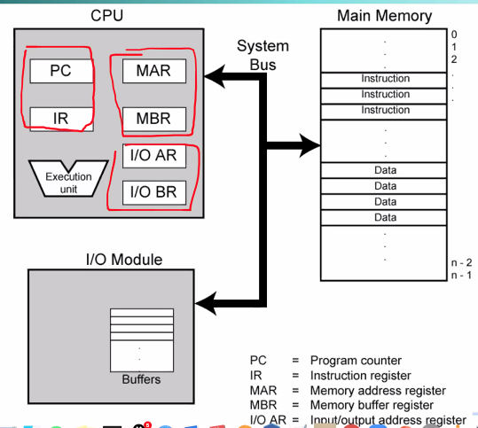

Week 2 of 2020 Spring. Performance Evaluation (cont'd) + Computer Function

**KeyWords**: Computer Composition

<!--more-->

[toc]

## Program Concept
- Hardwired systems are inflexible
- General purpose hardware can do different **(simple)** tasks **(sequentially)**, given correct control signals
  Instead of rewiring, supply a new set of control signals.

Program = A sequence of steps
step = arithmetic/logical operation
operation = a set of control signals identified by **a unique code**

A hardware segment accepts the code and **issues(produces) the control signals.**

## Components
Central Processing Unit (CPU)
- The Control Unit (将Control Signal转化为控制信号)
- The Arithmetic and Logic Unit
Input/Output: Data and instructions need to get into the system and results out
Main memory: Temporary storage of code and results is needed

> CPU通过Address/Data/Control三条总线向外连接
> AR 寻址
> BR 寄存
> 为什么需要分组?
> - recall: 我们对外部单元的寻址,是用唯一的ID标识的
> - MAR, I/OAR 共用一根总线,通常用 IO/negM 信号线标识
> - **但I/O模块不能存储"指令和数据", 这是因为Main Memory可以保证指令和数据后, 对同一个地址的值, 除非有其他指令, 否则不会改变. 但I/O Module不具有这样的特性**, 即便是硬盘, 也不具备"存储能力".(对硬盘而言, "存储数据"这是控制命令, "执行文件"对硬盘而言只是data, 这是由应用文件/操作系统决定的)
