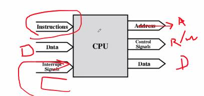

Week 3 of 2020 Spring. Computer Function (cont'd)

**KeyWords**: Computer Composition

<!--more-->

[toc]

## Interrupts

### Multiple Interrupts
对同时发生多个中断事件, 我们希望紧急的事件优先处理 快速响应(如外部断电, 内部网卡/显卡过热, 硬插拔), (网卡/显卡数据包(seperate bytes)的时间先后不一, polling是不可行的, 必须用inteerupt)


Sequential | Nested |
---------|----------|
 |  |
 Disable Interrupts | Define Priority |


1. Disable Interrupts
   - Processor will **ignore further** interrupts whilst processing one interrupt, 在CPU中设立Interrupt Enable, 
   
     - 一旦外部来了中断, IE关闭/ 或者IE也可能由其他信号控制.
     - CPU开始处理中断请求后(一旦进入ISR), 自动将IE拉低.
     - ISR结束/发出恢复指令/中断事件结束, 都可以设计成使IE拉高, 总之, 回到main的时候, IE一定是拉高
     - 
     -  中断请求+IE高电平-->处理中断.
   - Interrupts **remain pending**(继续请求,被记录,等待) and are checked after first interrupt has been processed
   - Interrupts handled in sequence as they occur
2. Define Priorities
   - Low priority interrupts can be interrupted by higher priority interrupts
   - When higher priority interrupt has been processed, processor returns to previous interrupt
   - 如果存在nested机制, 一定存在一个中断请求控制器(Interrput Controller), 对不同的信号线进行排序
   - 软件配合: CPU内的程序写作也要服从一定的规范, 即在进入ISR后, 要立刻把IE拉高, 否则嵌套是做不到的, 
   - 一般单条IE, 用堆栈存储PSW(IE作为寄存器状态是PSW的一部分),PC, 存储堆栈的大小由操作系统规约


> EXAMPLE: Multiple Interrupts
> 假设网卡的优先级最高, 硬盘次之, 打印机次之. 即网卡可以打断打印机.
> 
> t=25时, 虽然t=20已经有了disk中断, 但不能打断网卡的中断执行.


## Interconnection
All the units must be connected, Different type of connection for different type of unit (Memory/Input/Output/CPU)


Memory | CPU | I/O
---------|----------|---------
   |  | 

### Memory Connection
- Receives and sends data
- Receives addresses (of locations)
- Receives control signals
  - Read
  - Write
  - Timing(时序)
- memory的每一个地址都与data bus双向连接,**芯片内部的data bus**贯穿所有单元
- 要激活一个单元, 我们必须要有decoder/selector, 从而按照输入address的编码(74LS138), 激活每一个单元. 如对1M内存, 需要20根线输入.
- 当单元被激活时, 才有权读写data bus的内容
- 无论是输入还是输出, 都针对激活单元有效, 激活单元来源于address bus, 经过decode.
- 一维数组的构造通常只适用于规模较小的静态RAM
- 二维数组可以避免数据线过多的问题
  ```
  Address Bus                    ----->  Decoder --> 2^10 row
  RAS/neg(CAS)(row address select)  -->          ---> 2^10 column
  10 bit address --------------------->
  ```
  从而也达到了1M的地址量. 然而, 寻址速度慢一些


### I/O module

Control - I/O Adaptor ---| 主板|存储设备 |--- 硬盘/光驱/SSD/..

Recall I/O定义:
- Output
  - Receive data from computer
  - Send data to peripheral
- Input
  - Receive data from peripheral
  - Send data to computer

功能特性
- Receive control signals fromcomputer
- Send control signals to peripherals
  - e.g. spin disk
- Receive **addresses** from computer (address bus上传递的都是地址信号)
  - e.g. **port number** to identify peripheral (换一种称呼, 表明这是专门用于peripheral的端口地址)
- Send interrupt signals (control)

### CPU
根据普林斯顿架构, **Instructions是接data bus**


