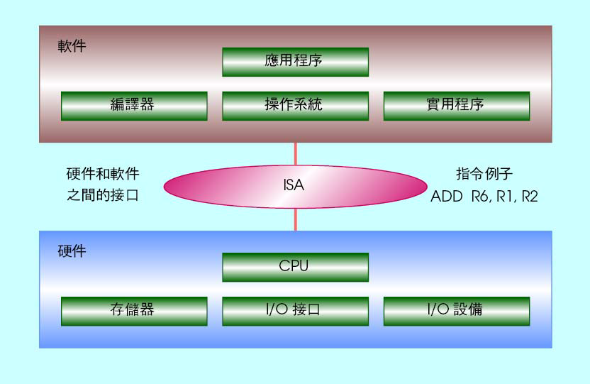
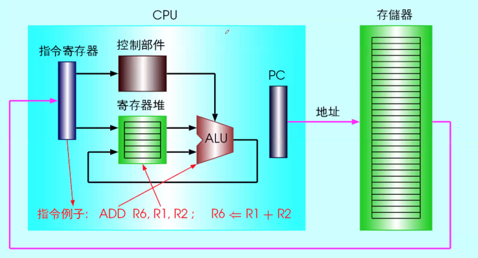
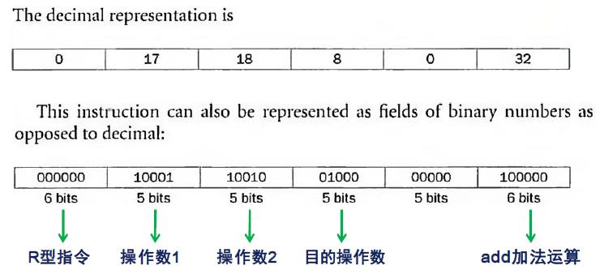
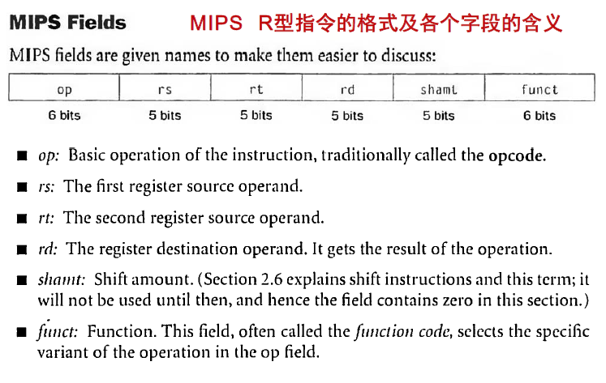
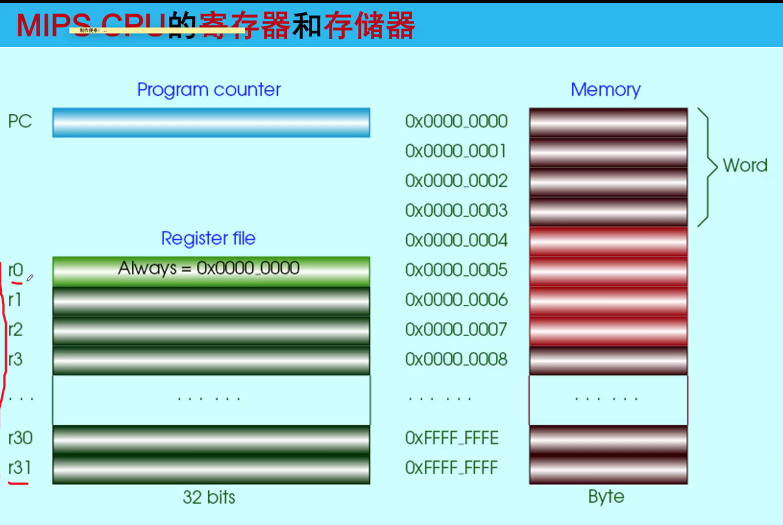
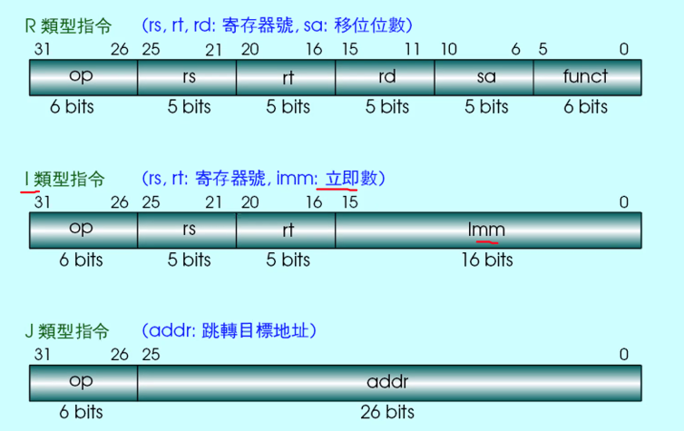
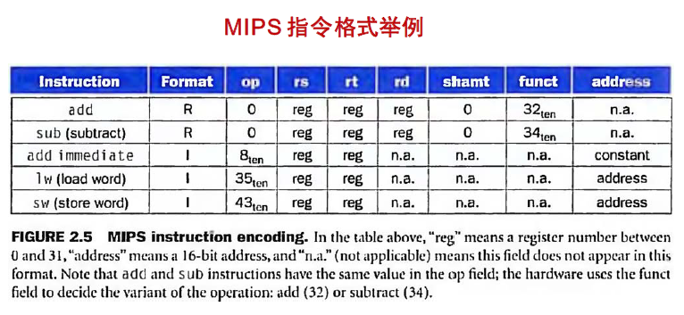

Week 5 of 2020 Spring

<!--more-->

[toc]

设计目标:
To find a language that makes it easy to build the hardware and the **compiler**(software) while maximizing performance and minimizing cost and power.

Instruction / Instruction Set：指令/ 指令集
the words of a computer's language are called instructions, and its vocabulary is called an instruction set.

## Signed and Unsigned Numbers

- 我们用最高位作为符号位
- 特点: 
  1. 一个数与它的补码相加, 结果为0
  2. 一个数取反加1, 得到补码
- 补码一定和位数相关. (无论是在比较大小, 执行计算时, 都要声明补码的位数)

## Representing Instructions in the Computer

Recall: ISA是硬件和软件之间的接口. (抽象层)

CPU通过在PC内放置固定的指令值, 存取外部存储器, 取出内容, 送到指令寄存器, 再将它的内容一路送到控制部件, 产生相应的控制时序, 同时将值送到寄存器堆(在控制部件的控制时序下)

> 例: `add $t0, $s1, $s2`
> 
> R型指令:  所有的操作都是register
> 后三个位域: 寄存器标志(32个)
> 一条汇编语句会唯一地编程一个指令码

- 指令格式/ Instruction Format
  - The layout of the instruction is called the instruction format.
  - 指令一般由多个字段组成，总长度相对固定，可设计有一种或几种长度。MIPS所有指令都为32bit长。
- 机器指令/ Machine Language
  - To distinguish from assembly language, we call the numeric version of instructions machine language and a sequence of such instructions machine code.
  - 用二进制或十六进制编码表示的指令。
- 16进制数/ Hexadecimal
  - 以16为基的一种数据表示形式。

#### R型指令

> 
> shamt: 位移数目
> funct: 挑选一个特殊的操作(如加,减,左移,与或非) 即ALU中实现的操作

图中, 4个Byte形成一个word, 因此PC移动时, 一般自加+4, 当然PC也会接受指令内容的反馈, 根据指令的长度/类型自加相应的长度(CISC架构) 换句话说, 单看memory是不能确定值时指令还是数据. 只有被PC运行时指向的内容, 取到CPU才会被放入IR(instruction register), 被解析为程序.

#### MIPS指令分类
按功能分类
- 算数
  - add, sub
  - addi
  - addu 无符号数
  - mul, mulu, div, divu
- 逻辑运算
  - and, or
  - andi, ori 立即值
  - sll(shift left logic), srl
- 数据传输
  - lw(load word)
  - sw(store word)
  - lb(load a byte)
  - lbu(load a byte unsigned):是否要做符号扩展
  - sb(store byte)
- 条件转移
  - beq(branch if equal)
  - bne(branch if not equal)
  - bnez, slt, slti, sltu, sltiu
- 无条件跳转
  - j (jump)
  - jr,jal (通过寄存器跳转)

按寻址方式分类(有且仅有)

注意到格式上是非常接近的
> 设计原理4: 良好的设计即是合理的折衷
> Design Principle 4: Good design demands good compromises

对R, op=0, funct 改变
对I, op=操作名