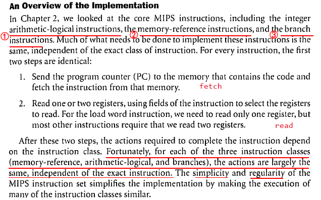
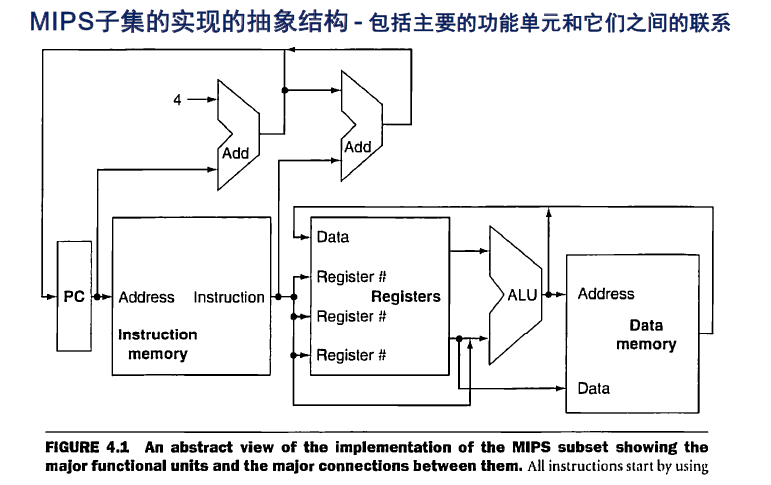
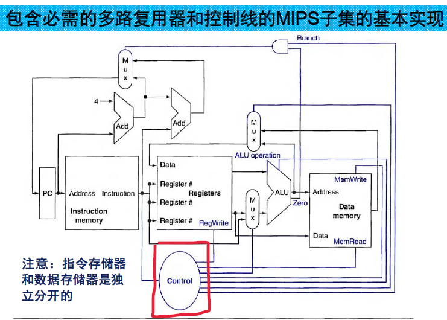

Week 8 of 2020 Spring.

<!--more-->

[toc]

## Introduction

Recall: 我们此前的大部分指令，前半部分（解析命令，取数）基本相同，后半部分则大不相同（算，读，写）

Higher-Order Abstraction

不同的指令实际上是在激活不同的模块，选择不同的数据流进行实现。那么，如果我们能够设计一个方案，在合适的时候设置合适的控制信号，就能够让数据流通道跑起来，那我们就实现了指令的功能。因此，下面我们的重点就放在了Controller上。

此外，对时序逻辑电路，我们还要确保状态的锁存，否则会出现振荡电路。

