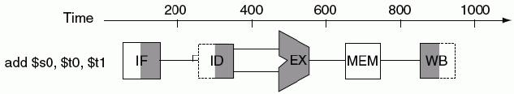
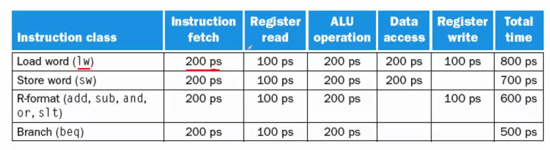
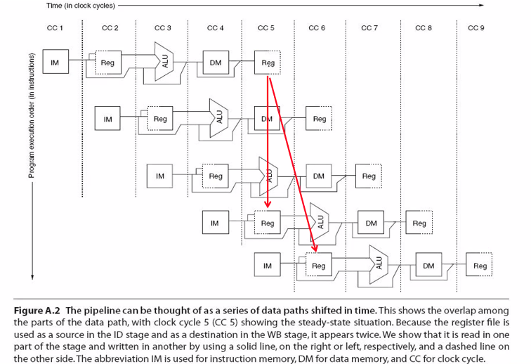
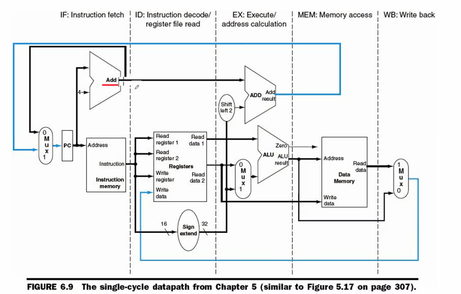

Week 9 of 2020 Spring

<!--more-->

[toc]

## 流水线

设计目标：
- 减小不同模块间的距离，提高速度，减小时钟周期
- 【流水线】：是利用执行指令所需的操作之间的并行性，实现多条指令的执行过程相互重叠执行的技术。目前，它已成为了高速CPU中所采用的关键技术。

Pipeline

- Pipelining doesn’t help **latency** of single task,不降低工序时间 it helps **throughput** of entire workload 提高了整个生产线的输出量/吞吐量
- 不同指令完成不同指令的不同部分
- Pipeline rate limited by **slowest** pipeline stage （流水节拍/流水段，相连形成流水线）
- Multiple tasks operating simultaneously
- Potential speedup = Number pipe stages
- **Unbalanced** lengths of pipe stages **reduces** speedup
- Time to “fill” pipeline and time to “drain” it reduces speedup
- 指令沿流水线移动一次的时间间隔就是**一个机器周期（processor cycle）（an advanced version）**，其由最慢的流水级决定。在计算机中，这个机器周期通常是一个时钟周期（clock cycle），有时是2个，很少是多个。

设计目标：
（尽可能逼近，实际达不到）平衡各个流水段的长度。

> 衡量指令执行速度的一个评价指标CPI
> CPI：Cycles Per Instruction，每条指令的平均时钟周期数。
> 流水线可以减少指令的平均执行时间，可以认为是减少了每条指令的平均时钟周期数（CPI），也可以认为是减少了时钟周期的长度，还可以认为在这两方面都减少了。
> 流水线是一种在连续指令流中开发指令级并行性的技术。它对编程者是透明的。(硬件上（CPU内部）实现的，程序员是不知道的，编程者对pipeline无能为力，只能知道，哪两条指令放在一起，可以让流水线流畅运行)

## MIPS的指令流水线

一条典型的MIPS指令的执行过程包含以下5个处理步骤：
1. 从内存中读取指令；Instruction Fetch
2. 指令译码的同时读取寄存器；（MIPS的设计允许指令译码和读取寄存器同时进行）Instruction Decode
3. 执行操作或计算地址；execute
4. 在数据存储器中读取操作数；memory
5. 将结果写回寄存器。write back

这要让任何一条指令都能fit-in

实际上，register write接受下一个时钟周期的上升沿。total-time是不严谨的，实际上我们只需研究这张表中最小部分作为pipeline的周期。真正做的时候是1~4段，但我们在考虑流水时，5需要被当做一步。
当我们使用flip-flop上升沿触发，那么这一步可以不算进单周期内，如果我们使用latch，那么写入时间利用的是当前周期末尾的低电平，就要计入单周期内。实际中不作特别说明，我们都是用flip-flop完成（边沿触发写入的好处）

> 这一点引出，FLIP-FLOP设计中，要求所有的寄存器同时翻转，我们会在设计中加入延时补偿，保证各部件能同时接收到上升沿的同步。这是由芯片的工艺决定的。（时间网络）

## 数据通路

横坐标：连续的clock
纵坐标：从上到下内存中顺序执行的语句。
block：实现，i.p.REG实线表示使用，虚线表示部分时段使用

我们发现了一个问题：只有（上半周期）完成写入后，下半周期才可以读。

因此，在紧接着要用刚刚写入的寄存器的两条指令中，我们可能读出错误的结果。
如果存在两条指令之间寄存器值的依赖，流水线将被迫发生“中断”。

## 基本原理

实现指令流水的两个最基本问题
1. 分段— 为了重叠起来并行执行（划分工位）
2. 流动— 能够向前同步推进执行/流水（段间接口）

制定**切割**原则和方法

问题例：两个ADD为什么放在那里？第二个ADD为什么要去MEM绕一圈？
1. 在下一条指令要开始的时候，就要把PC+4准备好，所以第一个add在IF阶段。
2. 我们还要等zero的结果，在MEM阶段才出得来
折线的设计与前一阶段结果什么时候出来影响至关重要。