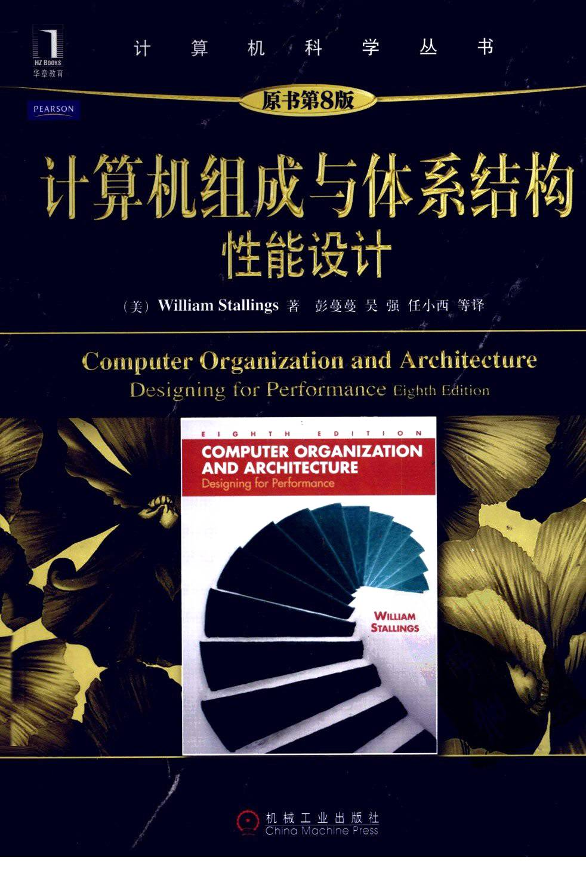

Reading Notes for **计算机组成与体系结构(性能设计)** Chapter 1 ~ 3. 持续更新中

**KeyWords**: Computer Composition

<!--more-->

[toc]

书名《计算机组成与体系结构(性能设计)》,是2020 Spring EE332的课程材料之一, 将会阅读其中的1~3章. 内容与EE332的独立笔记有重复之处, 以EE332 Course Notes优先

## Chapter 1 导论

1. 组成与体系结构
    - 体系结构是程序员可见的系统属性
    - 组成是实现结构规范的操作单元及相互连接
2. 结构与功能
    - 结构: 部件相互关联的方法
      外部(外围设备,通信线路)+内部解耦
      - 主存储器
      - I/O
      - 系统互联(如总线)
      - CPU
        - ALU 算术逻辑单元,数据处理功能
        - 寄存器 内部存储
        - 内部互联
        - 控制器
            - 时序逻辑
            - 控制器,寄存器和译码器
            - 控制存储器
    - 功能: 作为结构组成部分的单个独立部件的操作
      处理数据, 存储数据, 传送数据, 对以上三种功能控制
      > 计算机的通用性是根本, 所有功能专门化均发生在编程阶段, 而不是设计阶段
      传送数据中,要区分输入输出(I/O with peripheral)与数据通信

## Chapter 2 计算机演变和性能

### 2.1 计算机简史

第一代:真空管
1. ENIAC
2. 冯诺依曼机(IAS计算机结构)
  - 控制器通过一次从存储器中取一条指令并执行它的方式来操作IAS
  - 无论是控制器还是ALU, 都被称为寄存器
  - MBR/AC 高40位/MQ 低40位 -- IO设备
  - IBR暂存右指令/IR 8位指令/PC/MAR -- 主存储器/控制电路
  - ISA通过反复执行指令周期来运行
    - 取指周期 fetch cycle, 从IBR/存储器->MAR 获得指令, 解开放入(IBR/)IR/MAR
    - 一旦操作码在IR中,则进入执行周期,译码,发送控制信号(控制数据传输/ALU)
3. 商用计算器

第二代:晶体管
- 更复杂的ALU,CU
- 高级编程语言,系统软件
- 带有许多外设的大型配置环境是第二代计算机的代表, 使用了数据通道(独立I/O处理模块,减轻CPU负担)
- 多路复用器(multiplexer) 数据通道的连接点

第三代:集成电路
1. 微电子技术
   摩尔定律:描述集成电路的发展
2. IBM system/360
   系列机, 大型机标准
3. DEC公司的PDP-8
   小型机, 提出总线结构
4. 后续几代
    - 半导体存储器
    - 微处理器, (Intel 8080(1974)首个为通用微机设计的中央处理器)

### 2.2 性能设计