Week 2 of 2020 Spring. Modeling with UML

**KeyWords**: Software Engineering, UML

<!--more-->

[toc]

## 1. History of Object Oriented Method

### 1.1 The Growth of OO Methods
In 1965 the first object-oriented (OO) programming language, SimulaI, was introduced.
Almost immediately interest in OO design began to rapidly grow.
This led to the emergence of numerous competing OO design methods.

**OO Aalysis vs. OO Design**
- Analysis refers to **understanding the problem.**
- Design refers to **coming up with the solution.**
- Don’t confuse with broader use of word “design”

With all these design methods came numerous modeling languages.
By the early 90’s there were 50+ distinct OO modeling languages.
Darwinian forces in the marketplace led to three dominate methods, each having its own modeling language.

### 1.2 Three Dominant Methods

- Object-oriented Analysis & Design (OOAD) –Grady Booch
- The Object Modeling Technique (OMT) –Jim Rumbaugh
- The Object-oriented Software Engineering method (OOSE) –IvarJacobson
Each one had its strengths and weaknesses.

1. Booch (OOAD)
   - very complex
   - effective low-level design and fine grain detail supported
   - Good at OO design, weak at OO analysis
2. Rumbaugh(OMT)
   - better at higher-level designs
   - Good at OO Analysis, weak at OO Design
3. Jacobson (OOSE)
   - Major feature was **"use classes"**
   - **model how a system interacts with users**

The three then focused their efforts on unifyingtheir three modeling languages

### 1.3 UML was Born

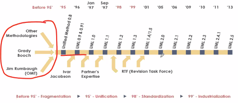

## 2. Modeling Concept

### 2.1 Systems, Models and Views

A **system** is an organized set of communicating parts
System is too complex and **modeling** is a means for dealing with complexity
Unfortunately, a model itself is also very complex. A **view** is a subset of a model
**Notations** are graphical or textual rules for representing views

### 2.2 Different Domains

**Application Domain**: It represents all aspects of the _user’s problem_ (Analysis)
**Solution Domain**: is the modeling space of _all possible systems_ (Design)
object建立了两个domain直观的桥梁, 使软件的维护容易了很多

## 3. An Overview of UML

### 3.1 UML is for Visual Modeling

- Uses standard graphical notations
- Semi-formal
- Captures **Business Process** from enterprise information systems to distributed Web-based applications and even to hard real time embedded systems

### 3.2 UML is also for ...

Specifying...
- 目的: Building models that are: Precise, Unambiguous, Complete
- 语义: UML symbols are based on well-defined syntax and semantics.
- 内容: UML addresses the specification of all important analysis, design, and implementation decisions.

Constructing...
- 语言: Models are related to OO programming languages.
- Round-trip engineering requires tool and human intervention to avoid information loss
  - Forward engineering — direct mapping of a UML model into code (of framework).
  - Reverse engineering — reconstruction of a UML model from an implementation.
- MOA: modeling-oriented architecture

Documenting...
- Architecture, Requirements, Tests, Activities (Project planning, Release management)

### 3.3 Architecture and View
UML is for visualizing, specifying, constructing, and documenting with emphasis on system architectures (things in the system and relationships among the things) from five different views

> 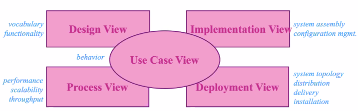
> - Design view: 系统结构, 类与类的关系等
> - Process View: 进程式, 系统运行起来后对象交互的关系
> - Deployment View: 部署, 软件对硬件/网络的要求
> - Implementation View: 从系统实现的角度
> - Use Case View: 系统的功能, 位于最重要的位置

### 3.4 Three Basic Builing Blocks of UML

**Things**  important modeling concepts (individual ones as the primitive kinds)
**Relationships** tying individual things (i.e., their concepts)
**Diagrams**   grouping interrelated collections of things and relationships
部分到整体的关系 (Thing have relationships and together form diagrams)

#### 3.4.1 Things

**Structural** nouns of UML models. Conceptual or physical elements

> 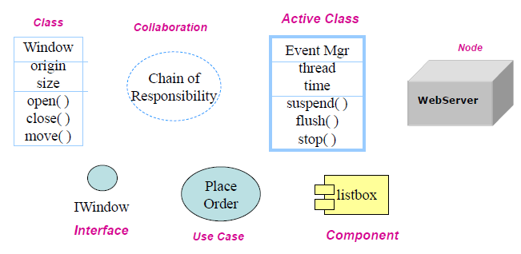
> Class: 类
> Interface: 抽象的类
> Active Class: 进程中的类
> Use Case: 系统功能(与interface区分)
> Component: 如文件h/编译结果dll/runtime, 大于类
> Node: 代表硬件, 用于部署图 [physical elements]
> Collaboration: 一组对象相互配合完成一个功能. 
> - e.g. 对place order这一user case, 可以通过Internet/...等方式完成, 完成这一功能的信息放在一起, 被称为collaboration

**Behavioral** dynamic (verbal) parts of UML models.

Interaction | State Machine | 
---------|---------- | 
 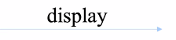 | 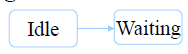 |
 消息的交换 | 刻画一个对象历经的多个状态(sequence of states) | 
 图中表明消息名 | 电话机挂机到waiting状态的改变 |

**Grouping** using **Packages**. organizational parts of UML models. 
> 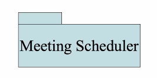
> 简单的grouping, purely conceptual, 仅在开发阶段, 类比成文件夹, nested
> 一个用处是帮助系统结构规划

**Annotational** explanatory parts of UML models.
> 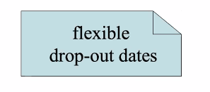
> 用于说明,可以添加超链接
> 折角矩形

#### 3.4.2 Relations

| Relations | Description | Symbol |
| :------- | ------ | ---- |
| Dependency | a **semantic** relationship between two things in which a change to one thing (independent) may affect the semantics of the other thing (dependent) | 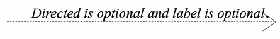 |
| Association | a **structural** relationship that describes a set of links, a link being a connection between objects. | 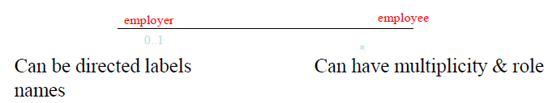 |
| \|- Aggregation | a special kind of association. It represents a structural relationship between **the whole and its parts**. | 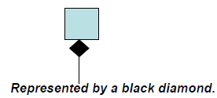 |
| Generalization | a specialization/generalization relationship in which objects of the specialized element (the child) are more specific than the objects of the generalized element. 子类指向父类,继承关系 | 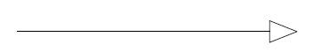 |
| Realization | 类与接口/use case与协同 | 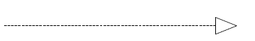 |

#### 3.4.3 Diagrams

最新版本 14 种, 书中/业界广泛应用介绍了9种.
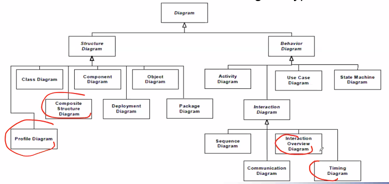

Diagrams and System Model:
- Functional model : Use case diagram
- Object model : Class diagram
- Dynamic model : Sequence diagrams, statechart, activity diagrams (其他非广泛应用与Dynamic Model的模型如上图圈出)

## 4. UML Diagrams
Diagrams | Functions
--- | ---
Use case| Describe the **functional behavior** of the system as seen by the user
Class | Describe **the static structure** of the system
Interaction | Describe **the dynamic behavior between objects** of the system
Statechart | Describe **the dynamic behavior of an individual object**
Activity | Describe **the dynamic behavior of a system**, in particular the **workflow**.
Package | Describe the **groupings of elements**

### 4.1 Use Case Diagrams

从需求表述来说, 文字, 框图较好, 要便于用户识别, 包含以下主要元素
- Actor: 用户类别(with role, 如图书管理员,读者,...)
  - 系统之外的 **external entity**(不等于user), 也可以是机器/其他系统/天气...
  - unique name + optional description
- Use Case: 系统为用户提供的一类功能, 用椭圆表示
  - a **class** of funcitonality: 包含各种情况
  - textual description 需要包含
    1. Unique name
    2. Participating actors
    3. Entry conditions
    4. Exit conditions
    5. **Flow of events** (focus)
    6. Special requirements (如性能描述)
  - 具有不同的描述方式brief/casual/fully addressed
- Actor 和 Use cases 是 communicate 关系.
  - use case 代表系统
  - actor 与 function 通过按键等方式进行交互
- Use Case 之间也具有一定的关系
  Extends Relationship | Includes Relationship | Inheritance Relationship
  ----- | ----- | ----
  在原有功能上加入另外的功能 | 提出common use case供其他case include | 定义一般流程, 其他流程做细化处理
  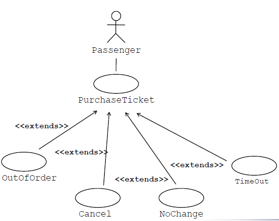 | 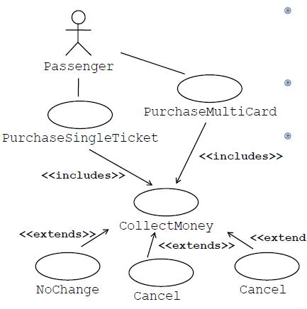 | 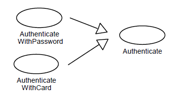
  如 exception 处理, 在原来定义情形中没有细化, 用扩展的方式对原有功能进行补充,  | 如购买单程/多程票都需要收钱, 可以把collect money作为单独用例提出 | 如认证方式既可以用password也可以用card, 但都包含对比信息码/判断正误的操作
  
  从补充功能指向被补充功能 | 从基用例指向子用例(派生用例) | 从派生用例(特殊)指向父用例(一般)
   
- Scenario 场景: instance of use case 具体(指明道姓的)某一次功能的执行
- 成千上万scenario的发生可以概括为用例

