Week 6 of 2020 Spring

<!--more-->

[toc]

## An Overview of Object Design

Recall 我们创造了用例模型, 功能模型, 动态模型 (application domain based), 在对象设计阶段, 我们希望从implmentation角度定义object, 在这一阶段:
1. adding details
2. making implementation decisions, 从诸多方案里抉择, with the goal to
   1. 减少执行时间
   2. 内存消耗
   3. 减少成本
   4. ...

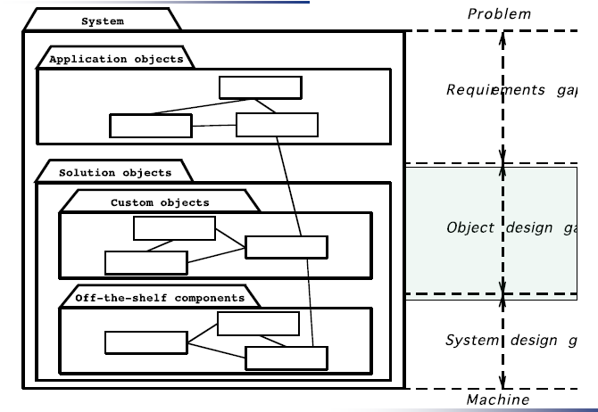

Group of Activities:
1. Reuse 基于现成的component完成构造
2. Interface Specification 落实子系统的API, 分别有哪些object提供, 执行代码, 以至于每个类的属性, 对外提供的方法
3. Restructuring 聚类的相似性, 增加软件的可维护性.
4. Optimization 与上一条相似

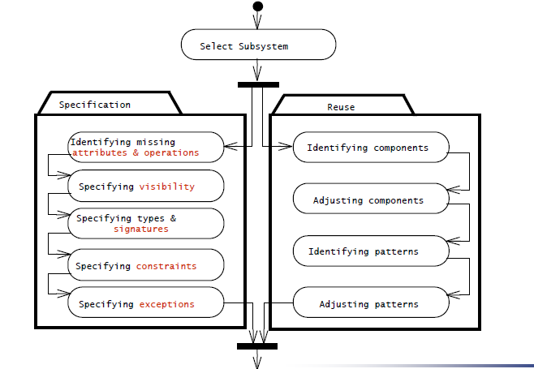

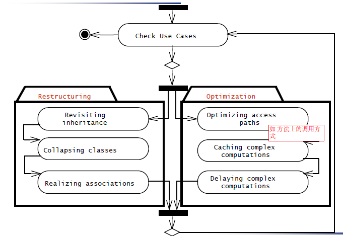

针对以上四大类活动, 我们如何安排object design的过程, 有很多方式. 将四类活动进行组合, 开展对象设计.
1. 从现成component出发, 定义API, 关联, 类, 选择合适的数据结构和算法实现
2. 从reuse出发, 看需求分析中的类, 优化, 继承关系上调整.
3. ...

以上四点会被分为4个lecture, 本节主要讨论reuse, 3/4两点属于mapping models to code.

## Reuse

### Introduction

主要目的:
1. reuse **functionality** already available
2. reuse **knowledge** from previous experience to current problem

方法:
1. Composition (Black Box Reuse)
   - New functionality is obtained by aggregation
   - The new object with more functionality is an aggregation of existing components
2. Inheritance (White-Box Reuse)
   - New functionality is obtained by inheritance.
3. Three ways to get new functionality: 
   - Implementation inheritance
   - Interface inheritance继承
   - Delegation委派

### Heuristics
- 始终关注class library
  - JSAPI(Java Speech API)
  - JTAPI(Java Telephony API)
- 选择合适的数据结构
- 只有在必要时才定义internal类和方法
  - 提高质量, 进度
  - Complex operations defined in terms of lower-level operations might need new classes and operations

### Concepts

#### Application Domain vs Solution Domain Objects

很有可能, 我们在app dom中识别了一个report, 那么在对象设计层面, 虽然类是对应的(启发产生的), 但我们还需要进一步生成text box, menu, scrollbar...

#### Inheritance

当我们要实现功能时, 我们虽然找到了class library, 但发现功能还不太够.
继承机制的两种用途:
- Description of Taxonomies 刻画分类(需求分析阶段, 形成概念的层次, 使模型更为理解, 建立相同性/特殊性概念)
- Implementation Specification  对象设计阶段, 增加可重用性
Inheritance is found either by specialization or generalization

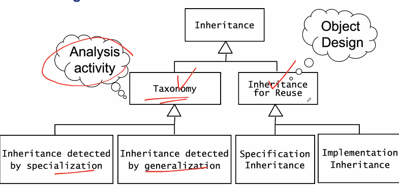

所谓重用, 分为spec和imple上的重用机制

- Specification inheritance
  - Also called subtyping
  - Inherit from an **abstract class**抽象类 with all operations specified, but not yet implemented
  - 子类的代码还需要自己实现, 所以只是spec(接口,规范)上的重用
- Implementation inheritance
  - Also called class inheritance
  - Goal: Extend an applications’ functionality by **reusing functionality in parent class**
  - Inherit from an existing class with some or all operations already implemented

#### Delegation
as alternative to Implementation Inheritance

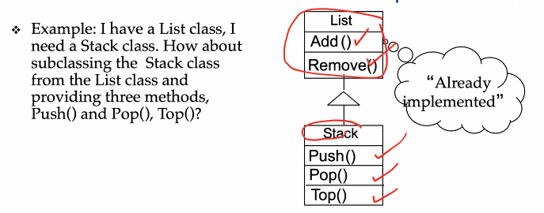
这个例子有没有问题?
- 既然stack是list的子类, remove方法会被stack使用. 因此, implementation继承好的继承坏的. 并不是总是优于spec inheritance. 我们只是想重用其中的一部分功能.

In Delegation two objects are involved in handling a request
- A receiving object delegates operations to its delegate. 
- The developer can make sure that the receiving object does not allow the client to misuse the delegate object

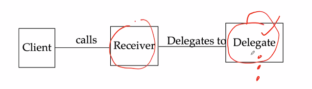
比如 只想要 delegate的1功能, 我们设计一个receiver, 将client call的内容真正地委派给delegate.

**Delegation: Catching an operation and sending it to another object.**

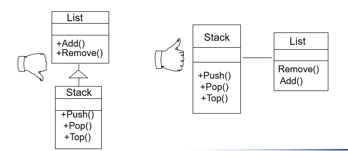

如, 我们创建私有对象作为代理(幕后英雄)
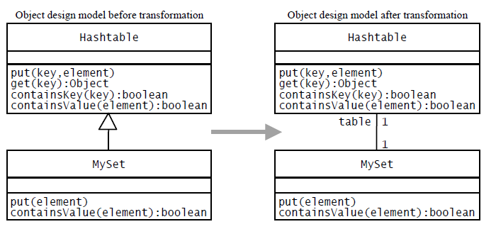
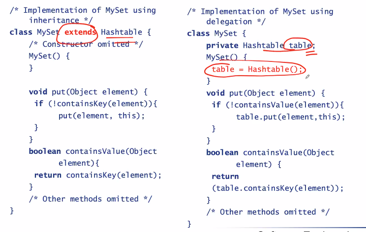

pros: 灵活,甚至可以内部切换代理 cons: 过度包装

> design pattern是inheritance和delegation的组合

## Design Patterns

### Finding Objects:
- Requirements Analysis focuses on application domain: Object identification (功能类)
- System Design addresses both,  application and implementation domain: Subsystem Identification (边界)
- Object Design focuses on implementation domain: Additional solution objects (应用中需要调用的接口类)
- 另一种寻找类的方式: Design Patterns

### Taxonomy
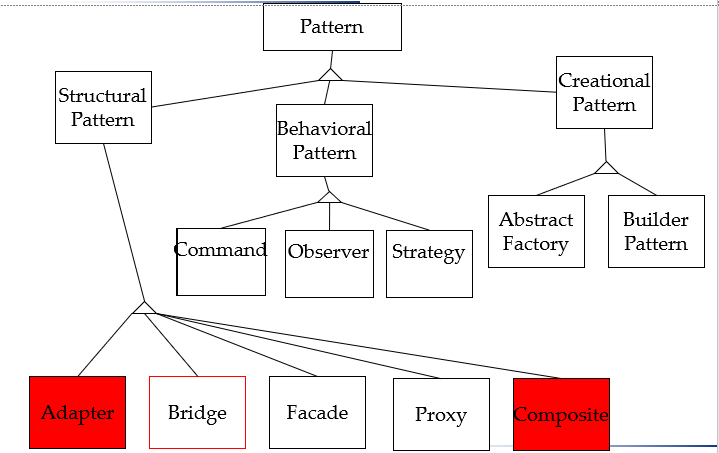

- Structural Patterns 回答结构有关的问题
  - Adapters, Bridges, Facades, and  Proxies are variations on a single theme: 
  - They reduce the coupling between two or more classes 
  - They introduce an abstract class to enable future extensions
  - They encapsulate complex structures
- Behavioral Patterns 回答行为有关的问题
  - Here we are concerned with algorithms and the assignment of responsibilities between objects: Who does what?
  - Behavioral patterns allow us to characterize complex control flows that are difficult to follow at runtime. 
- Creational Patterns 回答生成相关的问题
  - Here our goal is to provide a simple abstraction for  a complex instantiation process. 
  - We want to make the system independent from the way its objects are created, composed and represented.

### Composite Pattern
组合模式:动态树: Models tree structures that represent part-whole hierarchies with arbitrary depth and width. 
The Composite Pattern lets client treat individual objects and compositions of these  objects uniformly

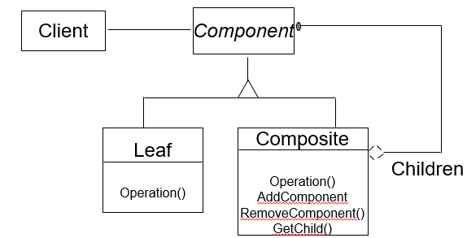

| Software System | Software Lifecycle |
| --------------- | ------------------ |
| A software system _consists of_ subsystems _which are either other_ subsystems _or collection of_ classes | The software lifecycle _consists of_ a set of development activities _which are either other_ activities _or collection of_ tasks |
| Composite: Subsystem (A software system consists of subsystems which consists of subsystems , which consists of subsystems, which...) | Composite: Activity (The software lifecycle consists of activities which consist  of  activities, which consist of activities, which....) |
| Leaf node: Class | Leaf node:  Task |
|  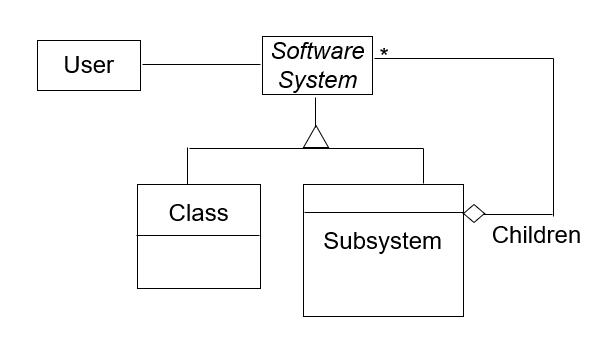 |  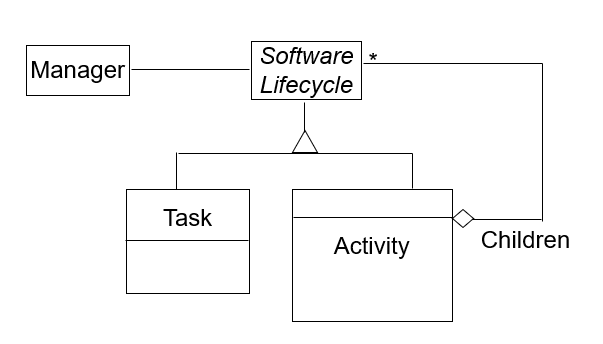 |

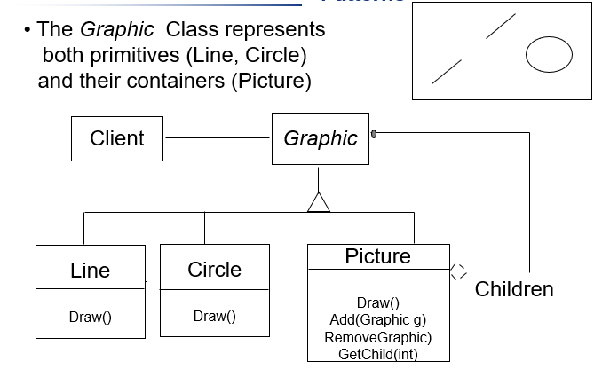

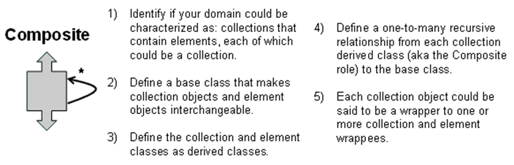

