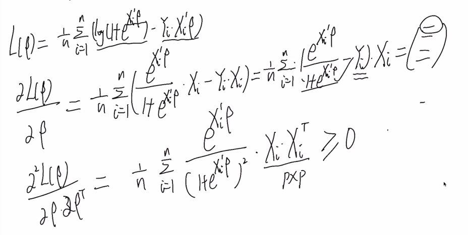

Week 5 of 2020 Spring.

<!--more-->

[toc]

> The problem of predicting a discrete random variable $Y$ from another random variable $X$ is called
> - classification(分类);
> - supervised learning(监督学习);
> - discrimination(判别分析);
> - pattern recognition(模式识别).

对于线性回归模型，一般适用于被解释变量是连续的情形。(否则难以解释$\arg\min \frac{1}{n}\sum_{i=1}^n(Y_i-X_i^T \beta)^2$的实际意义)如果Y的取值本身是离散的，简单的线性回归模型就不再适用(因为其给出的估计一般不是离散的), 这时我们用逻辑回归,对应的也是分类问题.

真实世界中，逻辑回归使用的频率远远超过线性回归

对于分类问题，如果预测值也是0或者1，那么

$$\operatorname{MSE}=\frac{1}{n} \sum_{i=1}^{n}\left(Y_{i}-\hat{Y}_{i}\right)^{2}=\frac{1}{n} \sum_{i=1}^{n} I\left(Y_{i} \neq \hat{Y}_{i}\right)$$

恰好就是分类问题中错分的比例，即错分率。

对于每个$\beta$, 我们设定预测为 $\hat{Y}=I\left(X^{\top} \beta>0\right)$. 即, 用一个平面分割.

$$\begin{aligned} \operatorname{MSE} &=\frac{1}{n} \sum_{i=1}^{n} I\left(Y_{i} \neq I\left(X_{i}^{\top} \beta>0\right)\right) \\ &=\frac{1}{n} \sum_{i=1}^{n} I\left(\left(2 Y_{i}-1\right) X_{i}^{\top} \beta \leq 0\right) \end{aligned}$$

注意到, 第二步等价变化原因是$Y_i$与$X_i \beta$在错分的情况下异号. 因此我们可以考虑

$$\hat{\beta}=\arg \min \frac{1}{n} \sum_{i=1}^{n} I\left(\left(2 Y_{i}-1\right) X_{i}^{\top} \beta \leq 0\right)$$

数学角度, 过于暴力, 不是好的损失函数.

- 这里的损失函数不连续，优化问题很难求解.
- 因为示性函数的特点，优化问题可能具有多个解，不易解释.
- 统计性质也很难分析

假定$Y \in\{0,1\}$, 即有两个类别； 在均方损失下，最优的回归函数为：
$$r(x)=E\{Y | X=x\}=P(Y=1 | X=x)$$

分类问题的回归函数对应的是一个0-1之间的数，反映了应变量取1的概
率大小。如果我们考虑线性函数, 可以假设存在一个 $\beta$ , 使得

$$r(x) \propto X^{\top} \beta$$

> 你能想到什么样的函数$f: \mathbb{R} \rightarrow[0,1]$

定义一个连接函数(link function) $f: \mathbb{R} \rightarrow[0,1]$

从解释性以及计算角度，还期待：
- 函数是单调增的;
- 函数是光滑连续的；
- 函数是常用的;
- ...

逻辑回归采用的是 $r(x)=\frac{1}{1+e^{-X^{\top} \beta}}=\frac{e^{X^{\top} \beta}}{1+e^{X^{\top} \beta}}$

即 我们希望找到$\beta$, $Y_i \approx f(X_i^T \beta)$.

## 极大似然估计

把$Y_i$ 生成机制设定为概率为$r(X_i)$的二项分布, 写出似然函数.
$$L(\beta)=\prod_{i=1}^{n} r\left(X_{i}\right)^{Y_{i}}\left(1-r\left(X_{i}\right)\right)^{1-Y_{i}}=\prod_{i=1}^{n} \frac{e^{Y_{i} X_{i}^{\prime} \beta}}{1+e^{X_{i}^{\prime} \beta}}$$

模型 $\exists \beta^*, P(Y_i=1) = r(X_i) = \frac{1}{1+e^{-X_i^T\beta^*}}$, 因为$Y_i$只能取0或1, 所以发生概率的乘积(似然估计)$L(\beta) = \prod_{i=1}^{n} P(Y=y_i)$可以用两个幂的积表示.

$$\begin{aligned}
\hat{\beta} &=\arg \max _{\beta} \prod_{i=1}^{n} \frac{e^{Y_{i} X_{i}^{\prime} \beta}}{1+e^{X_{i}^{\prime} \beta}} \\
&=\arg \max _{\beta} \frac{1}{n} \sum_{i=1}^{n}\left\{Y_{i} X_{i}^{\prime} \beta-\log \left(1+e^{X_{i}^{\prime} \beta}\right)\right\} \\
&=\underset{\beta}{\arg \min } \frac{1}{n} \sum_{i=1}^{n}\left\{\log \left(1+e^{X_{i}^{\prime} \beta}\right)-Y_{i} X_{i}^{\prime} \beta\right\}
\end{aligned}$$

我们发现, 这个损失函数是连续的, 具有凸性

## 求解

### 梯度下降法
$$f(x) \approx f\left(x_{n}\right)+\nabla f\left(x_{n}\right)\left(x-x_{n}\right)+\frac{1}{2 \gamma}\left\|x-x_{n}\right\|_{2}^{2}$$

$$\begin{aligned}
x_{n+1} &=\arg \min _{x}\left\{f\left(x_{n}\right)+\nabla f\left(x_{n}\right)\left(x-x_{n}\right)+\frac{1}{2 \gamma}\left\|x-x_{n}\right\|_{2}^{2}\right\} \\
&=x_{n}-\gamma \nabla f\left(x_{n}\right)
\end{aligned}$$

### 牛顿法

$$f(x) \approx f\left(x_{n}\right)+\nabla f\left(x_{n}\right)\left(x-x_{n}\right)+\frac{1}{2}\left(x-x_{n}\right)^{\top} \nabla^{2} f\left(x_{n}\right)\left(x-x_{n}\right)$$

$$\begin{aligned}
x_{n+1} &=\underset{x}{\arg \min }\left\{f\left(x_{n}\right)+\nabla f\left(x_{n}\right)\left(x-x_{n}\right)+\frac{1}{2}\left(x-x_{n}\right)^{\top} \nabla^{2} f\left(x_{n}\right)\left(x-x_{n}\right)\right\} \\
&=x_{n}-\left(\nabla^{2} f\left(x_{n}\right)\right)^{-1} \nabla f\left(x_{n}\right)
\end{aligned}$$

