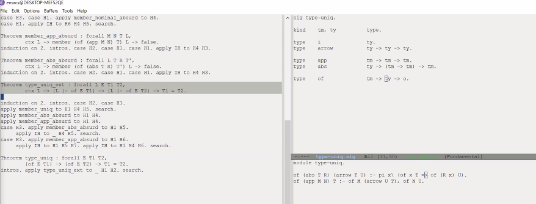
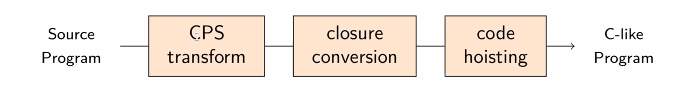
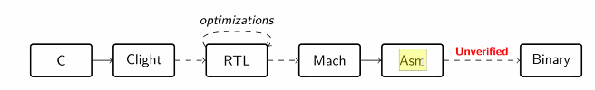
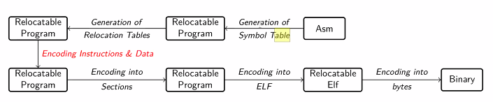
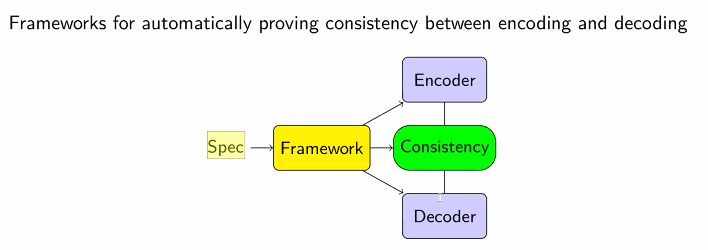

Week 6 of 2020 Spring. Lecture of Wang Yuting on his projects

<!--more-->

[toc]

## Techniques for Formalizing Meta-theorems of Type Systems
类型系统元定理的形式化验证技术

### A crash course on λ-calculus

λ-calculus is equivalent to Turing machine in terms of expressiveness in computation.

untyped λ-calculus is Turing-complete.

### Background: Type Theory and Type Systems

As a logical system, λ-calculus is inconsistent. Type system now breaks down recursion chain, becoming the foundation of programming language system.

> Type system: a syntactic method for enforcing levels of abstraction in programs. (Pierce)

A lot of different type systems:
- simply-typed λ-calculus
- Godel's T
- System F (...) (Poly)

我们希望证明一些Type Theory具有一些元性质, e.g.

Meta-theorems of these type systems
- Type preservation (well-typed is well-typed after calculation)
- Progress (well-typed will not get stuck)
- Normalization (consistence: strongly normalized, termination)

Question: is there any techniques to specify these properties?

### Example: Simply-typed λ-calculus
Theorem (Determinacy of typing)
$$
\forall \Gamma t \tau_1 \tau_2, \Gamma \vdash t: \tau_1 \implies \Gamma \vdash t: \tau_2 \implies \tau_1 = \tau_2 
$$
Proof. by induction on the typing derivations.

### Techniques for Formalizing Type Systems
[POPLMark Challenge](https://www.seas.upenn.edu/~plclub/poplmark/)

Different typing has different pros and cons.

Key question: How do we combine the benefits of different techniques for fomalizing.

### Formalization by Using Explicit Names for Variables
An example: Signature
```
ty, tm, id : Type
a          : ty
arr        : ty -> ty -> ty

var        : id -> tm
app        : tm -> tm -> tm
abs        : id -> ty -> tm -> tm
```

Context is a list of pairs of ids and terms
```
tof        : list (id*ty) -> tm -> ty -> Prop
```

Formalization of typing rules:
这是一种比较low-level的spec, 因为我们会引入一些计算上的方法(复杂度非常高)`fresh: list(id*ty)->id` gives new id not occurring in L.

这些techniques的缺点在于, 我们要对任意object system重新证明一次关于renaming, binding等meta-theorem.


### Formalization Techniques: Higher-Order Abstract Syntax

所有关于binding的证明在meta-language(内建的lambda calculus)层面, 使得在这一系统上的所有object system成立.

缺点是: 要求weak lambda, 与rich lambda冲突 (like Coq)

#### A Framework for Spec and Reasoning with HOAS

- λ-ProLog
- Abella
关系型

这样, 所有meta-level的证明都是在逻辑层面完成的. 

- 最终目的: 在Coq这样的rich lambda calculus中复现关于HOAS的验证机制.
  - 为此, 我们需要investigate the differences and connections between first-order and higher-order approaches
- 内容: 挑选有代表性的formalizing methods
  - 一阶
  - 高阶
- 应用到有代表性的type systems
  - simply, godel, system F
- Tools:
  - Coq: first order
  - λ-ProLog & Abella: Higher Order




## Prototyping of Functional Compiler Passes using HOAS
基于HOAS的函数式语言编译过程的原型开发. HOAS的形式化方法有很多应用, 开发速度会比其他方法快很多.

Imp Programs
- procedures of commands
- close to how machines actually work

Functional Programs
- program is a function mapping inputs to outputs
- computation is modeled as evaluation of expressions
- rooted in mathematical calculi
- real functional languages may contain imperative features (pure: Haskell, imp features: ML/Ocaml, 允许在函数调用时改变内存状态)

### Compilation Methods
1. traditional: compile to byte code and **run on VM** (e.g. OCaml, GHC)
2. compile to first-order programs (e.g. C) and reuse the existing compiler (e.g. SML-NJ)

我们主要研究第二种方法
Example: Continuation Passing Style
把functional programs编译成**Continuation**, 设定计算顺序.

- CPS-transformation: make evaluation order explicit 搞清执行函数
- Closure conversion: 处理函数嵌套/high-order/free-var, close open functions (使函数不依赖环境)
- Code hoisting: move closed functions to top-level (main function + closed programs)

Question: Are HOAS-based approaches effective for implementing functional transformations?
Answer: Yes! [Belanger JAR 2015, Wang ESOP 2016]
Reason:
1. manipulates functions as objects
2. manipulation of binding structure
3. HOAS good at handling binding structure

Key Question: To what extent is HOAS useful in compiling functional programs? 

### Example: Closure Conversion Transformation
```sml
let x = 3 in let y = 4 in
  fn z => x + y + z
```
is transformed into
```
let x = 3 in let y = 4 in
  <(fn z e => e.1 + e.2 + z), (x, y)>
```

注意到x和y没有出现在argument中, 它是与环境相关的. 现在, 原函数变成了一个pair, 一部分是闭合的函数, 另一部分是函数引用的free variable. 组合起来意义是一样的, 但function变成了closed function (我们可以随意地移动function, to top level, like C)

形式化方法: a mapping of $\rho$ of (source language) free variables to target language expressions

We represent the closure conversion judgment as follows:
$$\rho \triangle M \leadsto M^{\prime}$$

The key rule is for transforming (nested) functions into closures

$$
\begin{array}{c}
\left(x_{1}, \ldots, x_{n}\right)=\text { fvars }(\lambda x . M) ,\quad \rho \supset\left(x_{1}, \ldots, x_{n}\right) \leadsto M_{e}, \quad \rho^{\prime} \supset M \sim M^{\prime} \\
\hline \rho \mapsto \lambda x . M \leadsto\left\langle\lambda y . \lambda x_{e} . M^{\prime}, M_{e}\right\rangle
\end{array}
$$
where $\rho^{\prime}=\left[x \rightarrow y, x_{1} \rightarrow \pi_{1}\left(x_{e}\right), \ldots, x_{n} \rightarrow \pi_{n}\left(x_{e}\right)\right]$ and $y, x_{e}$ are fresh variables

HOAS可以将这种spec大大简化.

计算方法: 逐个检查, 如果bound, nil, 如果非bound, 加入
```
fvars (abs M) Vs FVs :-
  pi y\ bound y => fvars (M y) Vs FVs.
fvars X _ nil :- bound X
fvars Y _ (y::nil) :- bound Y
```

- lambda tamer project (>310 lines of Coq)
- CertiCoq
  - Verified compilation of Galina
  - Comparable complexity to Lambda Tamer

实现上的复杂度降低, 希望能降低证明的复杂度
另外, 还有λ-shrinking等优化方式.

### Overview of Project
实现比较具有代表性的函数式语言的compilation parse
1. functional compiler passes:
   1. essential ones: CPS transformation, closure conversion, and hoisting
   2. Optimizations: λ-shrinking
2. some representaative functional languages:
   1. simply typed lambda-calculus
   2. programming computable functions
   3. their extensions
3. further ...
   1. 用HOAS展示优势
   2. analyze time and space complexity of these transformations.
   3. correctness proof on paper


## Techniques for Formal Verification of Instruction Encoding
指令编码的形式化验证技术

### Background: Compiler Verification

Verification of Compiler:
- Results: CompCert, CakeML
- 不完整的compilation chain.

- asm是Coq中的形式化表示
- how to we verify the assembling process?

A Typical Assembler (标准的二进制代码)


关键步骤: assemble语言编译成二进制
assmbler的两大功能
1. meta-data in object files
2. **encode of instructions and data** (hard part)


### Instruction Encoding: X86
prefix + opcode + modRM + SIB + Imms
```
movl a(%eax, %eax, 1) %eax
encoded into
89 84 00 00 00 00 00
```

### Correctness of Instruction Encoding
要证明encoding的正确性, 我们需要证明中引入decoder
$$\forall b, i, i', \text{encode } i = \text{Some } b \implies \exists i', \text{decode } b = \text{Some } i' \And i \cong i'
$$
难点: 不同架构, 语义是由编码决定的, 如何automate

### Frameworks

encoding of data with dependence between fields



理想状况, 已有工作:
- Verified parser generators (EverParse)
- Correct-by-constructor synthesizer for binary formats (Narcissus)

较大问题: 难以处理指令集级别的data dependencies.

Example:
- `(N * vector N)` dependent records
- encoded into "index + N bytes"

Example of complex dependence: inductively defined instructions

products <-> inductive

### Overview of this Project

Question: How do we automate the proofs of instruction encoding?

We start with manual proofs for **a small subset** of x86 and RISC-V:
- manually write encoder/decoder/consistency between two
Preliminary investigation of possible automation techniques:
- automate the generation of encoder and decoders
- automate only the consistency proofs