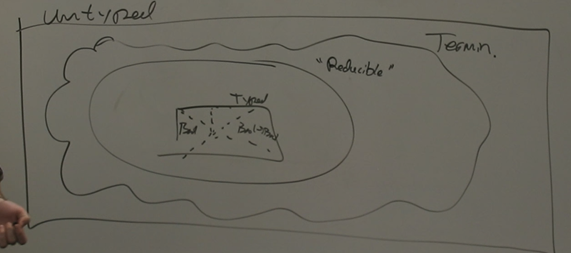

<!--more-->

[toc]

## Logical Relations and Termination

**Def (closed) $e$ is closed when $FV(e) = \emptyset$**

**Def (well-typed) e is well-typed when there is a $\Gamma$ and $\tau$ such that $\Gamma \vdash e:\tau$ is derivable**

**Def (Terminates): e is terminating when there is an e' such that $e\mapsto ^* e'$ and $e'\mapsto$ nothing.**

## Review

### Definition & Semantics
$$
\begin{array}{l}
b::= \text{True}\space|\space\text{False} \\
e::= x  \space|\space \lambda x.e \space|\space e1 e2\space|\space b \space|\space \text{ if } e_1 \text{ then } e_2 \text{ else }e_3 \\
\tau ::= \text{Bool} \space|\space \tau_1 \rightarrow \tau_2 \\
(\lambda x.e) \space e' \mapsto e[e'/x] \\
\text{ if True} \text{ then } e_1 \text{ else }e_2 \mapsto e_1 \\
\text{ if False} \text{ then } e_1 \text{ else }e_2 \mapsto e_1
\end{array}
$$

$$
\begin{array}{c}
  \begin{array}{c}
  e_1 \mapsto e_1' \\
  \hline
  e_1\space e_2 \mapsto e_1' \space e_2
  \end{array} &
  \begin{array}{c}
  e_1 \mapsto e_1' \\
  \hline
  \text{ if } e_1 \text{ then } e_2 \text{ else }e_3 \\
  \mapsto \text{ if } e_1' \text{ then } e_2 \text{ else }e_3
  \end{array} \\
\end{array}
$$

### Typing Rule
$$
\begin{array}{cc}
  \begin{array}{c}
  \hline
  \Gamma x : \tau \vdash x:\tau \\
  \end{array}
  &
  \begin{array}{c}
  \Gamma \vdash e_1:\tau \rightarrow \tau' \quad \Gamma \vdash e_2:\tau \\
  \hline
  \Gamma \vdash e_1 \space e_2 :\tau'
  \end{array} \\
  \\ 
  \begin{array}{c}
  \hline
  \Gamma \vdash \text{True}:\text{Bool}
  \end{array}
  &
  \begin{array}{c}
  \hline
  \Gamma \vdash \text{False}:\text{Bool}
  \end{array} \\
  \\
  \begin{array}{c}
  \Gamma x:\tau \vdash e:\tau' \\
  \hline
  \Gamma \vdash \lambda x.e : \tau \rightarrow \tau'
  \end{array}
  &
  \begin{array}{c}
  \Gamma \vdash e_1:\text{Bool} \quad \Gamma \vdash e_2: \tau \quad \Gamma \vdash e_3: \tau \\
  \hline
  \Gamma \vdash \text{ if } e_1 \text{ then } e_2 \text{ else }e_3: \tau
  \end{array}
\end{array}
$$

Intuition

### First Try

**Theorem: if $e$ is closed and well-typed, then it is terminating.**

**Theorem: if $\Box \vdash e: \tau$ is derivable then there is an $e'$ such that $e\vdash^* e' \vdash$ nothing.**

Proof. by induction on the derivation $\mathcal{D}$ of $\Box \vdash e: \tau$.
- $\mathcal{D} = \begin{array}{c} \hline \Box \vdash x:\tau \end{array}$ doesn't happen
- $\mathcal{D} = \begin{array}{c} \hline \Box \vdash \text{True}:\tau \end{array}$ is true since
  $\text{True} \mapsto^* \text{True} \mapsto$ nothing
- $\mathcal{D} = \begin{array}{c} \Box \vdash e_1:\text{Bool} \quad \Box \vdash e_2:\tau \quad \Box \vdash e_3:\tau \\ \hline \Box \vdash \text{if } e_1 \text{ then } e_2 \text{ else } e_3:\tau \end{array}$
  IH: for $i=1,2,3$, there is some $e'$ such that $e_i \mapsto^* e_i \mapsto$ nothing (i.e. proof tree $\mathcal{D}_i$). We need to show $\Box \vdash \text{if } e_1 \text{ then } e_2 \text{ else } e_3:\tau$ terminates
  $\text{if } e_1 \text{ then } e_2 \text{ else } e_3:\tau \mapsto^* \text{if } e'_1 \text{ then } e_2 \text{ else } e_3:\tau$
  Suppose $e'_1$ is a Bool, then $\mapsto^*e_j$ ($j=2$ if b = true else $j=3$), and that $e_j \mapsto^* e'_j \mapsto$ nothing.
  Suppose $e'_1 \neq b$, 
  - **terminates doesn't necessarily mean value**, Our proof is, this is the end, the expression will not step to anything. (The definition of inductive definition says it.) Termination is exactly what we want.
  - or, we may say, this case is impossible because the type-safety (but with a lot more extra complicated proof). or we can say we don't care about whether what the program terminating is a value. it terminates, and this is not exactly true beacuse type safety.
- $\mathcal{D} = \begin{array}{c} x:\tau \vdash e:\tau' \\ \hline \Box \vdash \lambda x.e: \tau \rightarrow \tau' \end{array}$ Find a reduction rule such that $\lambda$ do something. Nothing applies. No rule for $\lambda$ takes a step on its own.
  Furthermore, The IH is vacuous, because it introduces a free variable.
- $\mathcal{D} = \begin{array}{c} \Box \vdash e_1:\tau \rightarrow\tau^{'} \quad \Box \vdash e_2:\tau^{'} \\ \hline \Box \vdash e_1\quad e_2:\tau^{'}  \end{array}$
  IH: for $i = 1,2$, $e_i \mapsto^{*} e'_i \mapsto$ nothing
  Suppose $e'_1 = \lambda x . e^{'}$: it then happens that $e_1 \quad e_2 \mapsto^{*} \lambda x . e^{'} e_2 \mapsto e^{'} [e_2/x]$. Note here I don't know anything about $e^{'}$. **We need to know something about the function. The IH is too weak!** Stronger than what we really care about.

## Reducable terms are terminating

intuitively, it's the influence of types extension.
We should say, something inreducable is not just lambda, but also other things.
Now we need to define logical relations to illustrate the idea we just came up with.

### Definition

$$\Box e : \tau \implies e \in \left[\!\!\left[ \tau \right]\!\!\right] \subset \text{Terminating Things}
$$

$$
\begin{aligned}
  \mathbb{C}^{*} &= \{ e| \exists e' \in \mathbb{C}, e\mapsto^{*} e' \} \\
  \left[\!\!\left[\text{bool}\right]\!\!\right] &= \{ \text{True, False} \}^{*}
\end{aligned}
$$

expressions that are not booleans right now may evaluate to booleans, stuff like `λx.x True: Bool`, because it evaluates to boolean.

We define star notation, and this definition may not be well-typed, like `if False then (λx.x) else True`. No need to talk about types in a static sense when we are discussing things about dynamic behavior.

In some sense, it's just a type-based terminating definition, which doesn't care the type safety during the evaluating process.

### Properties of Expansion
- In general, if $\left[\!\!\left[\mathbb{C}\right]\!\!\right]$ terminating, then $\mathbb{C}^{*}$ is terminating.
- $\mathbb{C} \subset \mathbb{C}^{*}$ 
- $\mathbb{C}^{**} = \mathbb{C}^{*}$ 

$\tau_1 \rightarrow \tau_2$ wants a unfold operation.

$$
\left[\!\!\left[\tau_1 \rightarrow \tau_2 \right]\!\!\right] = \{ e \in \text{Termn} | \forall e' \in \left[\!\!\left[ \tau_1 \right]\!\!\right], e \space e' \in \left[\!\!\left[\tau_2\right]\!\!\right]  \}
$$

We are manually defining a terminating set (without type safety).

### Judgements on Substitutions
Now note that not everything in the proof are closed, for example, in lambda function, there may be free variables.

Define $\left[\!\!\left[\Gamma\right]\!\!\right]$ to be any sensible substitution you come up with.
$$\left[\!\!\left[\Gamma\right]\!\!\right] = \{ \sigma \in \text{Subst}| \forall (x:\tau) \in \Gamma, x[\sigma] \in \left[\!\!\left[\tau\right]\!\!\right] \}$$
$$\left[\!\!\left[\Gamma \vdash e: \tau\right]\!\!\right] = \{\forall \sigma \in \left[\!\!\left[\Gamma\right]\!\!\right], e[\Gamma] \in \left[\!\!\left[\tau\right]\!\!\right]\}$$ 

### Foundamental Lemma (Logical Relation)

Lemma (Fundamental Lemma):
if $\Gamma \vdash e:\tau$ is derivable, then $\left[\!\!\left[\Gamma \vdash e:\tau\right]\!\!\right]$ true.
