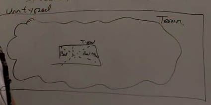

<!--more-->

[toc]

## Logical Relations and Termination

**Def (closed) $e$ is closed when $FV(e) = \emptyset$**

**Def (well-typed) e is well-typed when there is a $\Gamma$ and $\tau$ such that $\Gamma \vdash e:\tau$ is derivable**

**Def (Terminates): e is terminating when there is an e' such that $e\mapsto ^* e'$ and $e'\mapsto$ nothing.**

## Review

### Definition
$$
\begin{array}{l}
b::= \text{True}\space|\space\text{False} \\
e::= x  \space|\space \lambda x.e \space|\space e1 e2\space|\space b \space|\space \text{ if } e_1 \text{ then } e_2 \text{ else }e_3 \\
\tau ::= \text{Bool} \space|\space \tau_1 \rightarrow \tau_2 \\
(\lambda x.e) \space e' \mapsto e[e'/x] \\
\text{ if True} \text{ then } e_1 \text{ else }e_2 \mapsto e_1 \\
\text{ if False} \text{ then } e_1 \text{ else }e_2 \mapsto e_1
\end{array}
$$

### Proof Tree
$$
\begin{array}{cc}
  \begin{array}{c}
  e_1 \mapsto e_1' \\
  \hline
  e_1\space e_2 \mapsto e_1' \space e_2
  \end{array}
  &
  \begin{array}{c}
  e_1 \mapsto e_1' \\
  \hline
  \text{ if } e_1 \text{ then } e_2 \text{ else }e_3 \\
  \mapsto \text{ if } e_1' \text{ then } e_2 \text{ else }e_3
  \end{array} \\
  \\ \\
  \begin{array}{c}
  \hline
  \Gamma x : \tau \vdash x:\tau \\
  \end{array}
  &
  \begin{array}{c}
  \Gamma \vdash e_1:\tau \rightarrow \tau' \quad \Gamma \vdash e_2:\tau \\
  \hline
  \Gamma \vdash e_1 \space e_2 :\tau'
  \end{array} \\
  \\ 
  \begin{array}{c}
  \hline
  \Gamma \vdash \text{True}:\text{Bool}
  \end{array}
  &
  \begin{array}{c}
  \hline
  \Gamma \vdash \text{False}:\text{Bool}
  \end{array} \\
  \\
  \begin{array}{c}
  \Gamma x:\tau \vdash e:\tau' \\
  \hline
  \Gamma \vdash \lambda x.e : \tau \rightarrow \tau'
  \end{array}
  &
  \begin{array}{c}
  \Gamma \vdash e_1:\text{Bool} \quad \Gamma \vdash e_2: \tau \quad \Gamma \vdash e_3: \tau \\
  \hline
  \Gamma \vdash \text{ if } e_1 \text{ then } e_2 \text{ else }e_3: \tau
  \end{array}
\end{array}
$$

Intuition

**Theorem: if $e$ is closed and well-typed, then it is terminating.**

**Theorem: if $\Box \vdash e: \tau$ is derivable then there is an $e'$ such that $e\vdash^* e' \vdash$ nothing.**

Proof. by induction on the derivation $\mathcal{D}$ of $\Box \vdash e: \tau$.
- $\mathcal{D} = \begin{array}{c} \hline \Box \vdash x:\tau \end{array}$ doesn't happen
- $\mathcal{D} = \begin{array}{c} \hline \Box \vdash \text{True}:\tau \end{array}$ is true since
  $\text{True} \mapsto^* \text{True} \mapsto$ nothing
- $\mathcal{D} = \begin{array}{c} \Box \vdash e_1:\text{Bool} \quad \Box \vdash e_2:\tau \quad \Box \vdash e_3:\tau \\ \hline \Box \vdash \text{if } e_1 \text{ then } e_2 \text{ else } e_3:\tau \end{array}$
  IH: for $i=1,2,3$, there is some $e'$ such that $e_i \mapsto^* e_i \mapsto$ nothing. We need to show $\Box \vdash \text{if } e_1 \text{ then } e_2 \text{ else } e_3:\tau$ terminates
  $\text{if } e_1 \text{ then } e_2 \text{ else } e_3:\tau \mapsto^* \text{if } e'_1 \text{ then } e_2 \text{ else } e_3:\tau$
  Suppose $e'_1$ is a Bool, then $\mapsto^*e_j$ ($j=2$ if b = true else $j=3$), and that $e_j \mapsto^* e'_j \mapsto$ nothing.
  Suppose $e'_1 \neq b$, **terminates doesn't necessarily mean value**. this case is impossible because the type-safety (but with a lot more extra complicated proof). or we can say we don't care about this case.
- $\mathcal{D} = \begin{array}{c} x:\tau \vdash e:\tau' \\ \hline \Box \vdash \lambda x.e: \tau \rightarrow \tau' \end{array}$