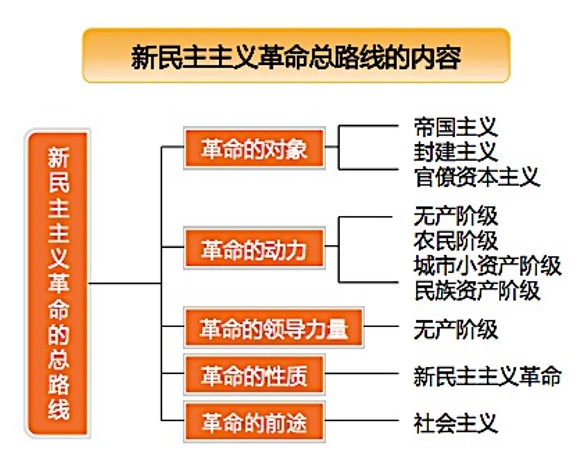

Week 3 of 2020 Spring.

<!--more-->

[toc]

新民主主义革命的理论揭示了近代中国革命发展的客观规律，**解决了在一个以农民为主体的、落后的半殖民地半封建的东方大国里进行革命的一系列理论问题**，在当时的历史条件下科学地回答了**中国革命向何处去以及中国革命的发展阶段问题**，极大地丰富了马克思主义的理论宝库，开辟了马克思主义中国化的发展道路。

> 毛泽东关于新民主主义革命理论的重要论著
> - 《共产党人》发刊词
> - 《中国革命和中国共产党》
> - 《新民主主义论》

## 新民主主义革命理论形成的依据

千年变局：近代中国的基本国情

落后的半殖民地半封建社会

多重矛盾的体现, 多重革命的任务

### 新民主主义革命理论的实践基础
1. 旧民主主义革命的失败呼唤新的革命理论
   鸦片战争后, 太平天国运动, 戊戌变法, 义和团运动, 辛亥革命
   虽然都对推动中国社会的走向进步产生了一定的影响, 但这些斗争和探索最终都失败了.
   实践的过程给了一个清楚的信号: 不触及社会根本矛盾的运动, 都不可能真正完成反帝反封建的根本任务, 也不能给中国找到出路.
2. 中国共产党人的艰辛探索奠定了革命理论形成基础
   革命初期, 我们对革命的认识还是存在许多不成熟的地方.
   > 回顾: 新民主主义的时间点
   > 起点: 1919 五四运动
   > 以五四运动的爆发为标志，中国资产阶级民主革命进入新民主主义革命的崭新阶段。
   > 不同于旧式的资产阶级民主革命(领导阶级)
   > 不同于欧美资产阶级民主革命(革命前途:为进入社会主义而做准备)
   > 不同于一般意义上的社会主义革命(如何对待资本主义:清楚地表明我们推翻的是帝国主义,封建主义和官僚资本主义,并不破坏参加革命的资本主义成分,建立的是革命阶级联合专政的民主共和国)

   > *那末，这个革命的对象究竟是谁？这个革命的任务究竟是什么呢？这个革命的动力是什么？这个革命的性质是什么？这个革命的前途又是什么呢？* ——毛泽东选集，《中国革命和中国共产党》，

## 新民主主义革命的总路线和基本纲领

时代之问: 在一个以农民为主体的、落后的半殖民地半封建的国度里进行革命，应该选择什么样的道路

以农民为主体的国家
- 史学家陈旭麓曾谈到:“中国近代产业工人的人数,辛亥革命前不过50-60万人,1919年五四运动前夕即达到了**200万人**。”
- 中共“二大”宣言指出：“中国**三万万的农民**，乃是革命中的最大要素。”

路在何方
- 首要问题：谁是我们的敌人?谁是我们的朋友? 
- 前途命运：中国革命要走向何方？
- 道路抉择：如何实现我们的目标？

### 新民主主义的总路线
对革命精辟的描述:
**“无产阶级领导的，人民大众的，反对帝国主义、封建主义和官僚资本主义的革命。”** 官僚资本主义是1948年后来明确的.(三座大山)

新民主主义革命的动力:无产阶级
- 中国革命最基本的动力 (深受三座大山的压迫, 革命性最强)
- 是新的社会生产力的代表，是近代中国最进步的阶级，是中国革命的领导力量
- 中国沦为半殖民地半封建社会过程中最早出现的一个新的社会阶级 

**农民问题是中国革命的基本问题**，新民主主义革命实质上就是**党领导下的农民革命**，中国革命战争实质上就是**党领导下的农民战争**。
农民阶级:
- 中国**革命的主力军**(注意区分:主要动力)
- 具有强烈的反帝反封建的革命要求
- 占全国人口的80%以上
- 受帝国主义和封建主义压迫最重

城市小资产阶级(知识分子, 小商人, 小手工业者, 自由职业者)同样受帝国主义、封建主义和官僚资本主义的压迫，是无产阶级的可靠同盟者(也具有软弱性)，同样是中国革命的动力。(一般不剥削别人, 也不受别人剥削. 但可能有一小部分生产资料/财产, 是在城市中不能忽视的群体, 但地位也处在分化的状态, 不是非常稳固, 有些可能会在地主阶级的剥削下转变成无产阶级, 有些则可能成为资产阶级)

民族资产阶级也是中国革命的动力之一
- 民族资产阶级具有两面性
  - 受到帝国主义和封建主义的压迫
  - 同帝国主义和封建势力有矛盾
  - 通帝国主义和封建主义有千丝万缕的联系
  - 在革命中容易动摇和妥协
- 要实行既团结又斗争的政策

五星红旗象征着中国共产党领导下的革命人民(四大群体)大团结

### 新民主主义革命的领导力量

无产者失去的只是锁链, 他们获得的将是整个世界

### 新民主主义革命的前途和性质

中国革命必须分两步走:
1. 推翻帝国主义, 封建主义, 官僚资本主义的压迫, 实现国家独立, 民族解放和人民民主, 新民主主义革命
2. 在此基础上继续向前发展, 进行社会主义革命, 是中国逐步过渡到社会主义社会.

### 新民主主义基本纲领
- 政治: 推翻帝国主义和封建主义的统治，建立一个无产阶级领导的、以工农联盟为基础的、**各革命阶级联合专政**的新民主主义的共和国。
- 经济: 没收封建地主阶级的土地归农民所有，没收官僚资产阶级的垄断资本归新民主主义的国家所有，**保护民族工商业**
- 文化: 无产阶级领导的人民大众的反帝反封建的文化，即**民族的科学的大众的文化**

## 新民主主义革命的道路和基本经验

新民主主义革命的道路
- 中国革命必须走**农村包围城市、武装夺取政权**的道路；
- 处理好土地革命、武装斗争、农村革命根据地建设三者之间的关系；
- 不照搬俄国十月革命的经验，而是从中国的**实际**出发。

建立农村革命根据地的必要性
- 内无民主、外无独立，只能武装斗争
- 农民占全国人口的绝大多数，必须依靠农民，解决农民问题
- 农村敌人统治薄弱，必须到农村去。

### 新民主主义革命的道路

“农村包围城市、武装夺取政权”革命道路的提出，展现了党在探索中国革命道路的过程中，**不是照抄照搬俄国十月革命的经验**，而是从中国的实际出发，开辟了引导中国革命走向胜利的正确道路，**独创性地发展了马克思列宁主义**。

### 新民主主义革命的三大法宝
统一战线、 武装斗争、党的建设
（不要与毛泽东思想活的灵魂混淆）
#### 统一战线
1. 中国社会是一个两头小、中间大的社会，无产阶级和地主、大资产阶级都只占少数，最广大的群众是农民、城市小资产阶级以及其他中间阶级。
2. 中国革命面对的中外反动势力异常强大。革命具有残酷性、长期性、发展不平衡性。
3. 半殖民地半封建的近代中国社会内部、外部的矛盾错综复杂。
何为统一战线？
> 所谓政治，“就是要把拥护我们的人搞得多多的，把反对我们的人搞得少少的……我们的势力越大，胜利的把握就越大。”（毛泽东）

统一战线的本质就是不同社会政治力量（包括阶级、阶层、政党、团体）在一定的历史条件下，为了实现一定的共同目标、在共同利益基础上而建立的政治联盟。

新民主主义革命中的统一战线(但直到今天依然发挥着重要的作用)

#### 武装斗争
> *在中国，离开了武装斗争，就没有无产阶级的地位，就没有人民的地位，就没有共产党的地位，就没有革命的胜利。 ——毛泽东*
> *“因为我们的敌人是异常强大的，革命力量就非在长期间内不能聚积和锻炼成为一个足以最后地战胜敌人的力量。因为敌人对于中国革命的镇压是异常残酷的，革命力量就非磨练和发挥自己的顽强性，不能坚持自己的阵地和夺取敌人的阵地。因此，那种以为中国革命力量瞬间就可以组成，中国革命斗争顷刻就可以胜利的观点，是不正确的。*
> *在这样的敌人面前，中国革命的主要方法，中国革命的主要形式，不能是和平的，而必须是武装的……”（P.634-635）*

#### 党的建设

1. 必须把**思想建设**始终放在党的建设首位(十九大之后, 政治建设放在了思想建设前面)
2. 必须在任何时候都重视党的**组织建设**(少数服从多数,下级服从上级)
3. 必须重视党的**作风建设**(理论联系实际,密切联系群众,批评与自我批评的三大作风)
4. 必须联系党的**政治路线**加强党的建设.(党的纲领在一定时期的具体体现)

三大法宝:
> “我们的二十八年，就大不相同。我们有许多宝贵的经验。**一个有纪律的，有马克思列宁主义的理论武装的，采取自我批评方法的，联系人民群众的党**。一个由这样的**党领导的军队**。一个由这样的**党领导的各革命阶级各革命派别的统一战线**。这三件是我们战胜敌人的主要武器。”（P.1480） 毛泽东：《论人民民主专政》

## Summary
- 新民主主义革命理论形成的依据（时代特征与实践基础）
- 新民主主义革命的总路线和基本纲领
- 新民主主义革命的道路和基本经验

