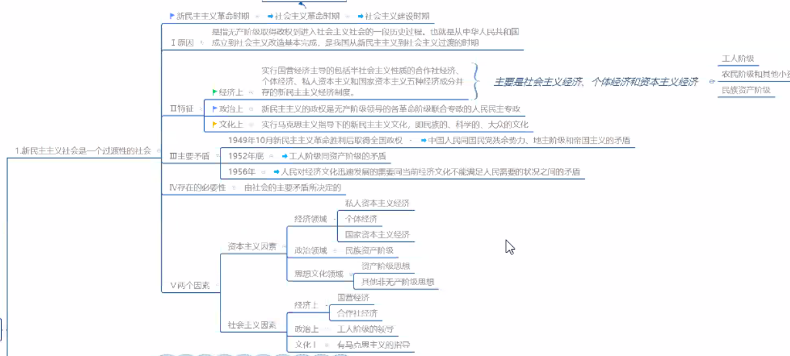
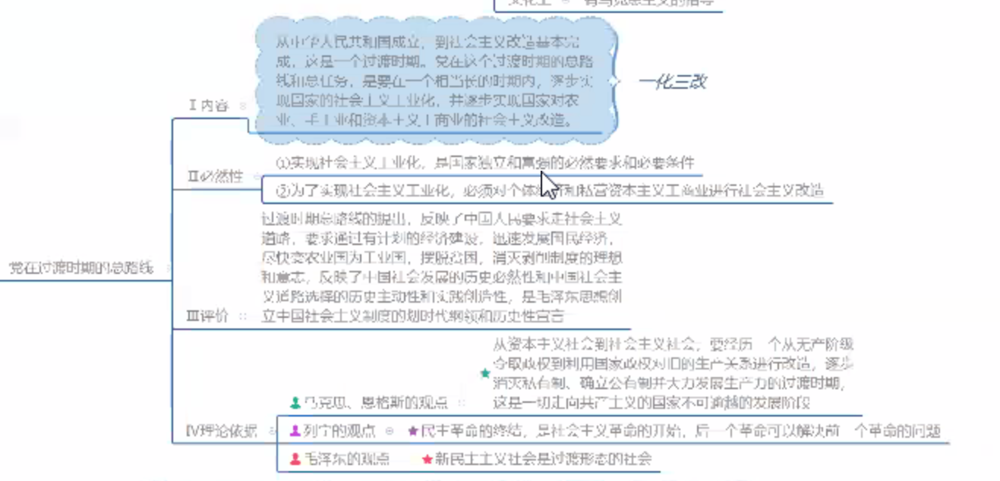
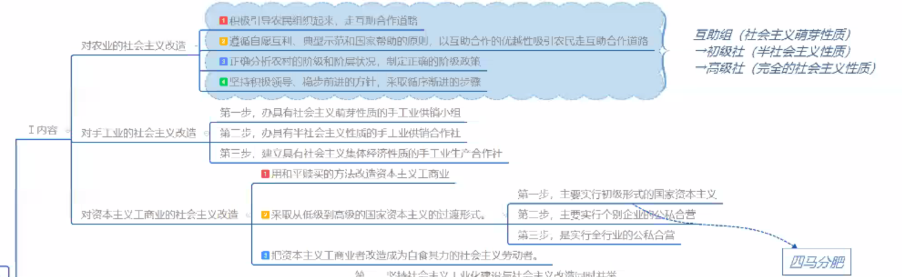

Week 4 of 2020 Spring 

<!--more-->

[toc]

## 社会主义改造理论

改造中的中国共产党
1. 共产党的优势: 组织建设与信仰重构
   - 强大的组织建设能力: 从传统的官民二元对立转变为政党组织的嵌入与吸纳
   - 强大的理论建构能力: 重塑社会主义
     新民主主义革命是以社会主义为历史取向的革命
2. 新民主主义社会: 一个过渡性质的社会(p44-46)
   - 社会性质: 
     - 不是一个独立的社会体系
     - 是属于社会主义体系的
   - 主要经济成分: 社会主义经济, 个体经济和资本主义经济
   - 阶级构成: 工人阶级, 农民阶级和其他小资产阶级, 民族资产阶级
   - 社会的主要矛盾: 
     - 社会主义和资本主义两条道路
     - 工人阶级和资产阶级两个阶级
     - 新民主主义社会是属于社会主义体系的

3. 过渡时期的政策: 总路线
   认识过程 p46-47
   主要内容: 一化三改造
   理论依据: 经典作家
   社会主义改造: 道路, 原则, 政策, 方法, 经验

4. 组织的力量与信仰的力量

## 科学辨识中国特色社会主义

1. 社会主义: 新生事物
2. 中国特色社会主义: 意识形态及其实践
3. 社会主义制度在中国的确立: 现实与未来
   经验与教训, 确立及其理论依据, 意义

## 社会主义建设道路初步探索的理论成果
1. 观念、理念（成型中的理念）与信念（理智的信仰）
2. 矛盾与平衡： 社会主义框架内
   （当代中国与地方的分权——论十大关系），权利的边界
3. 初步探索的成果

