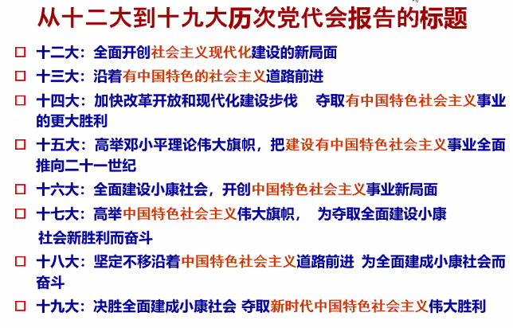
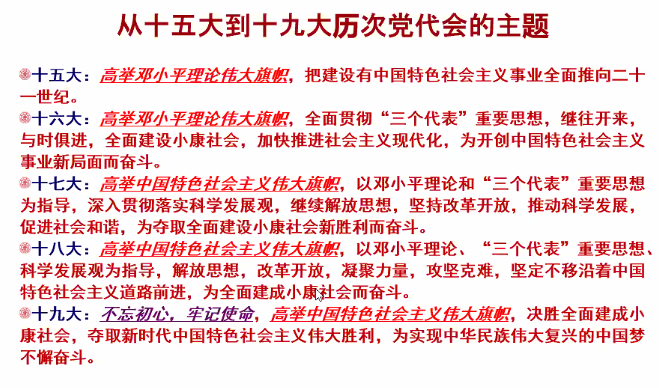
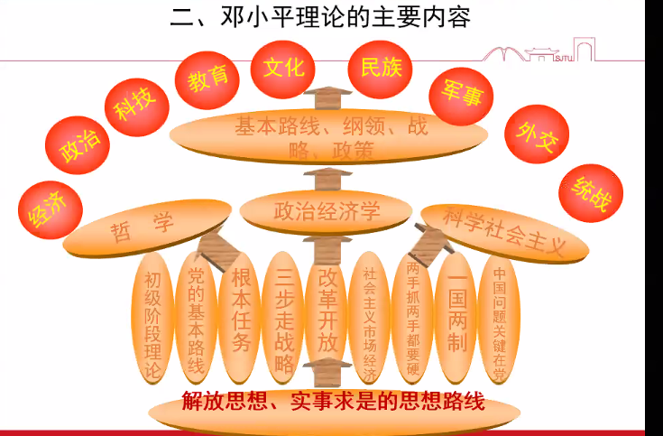

Week 5 of 2020 Spring

<!--more-->

[toc]

## 邓小平理论的形成

春天的故事: (两篇宣言书)
1979: 在中国的南海边画了一个圈
- 1976~1978 徘徊期.
- 1978 党的十一届三中全会, 拨乱反正, 解放思想, 实事求是, 确定了以经济建设为中心基本路线.
1992: 在中国的南海边写下诗篇.
- 东欧剧变, 基本路线一百年不动摇

### 邓小平理论的形成条件

1. 时代背景：和平与发展成为时代主题
   - 和平问题是东西问题
   - 发展问题是南北问题
   - “概括起来，就是东西南北四个字。南北问题是核心问题“。

2. 历史根据：社会主义建设的经验教训
   - 形成了一些正确的和比较正确的理论观点、方针政策和实践经验；
   - 也犯了不少错误，走了不少弯路

3. 现实依据：改革开放和现代化建设的实践
   - 领导全党从总结群众成功实践的经验中，也从总结工作的某些失误的教训中，把经验上升为理论，揭示了我国社会主义现代化建设的规律，从而创立了邓小平理论。

### 邓小平理论的形成过程

1. 十一届三中全会
  1978年12月召开的党的十一届三中全会，重新确立了解放思想、实事求是的思想路线，停止使用“以阶级斗争为纲”的错误提法，确定把全党工作的着重点转移到社会主义现代化建设上来，作出实行改革开放的重大决策。
  意义: 十一届三中全会实现了党的历史上具有深远意义的伟大转折。

2. 十二大
  1982年邓小平在党的十二大开幕词中明确指出：“把马克思主义的普遍真理同我国的具体实际结合起来，**走自己的道路，建设有中国特色的社会主义**，这就是我们总结长期历史经验得出的基本结论。”
  此后每五年举行一次党的全国代表大会, 形成常规.
  
  

3. 十二届三中全会
  1984年党的十二届三中全会作出了《关于经济体制改革的决定》，提出了社会主义经济是公有制基础上的有计划的商品经济。
  意义: 此后，从农村改革到城市改革，由经济体制改革到各方面体制改革，展开了波澜壮阔的历史进程。

4. 十三大
  1987年召开的党的十三大，第一次比较系统地论述了我国社会主义初级阶段理论，明确概括和全面阐发了党的“一个中心、两个基本点”的基本路线。
  意义:从马克思主义哲学、政治经济学和科学社会主义等方面，第一次对中国特色社会主义理论的主要内容作了系统概括。

5. 南方谈话
  1992年1月18日至2月21日，邓小平先后视察武昌、深圳、珠海、上海等地，发表重要谈话。 
  针对人们思想中普遍存在的疑虑，邓小平重申了深化改革、加速发展的必要性和重要性，提出了一系列重要论断
  社会主义本质；
   - “三个有利于”标准；
   - 发展市场经济；
   - 革命是解放生产力，改革也是解放生产力；
   - 不坚持社会主义，不改革开放，不发展经济，不改善人民生活，就没有出路；
   - 改革开放的胆子要大一些，敢于试验，看准了的，就大胆地试，大胆地闯；
   - 要提倡科学，靠科学才有希望；
   - 要坚持两手抓，一手抓改革开放，一手抓打击各种犯罪活动，这两手都要硬。

6. 十四大
  1992年召开的党的十四大指出：“我们党所以能够取得这样的胜利，根本原因是在十四年的伟大实践中，坚持把马克思主义基本原理同中国具体实际相结合，逐步形成和发展了建设有中国特色社会主义的理论。”
  建设有中国特色社会主义的理论，“第一次比较系统地初步回答了中国这样的经济文化比较落后的国家如何建设社会主义、如何巩固和发展社会主义的一系列基本问题，用新的思想、观点，继承和发展了马克思主义” 。

7. 十五大
  党的十五大正式提出“邓小平理论”这一概念，深刻阐述了邓小平理论的历史地位和指导意义，进一步论述了邓小平对这一理论的创立作出的独创性贡献。
  十五大还郑重地把邓小平理论同马克思列宁主义、毛泽东思想一起，确立为党的指导思想并写入党章。
  1999年的宪法修正案，正式将邓小平理论载入宪法。

## 邓小平理论的基本问题和主要内容

为什么要在主要内容前强调基本问题? 高度重视"什么是社会主义、怎样建设社会主义" 问题意识

### 邓小平理论回答的基本问题
1. 什么是社会主义、怎样建设社会主义是邓小平在领导改革开放和现代化建设这一新的革命过程中，不断提出和反复思考的**首要的基本的理论问题**。
   ≠ 邓小平理论仅仅是关于社会主义建设的理论
2. 搞清楚什么是社会主义、怎样建设社会主义 what & how
   关键是要在坚持社会主义基本制度的基础上进一步认清社会主义的本质。
   邓小平根据马克思主义的基本原理和社会主义的实践经验，对这个问题进行了不懈的探索，作出了科学的回答。
1992年初，邓小平在南方谈话中对社会主义本质作了总结性理论概括：**“社会主义的本质，是解放生产力，发展生产力，消灭剥削，消除两极分化，最终达到共同富裕。”**

### 邓小平理论的主要内容

1. 解放思想、实事求是的思想路线
   *1978年党的十一届三中全会召开前夕，在中央工作会议上邓小平发表《解放思想，实事求是，团结一致向前看》的讲话， 明确指出：**“一个党，一个国家，一个民族，如果一切从本本出发，思想僵化，迷信盛行，那它就不能前进，它的生机就停止了，就要亡党亡国。”***
   - 有力地推动和保证了改革开放的进行
   - 体现了辩证唯物主义和历史唯物主义的世界观方法论
   - 体现了革命胆略和科学精神的统一
   - 是邓小平理论的活的灵魂，是邓小平理论的精髓
2. 社会主义初级阶段理论
   **我国处在社会主义初级阶段**是邓小平和我们党对当代中国基本国情的科学判断
   两层含义
   1. 第一，我国已经进入社会主义社会，必须坚持而不能离开社会主义。
   2. 第二，我国的社会主义社会还处在不发达的阶段，必须正视而不能超越初级阶段。(不合格)
   **邓小平关于社会主义初级阶段的论断，使我们对社会主义建设的长期性、复杂性、艰巨性有了更加清醒的认识。**
3. 党的基本路线
   **党的十三大报告**提出了党在社会主义初级阶段的基本路线
   领导和团结全国各族人民，以经济建设为中心，坚持四项基本原则，坚持改革开放，自力更生，艰苦创业，为把我国建设成为富强、民主、文明的社会主义现代化国家而奋斗。
   1. 建设“富强、民主、文明的社会主义现代化国家”
   2. “一个中心、两个基本点”
   3. “领导和团结全国各族人民”
   4. “自力更生，艰苦创业”
   - 坚持党的基本路线，必须紧紧围绕经济建设这一中心
   - 坚持党的基本路线，必须把坚持四项基本原则同坚持改革开放结合起来，正确处理改革开放和四项基本原则的关系。
   - 十九大：领导和团结全国各族人民，以经济建设为中心，坚持四项基本原则，坚持改革开放，自力更生，艰苦创业，为把我国建设成为富强民主文明和谐美丽的社会主义现代化强国而奋斗。
4. 社会主义的根本任务的理论
   **生产力**是社会发展的最根本的决定性因素----社会主义的根本任务是发展生产力
   **邓小平强调，发展是硬道理，中国解决所有问题的关键是要靠自己的发展。** ---- **发展**要抓住机遇
   中国要发展，离不开科学 ---- 科学技术是第一生产力
5. “三步走”战略
   在我国落后的生产力基础上实现社会主义现代化是一项十分艰巨的事业，必须有步骤分阶段实现。
   1987年10月，党的十三大把邓小平“三步走”的发展战略构想确定下来，明确提出：
   1. 从1981年到1990年实现国民生产总值比1980年翻一番，解决人民的温饱问题。
   2. 从1991年到20世纪末，使国民生产总值再翻一番，达到小康水平。
   3. 到21世纪中叶，国民生产总值再翻两番，达到中等发达国家水平，基本实现现代化。
   **“新三步走”战略：** 党的十五大：全面建设小康社会、实现第三步战略目标的战略思考
   **“新两步走”战略：** 党的十九大：2020-2035：基本实现社会主义现代化；2035-本世纪中叶：富强民主文明和谐美丽的社会主义现代化强国
6. 改革开放理论
   **新时期最鲜明的特点是改革开放**
   改革
   - 是社会主义社会发展的直接动力
   - 是一项崭新的事业，是一个大试验
   对外开放，
   - 包括对发达国家的开放，
   - 也包括对发展中国家的开放，
   - 是对世界所有国家的开放。
7. 社会主义市场经济理论
   “计划经济不等于社会主义，资本主义也有计划；市场经济不等于资本主义，社会主义也有市场”。
   **社会主义市场经济理论的要点**
   1. 计划经济和市场经济不是划分社会制度的标志，计划经济不等于社会主义，市场经济也不等于资本主义；
   2. 计划和市场都是经济手段，对经济活动的调节各有优势和长处，社会主义实行市场经济要把两者结合起来；
   3. 市场经济作为资源配置的一种方式本身不具有制度属性，可以和不同的社会制度结合，从而表现出不同的性质。坚持社会主义制度与市场经济的结合，是社会主义市场经济的特色所在、优势所在。
8. “两手抓，两手都要硬”
   **社会主义精神文明是社会主义社会的重要特征**
   邓小平强调，物质文明和精神文明都搞好，才是中国特色的社会主义。
   一手抓物质文明，一手抓精神文明，“两手抓、两手都要硬”，这是我国社会主义现代化建设的一个根本方针。
   - “一手抓建设，一手抓法制”
   - “一手抓改革开放，一手抓惩治腐败”
9.  “一国两制”
   - 坚持一个中国；
   - 两制并存；
   - 高度自治；
   - 尽最大努力争取和平统一，但不承诺放弃使用武力；
   - 解决台湾问题，实现祖国完全统一，寄希望于台湾人民。
   “一国两制”的伟大构想的提出是从解决台湾问题开始的
   台湾问题: 是国内战争遗留下来的问题, 属于中国的内政, 不容许外国干涉
   “一国两制”的伟大构想在实践中首先运用于解决香港问题、澳门问题
10.  中国问题的关键在于党
   **建设中国特色社会主义**关键在于坚持、加强和改善党的领导
   **加强党的建设**是我们党领导人民取得革命和建设胜利的一个法宝
   要加强党的**思想建设、组织建设、作风建设。**
   邓小平指出，领导制度、组织制度问题更带有根本性、全局性、稳定性和长期性。

邓小平理论内容丰富，除以上这些主要创新外，还有许多丰富和深刻的思想。

> 理解社会主义本质
> 邓小平关于社会主义本质的论述,既包括了**生产力问题**(决定性, 解放生产力), 也包括了以生产关系(公有制, 按劳分配)为基础的社会关系问题, 是有机的整体. 
> 先说什么不是, 在说什么是
> 社会主义原则: 一是发展生产, 而是共同富裕

## 邓小平理论的历史地位

### 马克思列宁主义、毛泽东思想的继承和发展

- 是马克思列宁主义基本原理与当代中国实际和时代特征相结合的产物
- 是马克思列宁主义、毛泽东思想的继承和发展
- 是全党全国人民集体智慧的结晶

邓小平是我国改革开放和社会主义现代化建设的总设计师，对邓小平理论的创立作出了历史性的重大贡献。

### 中国特色社会主义理论体系的开篇之作

邓小平理论: 什么是社会主义 怎样建设社会主义
“三个代表”重要思想: 建设什么样的党 怎样建设党
科学发展观: 实现什么样的发展 怎样发展
习近平新时代中国特色社会主义思想: 新时代坚持和发展什么样的中国特色社会主义　怎样坚持和发展中国特色社会主义

### 改革开放和社会主义现代化建设的科学指南

**邓小平理论指导了改革开放的伟大实践**
邓小平理论使改革开放后的中国发生天翻地覆的变化，迎来了思想的解放、经济的发展、政治的昌明、教育的勃兴、文艺的繁荣、科学的春天。

